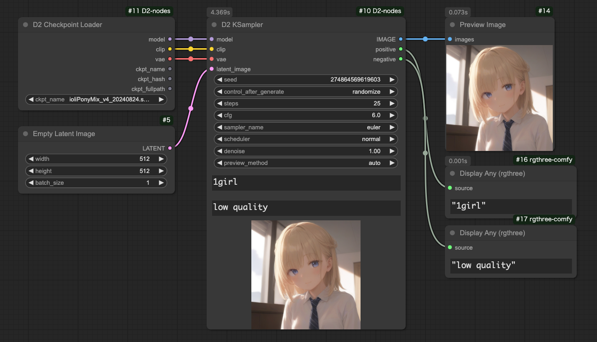
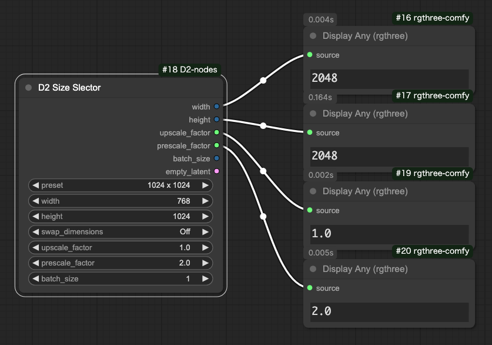
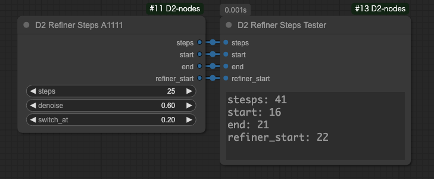
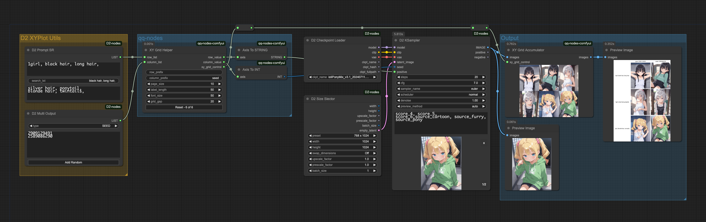
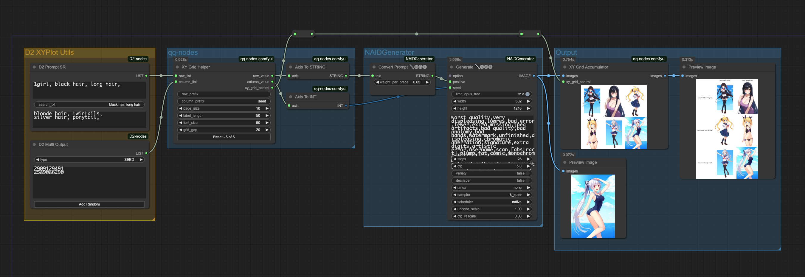
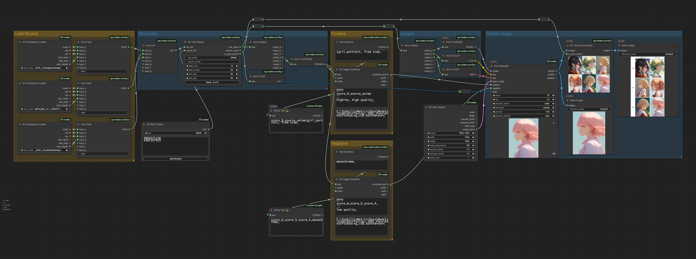
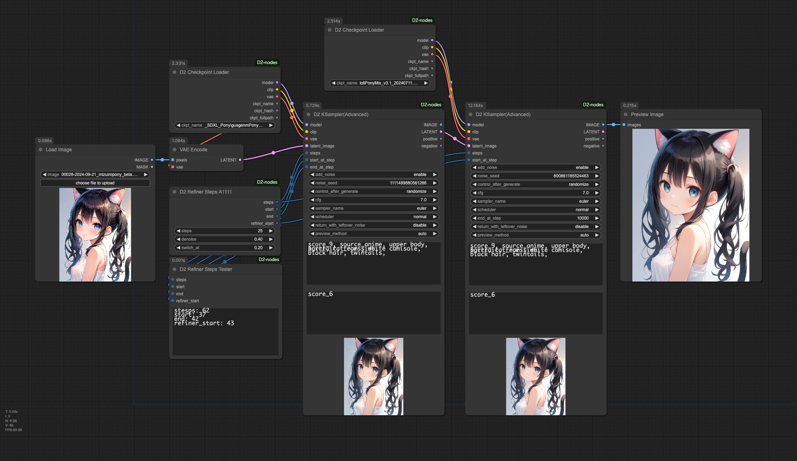

<style>
  .d2-details{
    padding: 1rem;
    border: 1px solid var(--borderColor-muted, #ccc);
    border-radius: 6px;
  }
</style>


# D2 Nodes ComfyUI

[English][<a href="README_ja.md">日本語</a>][<a href="README_zh.md">繁体中文</a>]

**D2 Nodes ComfyUI** is a collection of custom nodes that make ComfyUI slightly more convenient.

**It's suitable for those who want to create simple workflows.**

I have consolidated the following custom nodes that I previously created, and added nodes such as D2 KSampler.  
**If you have already installed the following custom nodes, please delete them as the node names will conflict.**

- [ComfyUI-d2-size-selector](https://github.com/da2el-ai/ComfyUI-d2-size-selector)
- [ComfyUI-d2-steps](https://github.com/da2el-ai/ComfyUI-d2-steps)
- [ComfyUI-d2-xyplot-utils](https://github.com/da2el-ai/ComfyUI-d2-xyplot-utils)


## :tomato: Nodes

### D2 Regex Switcher
  

  - Searches input text with regular expressions and outputs matching text
  - Can also perform string concatenation
  
<details class="d2-details">
  <summary><strong>Details</strong></summary>

  - The main purpose is to switch quality tags for each Checkpoint
  - When a matching string is found in the input `text`, it outputs the target string and which match it was (starting from 0)
  - In the image above, it received `ioliPonyMixV4.safetensors`, matched the search condition `pony`, so `score_9` is output
  - Since it matched the first search condition, `index` outputs `0`
  - If it doesn't match any conditions, `-1` is output
  - Can also concatenate strings at the front and back

  #### Input

  - `text`
    - Target string for searching
  - `prefix`
    - String to concatenate at the front
  - `suffix`
    - String to concatenate at the back
  - `regex_and_output`
    - List of search strings and output strings
    - Enter in the following format:

  ```
  Search string 1 (regex can be used)
  --
  Output string 1
  --
  Search string 2 (regex can be used)
  --
  Output string 2
  --
  --
  String to output when nothing matches
  ```

  #### Output

  - `combined_text`
    - String combining `prefix` + output string + `suffix`
  - `prefix` / `suffix`
    - Pass-through from Input

  #### Usage Example

  

  In this example, the matched number (`index`) is passed to the Text Index Switch of [Easy Use](https://github.com/yolain/ComfyUI-Easy-Use) for switching.

  Since it becomes `-1` when there's no match, we use the regular expression `.+` that matches all strings as a default output.
</details>

### D2 Prompt SR

  

  - A node that searches and replaces input text and returns it as a list
  - A custom node for using Prompt S/R with XY Plot
  - Compatible with [qq-nodes-comfyui](https://github.com/kenjiqq/qq-nodes-comfyui)

<details class="d2-details">
  <summary><strong>Details</strong></summary>

  #### Input

  - `prompt`
    - Prompt. Can include line breaks
  - `search_txt`
    - Text to search for. Can include multiple words
    - Cannot use line breaks
  - `replace`
    - Text for replacement
    - Since it's separated by line breaks, it's OK if it contains ","

  #### Output

  - LIST
    - Outputs replaced text in list format

</details>

### D2 Multi Output

  

  - A node that outputs general parameters like seed and cfg in list format

<details class="d2-details">
  <summary><strong>Details</strong></summary>

  #### Input
  - `type`
    - `FLOAT`: Floating point number. For CFG, etc.
    - `INT`: Integer. For steps, etc.
    - `STRING`: String. For sampler, etc.
    - `SEED`: Can input seed value with random number generation button
  - `Add Random`
    - Adds random numbers to the input field
    - Only displayed when `type` is `SEED`

</details>

### D2 Checkpoint Loader


  - A Checkpoint Loader that outputs the full path of the model file

<details class="d2-details">
  <summary><strong>Details</strong></summary>

  #### Output
  
  - `model` / `clip` / `vae`
    - Same as the conventional CheckpointLoader.
  - `ckpt_name` / `ckpt_hash` / `ckpt_fullpath`
    - Checkpoint name, hash, full path.

  The implementation mostly uses code from [mikey_nodes](https://github.com/bash-j/mikey_nodes).

</details>

### D2 KSampler / D2 KSampler(Advanced)



  - A KSampler that can input prompts as STRING

<details class="d2-details">
  <summary><strong>Details</strong></summary>

  #### Input

  - `model` / `clip` / `vae` / ..etc
    - Same as standard KSampler
  - `negative` / `positive`
    - Prompts in STRING format

  #### Output

  - `IMAGE`
    - Image output
  - `positive` / `negative`
    - Pass-through from Input

</details>

### D2 Size Selector



  - A node that allows selecting image size from presets

<details class="d2-details">
  <summary><strong>Details</strong></summary>

  #### Input

  - `preset`
    - Size preset
    - To change presets, edit `/custom_nodes/D2-nodes-ComfyUI/config/sizeselector_config.yaml`
  - `width` / `height`
    - Width and height dimensions
  - `swap_dimensions`
    - Swaps width and height
  - `upscale_factor`
    - Value to pass to other resize nodes
  - `prescale_factor`
    - Multiplier to resize width / height
  - `batch_size`
    - Batch size to set for empty_latent
  
  #### Output
  
  - `width / height`
    - Multiplies input `width` and `height` by `prescale_factor`
  - `upscale_factor` / `prescale_factor`
    - Passes through what was Input
  - `empty_latent`
    - Outputs latent created with specified size and batch size
  - `batch_size`
    - Passes through what was Input

</details>

### D2 Refiner Steps


  - A node that outputs steps for Refiner

<details class="d2-details">
  <summary><strong>Details</strong></summary>

  #### Input

  - `steps`
    - Total number of steps
  - `start`
    - Steps where the first KSampler starts
  - `end`
    - Steps where the first KSampler ends
  
  #### Output
  
  - `steps` / `start` / `end`
    - Pass-through from Input
  - `refiner_start`
    - Steps where the second KSampler starts

</details>

### D2 Refiner Steps A1111



  - A node that can also specify denoise for Refiner in img2img

<details class="d2-details">
  <summary><strong>Details</strong></summary>

  #### Input

  - `steps`
    - Total number of steps
  - `denoise`
    - Specifies denoise for img2img
  - `switch_at`
    - At what percentage of total steps to switch to the next KSampler
  
  #### Output
  
  - `steps` / 
    - Pass-through from Input
  - `start`
    - Starting steps for the first KSampler
  - `end`
    - Ending steps for the first KSampler
  - `refiner_start`
    - Steps where the second KSampler starts

</details>

### D2 Refiner Steps Tester
  - A node for checking steps

## :card_index_dividers: Sample Workflow
You can recreate the workflow by dropping the image into ComfyUI.

**SDXL XY Plot**

<a href="./workflow/XYPlot_SDXL_20241002.png"></a>

**NovelAI XY Plot**
<a href="./workflow/XYPlot_NAI_202401002.png"></a>

**Switching quality tags based on Checkpoint's full path name**
<a href="./workflow/XYPlot_Checkpoint_20241002.png"></a>

**Switching Checkpoint midway with Refiner**
<a href="./workflow/Refiner_20241002.png"></a>

## :computer: Installation Options

### 1. ComfyUI Manager Installation
ComfyUI Manager → Custom Node Manager → Search for `D2 Nodes` and install

### 2. Git Pull Method
In the custom_nodes folder, `git clone`
```
> git clone https://github.com/da2el-ai/D2-nodes-ComfyUI.git
```

## :blossom: Changelog

**2024.10.02**

- Created by integrating existing nodes
