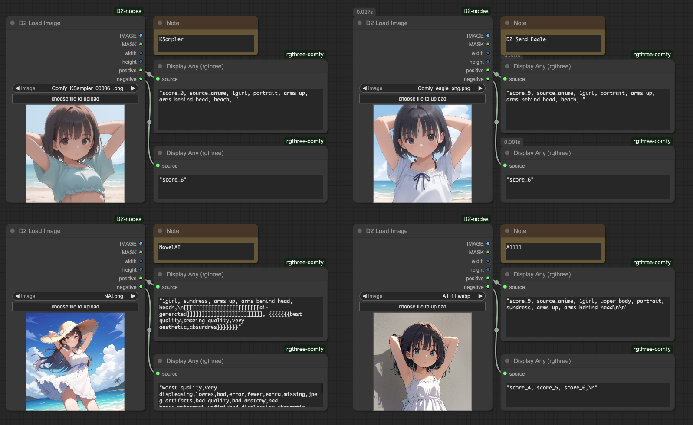

# D2 Nodes ComfyUI

[<a href="README.md">English</a>][日本語][<a href="README_zh.md">繁体中文</a>]

**D2 Nodes ComfyUI** は ComfyUI がちょっとだけ便利になるカスタムノード集です。

**シンプルなワークフローを作りたい方に向いています。**

過去に制作した下記のカスタムノードをまとめ、D2 KSampler などを追加しています。  
**ノード名が衝突してしまうので下記のカスタムノードをインストール済みでしたら削除してください。**

- [ComfyUI-d2-size-selector](https://github.com/da2el-ai/ComfyUI-d2-size-selector)
- [ComfyUI-d2-steps](https://github.com/da2el-ai/ComfyUI-d2-steps)
- [ComfyUI-d2-xyplot-utils](https://github.com/da2el-ai/ComfyUI-d2-xyplot-utils)


## :tomato: Nodes

### D2 Regex Switcher
  

  - 入力テキストを正規表現で検索し、該当したテキストを出力
  - 文字列結合も行える
  
<details class="d2-details">
  <summary><strong>詳細</strong></summary>


  - 主な目的は Checkpoint 毎のクオリティタグの切り替え
  - 入力した `text` の中に合致する文字列を発見すると、対象文字列と、何番目に合致したか（0から開始）を出力する
  - 上の画像では `ioliPonyMixV4.safetensors` を受け取り、検索条件 `pony` に合致したので `score_9` が出力されている
  - 最初の検索条件に合致したので `index` は `0` が出力される
  - 全ての条件に合致しないと `-1` が出力される
  - 文字列の前方結合、後方結合もできる。

  #### Input

  - `text`
    - 検索対象文字列
  - `prefix`
    - 前方に結合する文字列
  - `suffix`
    - 後方に結合する文字列
  - `regex_and_output`
    - 検索文字列と出力文字列の一覧
    - 下記のフォーマットで記入する

  ```
  検索文字 1（正規表現も使用可能）
  --
  出力文字列 1
  --
  検索文字 2（正規表現も使用可能）
  --
  出力文字列 2
  --
  --
  合致するものが無い時に出力する文字
  ```

  #### Output

  - `combined_text`
    - `prefix` + 出力文字列 + `suffix` を結合した文字列
  - `prefix` / `suffix`
    - Input のパススルー


  #### 使用例

  

  この例では合致した番号（`index`）を [Easy Use](https://github.com/yolain/ComfyUI-Easy-Use) の Text Index Switch に渡して切り替えている。

  合致しないと `-1` になってしまうので、全ての文字列に合致する正規表現 `.+` を使ってデフォルト出力の代わりにしている。
</details>


### D2 Prompt SR

  

  - 入力テキストを検索・置換してリストで返すノード
  - XY Plot で Prompt S/R を使うためのカスタムノード
  - [qq-nodes-comfyui](https://github.com/kenjiqq/qq-nodes-comfyui) に対応

<details class="d2-details">
  <summary><strong>詳細</strong></summary>


  #### Input

  - `prompt`
    - プロンプト。改行を含めてもOK
  - `search_txt`
    - 検索対象テキスト。複数単語を含めてもOK。
    - 改行は使えない
  - `replace`
    - 置換用テキスト
    - 改行で区切っているので「,」が含まれていてもOK

  #### Output

  - LIST
    - 置換後のテキストをリスト形式で出力

</details>


### D2 Multi Output

  

  - seed や cfg など汎用的なパラメータをリスト出力するノード

<details class="d2-details">
  <summary><strong>詳細</strong></summary>

  #### Input
  - `type`
    - `FLOAT`: 浮動小数点数。CFGなど
    - `INT`: 整数。stepsなど
    - `STRING`: 文字列。samplerなど
    - `SEED`: 乱数生成ボタンで seed値を入力できる
  - `Add Random`
    - 入力欄に乱数を追加する
    - `type` が `SEED` の時だけ表示される

</details>


### D2 Checkpoint Loader


  - モデルファイルのフルパスを出力する Checkpoint Loader

<details class="d2-details">
  <summary><strong>詳細</strong></summary>

  #### Output
  
  - `model` / `clip` / `vae`
    - 従来の CheckpointLoader と同じ。
  - `ckpt_name` / `ckpt_hash` / `ckpt_fullpath`
    - Checkpoint名、ハッシュ、フルパス。

  実装はほとんど [mikey_nodes](https://github.com/bash-j/mikey_nodes) のコードを使わせていただきました。

</details>


### D2 KSampler / D2 KSampler(Advanced)


  - プロンプトを STRING で入力できる KSampler

<details class="d2-details">
  <summary><strong>詳細</strong></summary>

  #### Input

  - `model` / `clip` / `vae` / ..etc
    - 標準の KSampler と同じ
  - `negative` / `positive`
    - STRING 形式のプロンプト

  #### Output

  - `IMAGE`
    - 画像出力
  - `positive` / `negative`
    - Input のパススルー

</details>


### D2 Load Image



  - 画像からプロンプトを取得できる Load Image ノード
  - StableDiffusion webui A1111、NovelAI で作成した画像にも対応
  - マスクエディターを開くボタンが付いてる

<details class="d2-details">
  <summary><strong>詳細</strong></summary>

  #### Output
  
  - `IMAGE / MASK`
    - 画像とマスク
  - `width / height`
    - 画像サイズ
  - `positive` / `negative`
    - プロンプト

  ※ワークフローの構成によってはプロンプトを取得できない場合もあります。例えば「KSampler」という文字が含まれたノード（例：Tiled KSampler）が無いと取得できません。

</details>


### D2 Size Slector


  - 画像サイズをプリセットから選択できるノード

<details class="d2-details">
  <summary><strong>詳細</strong></summary>

  #### Input

  - `preset`
    - サイズのプリセット
    - プリセットを変更したい時は `/custom_nodes/D2-nodes-ComfyUI/config/sizeselector_config.yaml` を編集
  - `width` / `height`
    - 縦横サイズ
  - `swap_dimensions`
    - width / height を入れ替える
  - `upscale_factor`
    - 他のリサイズ系ノードに渡す数値
  - `prescale_factor`
    - width / height をリサイズする倍数
  - `batch_size`
    - empty_latent にセットする batch size
  
  #### Output
  
  - `width / height`
    - 入力された `width`、`height` に `prescale_factor` を乗算する
  - `upscale_factor` / `prescale_factor`
    - Input されたものをパススルーする
  - `empty_latent`
    - 指定されたサイズ、batch sizeで作成した latent を出力
  - `batch_size`
    - Input されたものをパススルーする

</details>


### D2 Refiner Steps


  - Refiner 用の steps を出力するノード

<details class="d2-details">
  <summary><strong>詳細</strong></summary>

  #### Input

  - `steps`
    - 総step数
  - `start`
    - 最初の KSampler の開始する steps
  - `end`
    - 最初の KSampler の終了する steps
  
  #### Output
  
  - `steps` / `start` / `end`
    - Input のパススルー
  - `refiner_start`
    - 2つめの KSampler の開始する steps

</details>

### D2 Refiner Steps A1111


  - img2img で Refiner するために denoise も指定できるノード

<details class="d2-details">
  <summary><strong>詳細</strong></summary>

  #### Input

  - `steps`
    - 総step数
  - `denoise`
    - img2img の denoise を指定する
  - `switch_at`
    - 総steps数の何割で次の KSampler に切り替えるか
  
  #### Output
  
  - `steps` / 
    - Input のパススルー
  - `start`
    - 最初の KSampler の開始 steps
  - `end`
    - 最初の KSampler の終了 steps
  - `refiner_start`
    - 2つめの KSampler の開始する steps

</details>

### D2 Refiner Steps Tester
  - steps を確認するためのノード


## :card_index_dividers: Sample Workflow
画像を ComfyUI にドロップするとワークフローを再現できます。

**SDXL の XY Plot**

<a href="./workflow/XYPlot_SDXL_20241002.png"></a>

**NovelAI の XY Plot**
<a href="./workflow/XYPlot_NAI_202401002.png"></a>

**Checkpoint のフルパス名で判断してクオリティタグを切り替える**
<a href="./workflow/XYPlot_Checkpoint_20241002.png"></a>

**Refiner で Checkpoint を途中で切り替える**
<a href="./workflow/Refiner_20241002.png"></a>


## :computer: Installation Options

### 1. ComfyUI Manager Installation
ComfyUI Manager → Custom Node Manager → `D2 Nodes` を検索してインストール

### 2. Git Pull Method
custom_nodes フォルダで `git clone` する
```
> git clone https://github.com/da2el-ai/D2-nodes-ComfyUI.git
```

## :blossom: Changelog

**2024.10.10**
- D2 Load Image: "Open Mask Editor"ボタンを追加

**2024.10.08**
- D2 Load Image: 新規追加

**2024.10.03**
- D2 Regex Switcher: 検索にマッチしても素通りする不具合を修正

**2024.10.02**
- 既存のノードを統合して作成