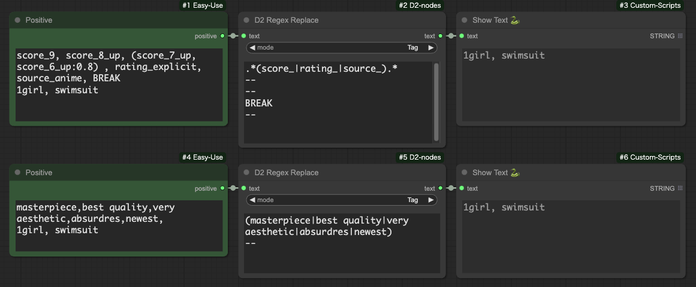
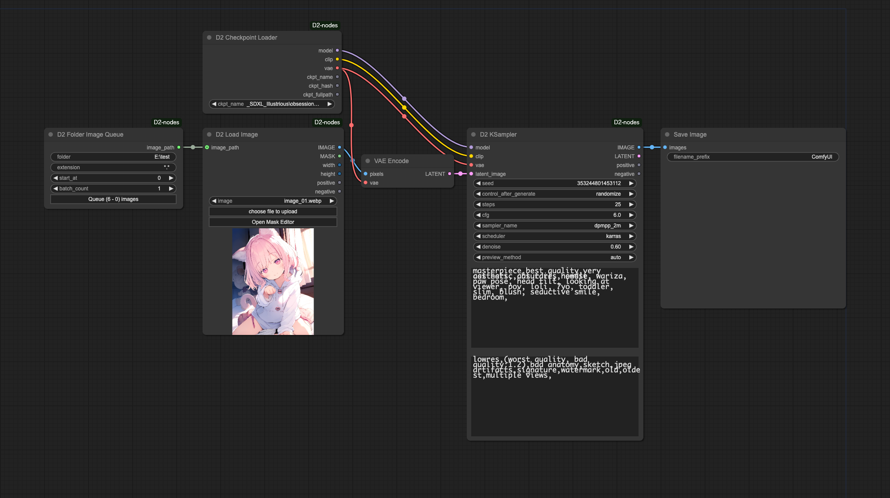
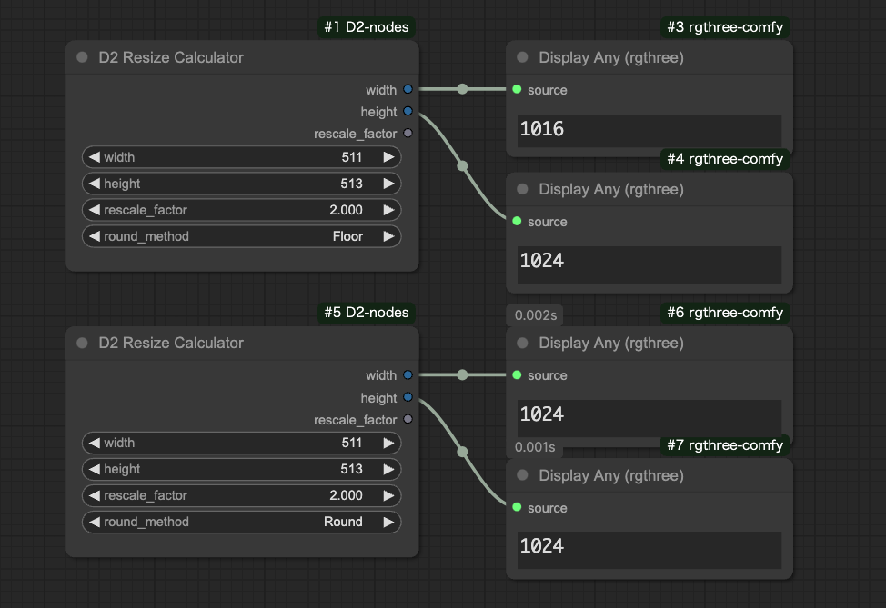
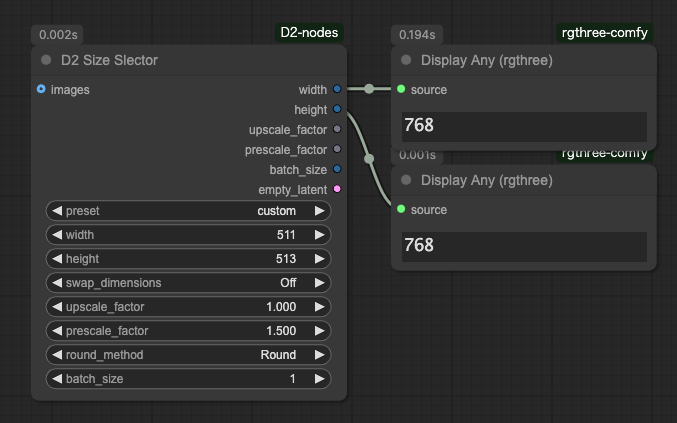
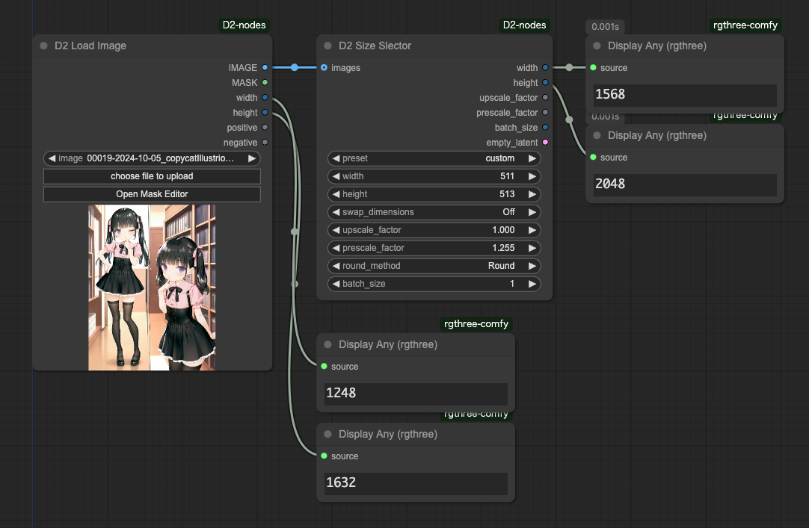
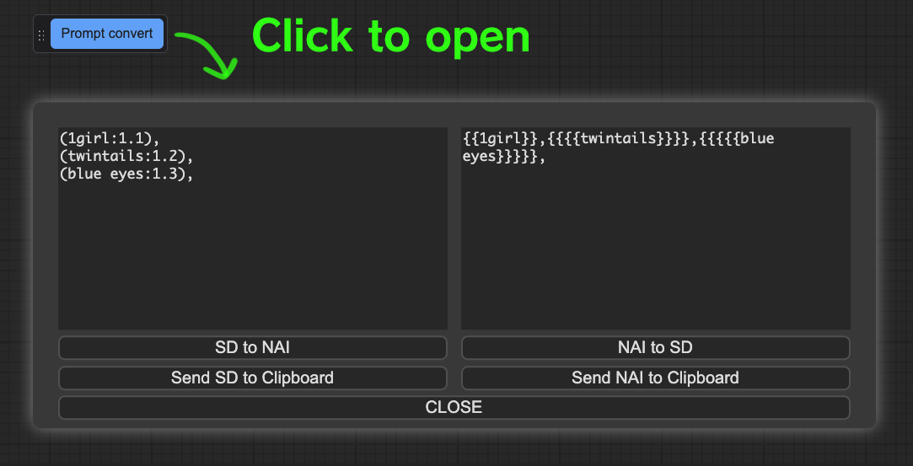
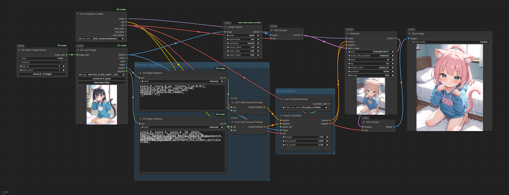

# D2 Nodes ComfyUI

[<a href="README.md">English</a>][<a href="README_ja.md">日本語</a>][繁體中文]

**D2 Nodes ComfyUI** 是一個使 ComfyUI 變得更加方便的自定義節點集合。

**適合想要創建簡單工作流程的用戶。**

**如果您之前已經安裝了以下自訂節點，請務必將其解除安裝。**

- [ComfyUI-d2-size-selector](https://github.com/da2el-ai/ComfyUI-d2-size-selector)
- [ComfyUI-d2-steps](https://github.com/da2el-ai/ComfyUI-d2-steps)
- [ComfyUI-d2-xyplot-utils](https://github.com/da2el-ai/ComfyUI-d2-xyplot-utils)

## :tomato: 節點


### D2 Queue Button

  

- 用於生成指定數量（Batch count）圖像的按鈕
- 可以通過拖動調色板的左邊緣來移動

<details class="d2-details">
  <summary><strong>詳細資訊</strong></summary>

  

- 要隱藏它，請在 ComfyUI 設置畫面的 "D2" 類別中進行配置
- 圖像數量也可以在設置畫面中指定
- 數字之間用逗號（,）分隔

</details>


### D2 Regex Switcher
  

  - 使用正則表達式搜索輸入文本，並輸出匹配的文本
  - 還可以進行字符串連接
  
<details class="d2-details">
  <summary><strong>詳細信息</strong></summary>

  - 主要目的是切換每個 Checkpoint 的質量標籤
  - 當在輸入的 `text` 中發現匹配的字符串時，會輸出目標字符串和它是第幾個匹配（從0開始）
  - 在上面的圖片中，接收到 `ioliPonyMixV4.safetensors`，匹配搜索條件 `pony`，所以輸出 `score_9`
  - 因為匹配了第一個搜索條件，所以 `index` 輸出 `0`
  - 如果不匹配任何條件，則輸出 `-1`
  - 可以進行字符串的前後連接

  #### 輸入

  - `text`
    - 搜索目標字符串
  - `prefix`
    - 前方連接的字符串
  - `suffix`
    - 後方連接的字符串
  - `regex_and_output`
    - 搜索字符串和輸出字符串的列表
    - 按以下格式填寫
  - `pre_delim`
    - 連接 `prefix` 和 `regex_and_output` 時插入的字符
    - `Comma`：`,` / `Line break`：換行 / `None`：不插入任何字符
  - `suf_delim`
    - 連接 `suffix` 和 `regex_and_output` 時插入的字符

  ```
  搜索字符串 1（可以使用正則表達式）
  --
  輸出字符串 1
  --
  搜索字符串 2（可以使用正則表達式）
  --
  輸出字符串 2
  --
  --
  沒有匹配時輸出的字符串
  ```

  #### 輸出

  - `combined_text`
    - 連接 `prefix` + 輸出字符串 + `suffix` 的字符串
  - `prefix` / `suffix`
    - 輸入的直接傳遞

  #### 使用示例

  

  在這個例子中，將匹配的編號（`index`）傳遞給 [Easy Use](https://github.com/yolain/ComfyUI-Easy-Use) 的 Text Index Switch 進行切換。

  因為不匹配時會變成 `-1`，所以使用匹配所有字符串的正則表達式 `.+` 作為默認輸出的替代。
</details>


### D2 Regex Replace

  

- 替換輸入文字
- 可以指定多個條件

<details class="d2-details">
  <summary><strong>詳細</strong></summary>

- 支持使用正則表達式進行替換
- 支持重複使用正則表達式匹配字串（使用 \1、\2 等）
- 可以按「標籤單位」或「整體」處理目標字串

#### 輸入

- `text`
    - 搜尋目標字串
- `mode`
  - `Tag`: 將 `text` 按換行和逗號分解，然後單獨替換
  - `Advanced`: 整體替換 `text`
- `regex_and_output`
    - 搜尋模式和輸出字串的列表
    - 按以下格式輸入
    - 當輸出字串為空時，將刪除匹配部分
    - 模式數量沒有上限
```
搜尋模式 1
--
輸出字串 1
--
搜尋模式 2
--
輸出字串 2
```

#### 輸出

- `text`
    - 經過替換處理的文字

#### Sample

移除Pony系列品質標籤的範例。

Mode: `Tag`

Input text
```
score_9, score_8_up, (score_7_up, score_6_up:0.8) , rating_explicit, source_anime, BREAK
1girl, swimsuit
```
Regex Replace
```
.*(score_|rating_|source_).*
--
--
BREAK
--

```

Output text
```
1girl, swimsuit
```

</details>


### D2 Prompt SR

  

  - 搜索和替換輸入文本並以列表形式返回的節點
  - 用於在 XY Plot 中使用 Prompt S/R 的自定義節點
  - 兼容 [qq-nodes-comfyui](https://github.com/kenjiqq/qq-nodes-comfyui)

<details class="d2-details">
  <summary><strong>詳細信息</strong></summary>

  #### 輸入

  - `prompt`
    - 提示。可以包含換行
  - `search_txt`
    - 搜索目標文本。可以包含多個單詞。
    - 不能使用換行
  - `replace`
    - 替換用文本
    - 因為用換行分隔，所以即使包含「,」也沒問題

  #### 輸出

  - LIST
    - 以列表形式輸出替換後的文本

</details>

### D2 Multi Output

  

  - 輸出 seed 或 cfg 等通用參數列表的節點

<details class="d2-details">
  <summary><strong>詳細信息</strong></summary>

  #### 輸入
  - `type`
    - `FLOAT`: 浮點數。例如 CFG
    - `INT`: 整數。例如 steps
    - `STRING`: 字符串。例如 sampler
    - `SEED`: 可以用隨機生成按鈕輸入 seed 值
  - `Add Random`
    - 在輸入欄添加隨機數
    - 只有在 `type` 為 `SEED` 時才顯示

</details>

### D2 Checkpoint Loader


  - 輸出模型文件完整路徑的 Checkpoint Loader

<details class="d2-details">
  <summary><strong>詳細信息</strong></summary>

  #### 輸出
  
  - `model` / `clip` / `vae`
    - 與傳統的 CheckpointLoader 相同。
  - `ckpt_name` / `ckpt_hash` / `ckpt_fullpath`
    - Checkpoint 名稱、哈希值、完整路徑。

  實現主要使用了 [mikey_nodes](https://github.com/bash-j/mikey_nodes) 的代碼。

</details>

### D2 KSampler / D2 KSampler(Advanced)


  - 可以以 STRING 形式輸入提示的 KSampler

<details class="d2-details">
  <summary><strong>詳細信息</strong></summary>

  #### 輸入

  - `model` / `clip` / `vae` / ..etc
    - 與標準 KSampler 相同
  - `negative` / `positive`
    - STRING 格式的提示

  #### 輸出

  - `IMAGE`
    - 圖像輸出
  - `positive` / `negative`
    - 輸入的直接傳遞

</details>


### D2 Load Image


  - 可從圖片中提取提示詞的載入圖片節點
  - 支援由 StableDiffusion webui A1111 和 NovelAI 創建的圖片
  - 已添加打開遮罩編輯器的按鈕

<details class="d2-details">
  <summary><strong>詳細信息</strong></summary>

  #### Input
  - `image_path`
    - 用於與 D2 Folder Image Queue 連接
    - 輸入圖片路徑時讀取文件

  #### Output
  
  - `IMAGE / MASK`
    - 圖片和遮罩
  - `width / height`
    - 圖片尺寸
  - `positive` / `negative`
    - 提示詞

  注意：根據工作流程的配置，有時可能無法獲取提示詞。例如，如果沒有包含「KSampler」字樣的節點（如 Tiled KSampler），就無法獲取提示詞。

</details>


### D2 Folder Image Queue


- 輸出文件夾中圖片的路徑
- 點擊 `Queue (x - y) images` 按鈕可執行對應圖片數量的佇列。請勿使用標準的 Queue 按鈕
- 非常方便，因為使用者不需要手動計算圖片數量

<details class="d2-details">
  <summary><strong>詳細</strong></summary>



- 此工作流程使用相同的提示詞對文件夾中的所有圖片執行 img2img
- 在 Sample Workflow 章節中介紹了更詳細的工作流程

#### 輸入

- `folder`
  - 圖片文件夾
- `extension`
  - 指定文件名過濾器
  - `*.*`: 所有圖片
  - `*.png`: 僅 PNG 格式
- `start_at`
  - 開始處理的圖片編號
- `batch_count`
  - 每張圖片註冊多少個佇列
- `Queue (x - y) images`
  - 開始生成的按鈕
  - x: 圖片數量
  - y: `start_at`

#### 輸出

- `image_path`
  - 圖片的完整路徑

</details>


### D2 EmptyImage Alpha


- 在 EmptyImage 中添加α通道（透明度）


### D2 Image Resize


- 簡單的圖像縮放
- 可指定至小數點後三位
- 可選擇四捨五入、無條件捨去或無條件進位


### D2 Resize Calculator



- 計算出的數值必定為8的倍數
- 可選擇四捨五入、無條件捨去或無條件進位


### D2 Size Selector



  - 可以從預設中選擇圖像尺寸的節點

<details class="d2-details">
  <summary><strong>詳細信息</strong></summary>

  
  這是一個從圖像獲取尺寸，放大1.255倍，然後四捨五入結果的例子。

  #### 輸入

  - `images`
    - 用於從圖像獲取尺寸
    - 需要將 `preset` 設置為 `custom`
  - `preset`
    - 尺寸預設
    - 使用 `width`、`height` 或 `images` 尺寸時需設置為 `custom`
    - 要更改預設，請編輯 `/custom_nodes/D2-nodes-ComfyUI/config/sizeselector_config.yaml`
  - `width` / `height`
    - 垂直和水平尺寸
    - 需要將 `preset` 設置為 `custom`
  - `swap_dimensions`
    - 交換寬度和高度
  - `upscale_factor`
    - 傳遞給其他調整大小相關節點的值
  - `prescale_factor`
    - 調整寬度/高度的倍數
  - `round_method`
    - `Round`：四捨五入
    - `Floor`：向下取整
  - `batch_size`
    - 設置給 empty_latent 的批次大小
  
  #### 輸出
  
  - `width / height`
    - 將輸入的 `width`、`height` 乘以 `prescale_factor`
  - `upscale_factor` / `prescale_factor`
    - 直接傳遞輸入的值
  - `empty_latent`
    - 輸出指定尺寸和 batch size 創建的 latent
  - `batch_size`
    - 直接傳遞輸入的值

</details>

### D2 Refiner Steps


  - 輸出 Refiner 用 steps 的節點

<details class="d2-details">
  <summary><strong>詳細信息</strong></summary>

  #### 輸入

  - `steps`
    - 總步數
  - `start`
    - 第一個 KSampler 開始的步數
  - `end`
    - 第一個 KSampler 結束的步數
  
  #### 輸出
  
  - `steps` / `start` / `end`
    - 輸入的直接傳遞
  - `refiner_start`
    - 第二個 KSampler 開始的步數

</details>

### D2 Refiner Steps A1111


  - 可以為 img2img 的 Refiner 指定 denoise 的節點

<details class="d2-details">
  <summary><strong>詳細信息</strong></summary>

  #### 輸入

  - `steps`
    - 總步數
  - `denoise`
    - 指定 img2img 的 denoise
  - `switch_at`
    - 在總步數的多少比例切換到下一個 KSampler
  
  #### 輸出
  
  - `steps` / 
    - 輸入的直接傳遞
  - `start`
    - 第一個 KSampler 開始的步數
  - `end`
    - 第一個 KSampler 結束的步數
  - `refiner_start`
    - 第二個 KSampler 開始的步數

</details>

### D2 Refiner Steps Tester
  - 用於確認步數的節點


### Prompt convert dialog



- 提供 NovelAI 和 StableDiffusion 權重（weight）互相轉換的對話框
- 從 `Prompt convert` 按鈕開啟
- 預設為隱藏狀態
- 啟用 `settings > D2 > Show prompt convert button` 後即可顯示


## :card_index_dividers: 示例工作流程
將圖像拖放到 ComfyUI 中可以重現工作流程。

**處理文件夾中的所有圖片**
從圖片中提取提示詞，替換品質標籤，應用 ControlNet AnyTest，並進行放大。
<a href="./workflow/folder_image_queue_adv_20241025.png"></a>

**SDXL 的 XY Plot**

<a href="./workflow/XYPlot_SDXL_20241002.png"></a>

**NovelAI 的 XY Plot**
<a href="./workflow/XYPlot_NAI_202401002.png"></a>

**根據 Checkpoint 的完整路徑名判斷並切換質量標籤**
<a href="./workflow/XYPlot_Checkpoint_20241002.png"></a>

**在 Refiner 中途切換 Checkpoint**
<a href="./workflow/Refiner_20241002.png"></a>

## :computer: 安裝選項

### 1. ComfyUI Manager 安裝
ComfyUI Manager → Custom Node Manager → 搜索 `D2 Nodes` 並安裝

### 2. Git Pull 方法
在 custom_nodes 文件夾中執行 `git clone`
```
> git clone https://github.com/da2el-ai/D2-nodes-ComfyUI.git
```

## :blossom: 更新日誌

**2024.11.02**

- D2 Regex Switcher: 新增輸入文字確認文字區域的顯示/隱藏切換功能

**2024.10.28**

- Prompt convert: 新增 NovelAI 和 StableDiffusion 提示詞（prompt）互相轉換的對話框
- D2 Folder Image Queue: 修復生成圖片數量不一致的錯誤

**2024.10.26**

- 新增 D2 EmptyImage Alpha
- 新增 D2 Image Resize
- 新增 D2 Resize Calculator

**2024.10.24**

- 新增 D2 Regex Replace
- 新增 D2 Folder Image Queue
- D2 Load Image: 添加圖片路徑輸入
- D2 KSampler(Advanced): 在輸入中添加 Positive / Negative Conditioning
  
**2024.10.19**

- 新增 D2 Queue Button

**2024.10.18**
- D2 Size Selector：新增從圖像獲取尺寸的功能
- D2 Size Selector：新增可選擇「四捨五入」和「向下取整」的調整大小方法
  
**2024.10.14**
- D2 Load Image：修復了在載入沒有Exif數據的圖片（例如從剪貼板貼上的圖片）時發生的錯誤

**2024.10.11**
- D2 Regex Switcher：新增指定連接字符串時插入的字符的功能

**2024.10.10**
- D2 Load Image: 已添加"打開遮罩編輯器"按鈕

**2024.10.08**
- D2 Load Image：新增功能

**2024.10.03**
- D2 Regex Switcher: 修復了搜尋功能未在首次匹配時停止，導致忽略有效匹配項的錯誤

**2024.10.02**
- 整合現有節點創建
