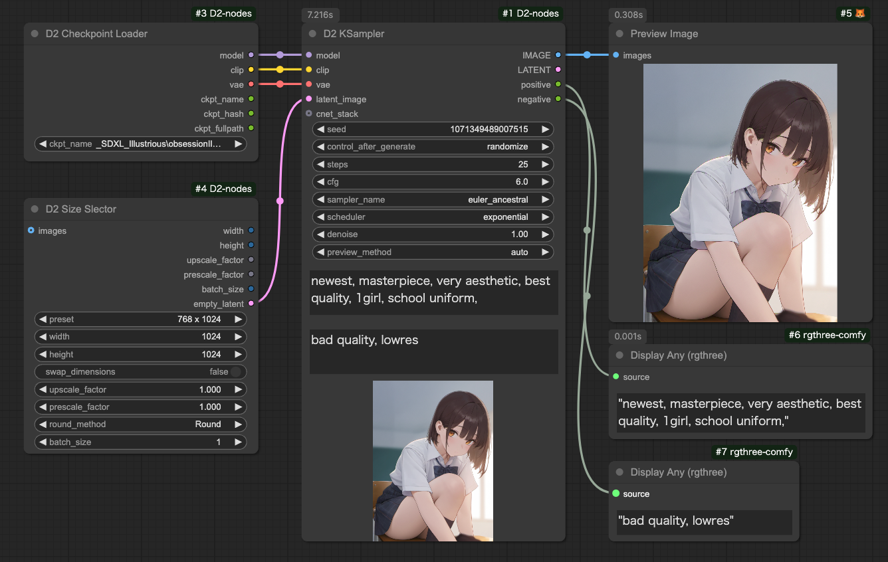
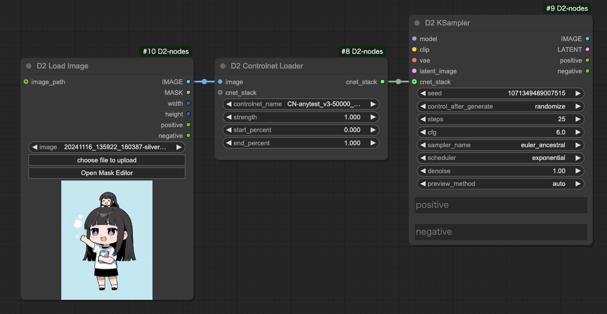
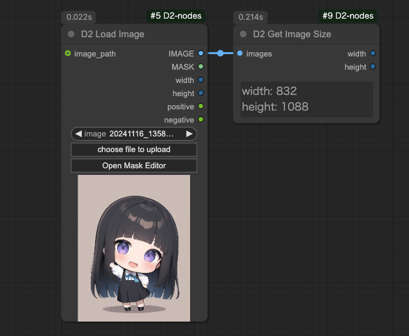
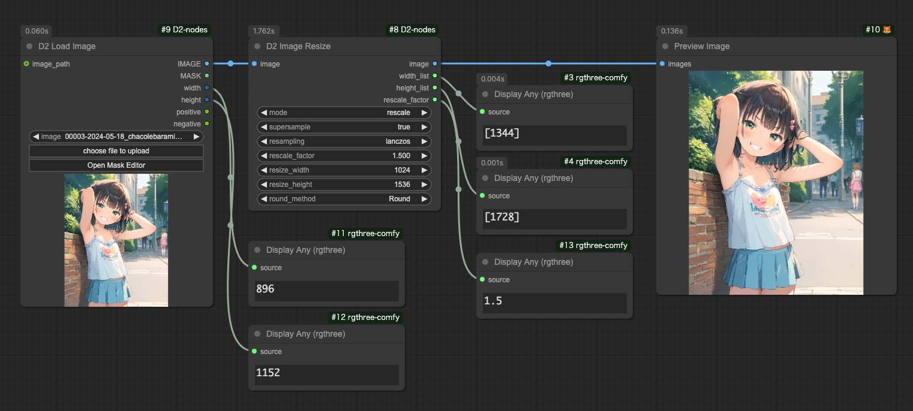
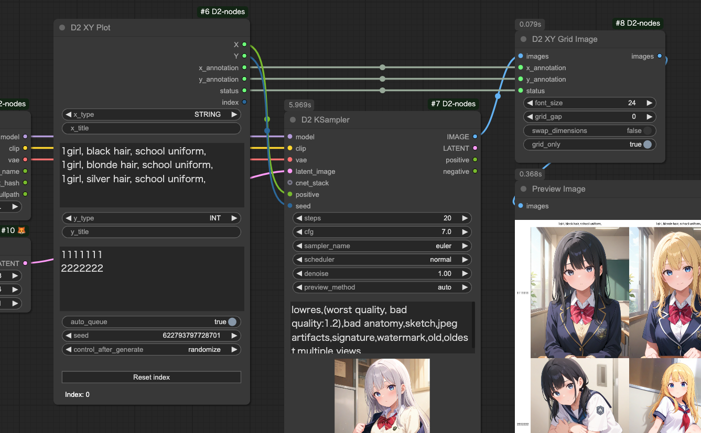
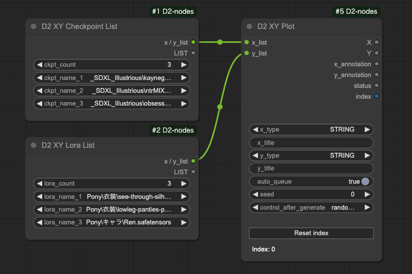
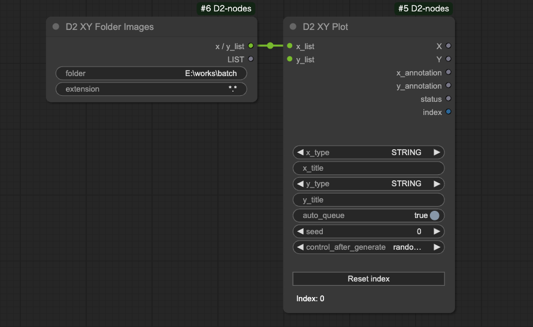
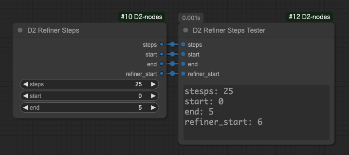
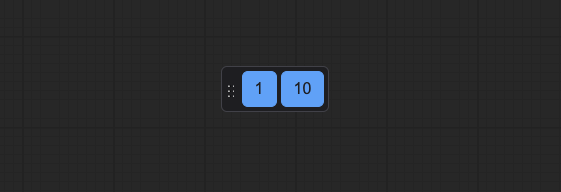
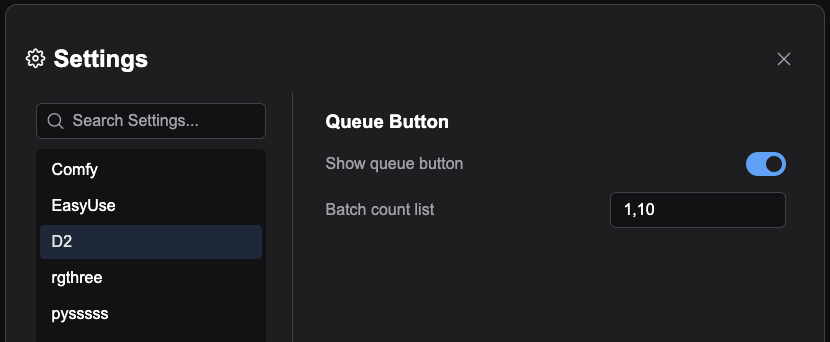

<div style="text-align:center; margin-block:2rem;">
<a href="../en/index.md">English</a> | <a href="../ja/index.md">日本語</a> | <a href="../zh/index.md">繁体中文</a>
</div>

<div style="margin-block:2rem;">
<a href="index.md">Top</a> | <a href="node.md">Node</a> | <a href="workflow.md">Workflow</a>
</div>


# Node

## :tomato: Sampler Nodes

### D2 KSampler / D2 KSampler(Advanced)

<figure>

</figure>

- KSampler that can input prompts as STRING

#### Input

- `cnet_stack`
  - For connecting to `D2 Controlnet Loader`
- `model` / `clip` / `vae` / ..etc
    - Same as standard KSampler
- `negative` / `positive`
    - Prompts in STRING format

#### Output

- `IMAGE`
    - Image output
- `positive` / `negative`
    - Input passthrough

---

## :tomato: Loader Node

### D2 Checkpoint Loader


- Checkpoint Loader that outputs the full path of model files

#### Output

- `model` / `clip` / `vae`
    - Same as conventional CheckpointLoader
- `ckpt_name` / `ckpt_hash` / `ckpt_fullpath`
    - Checkpoint name, hash, and full path

Implementation mostly uses code from [mikey_nodes](https://github.com/bash-j/mikey_nodes).

---

### D2 Controlnet Loader

<figure>

</figure>

- Controlnet Loader that creates simple workflows when connected to `D2 KSampler`

#### Input

- `cnet_stack`
  - For connecting to `D2 Controlnet Loader`

#### Output

- `cnet_stack`
  - For connecting to `D2 KSampler` or `D2 Controlnet Loader`

---

## :tomato: Image Node

### D2 Load Image

<figure>

</figure>

- Load Image node that can extract prompts from images
- Compatible with images created in StableDiffusion webui A1111 and NovelAI
- Includes a button to open mask editor

#### Input

- `image_path`
  - Loads file when image path is input
  - Used for connection with `D2 Folder Image Queue`

#### Output

- `IMAGE / MASK`
    - Image and mask
- `width / height`
    - Image size
- `positive` / `negative`
    - Prompts

Note: Prompts may not be retrievable depending on workflow configuration. For example, they cannot be retrieved without a node containing the string "KSampler" (e.g., Tiled KSampler).

---

### D2 Load Folder Images

<figure>

</figure>

- Batch loads and outputs images from a folder
- Used with `D2 Grid Image` etc.
- Use `D2 Folder Image Queue` for sequential processing

#### Input

- `folder`
  - Specify folder in full path
- `extension`
  - Specify like `*.jpg` to load only JPEG images
  - Can also specify patterns like `*silver*.webp`

---

### D2 Folder Image Queue

<figure>

</figure>

- Outputs paths of images in a folder
- Automatically executes Queue for the number of images when Queue is run

#### Input

- `folder`
  - Image folder
- `extension`
  - Specify file name filter
  - `*.*`: All images
  - `*.png`: PNG format only
- `start_at`
  - Image number to start processing
- `auto_queue`
  - `true`: Automatically execute remaining Queues
  - `false`: Execute only once

#### Output

- `image_path`
  - Full path of image

---

### D2 Grid Image

<figure>

</figure>

- Outputs grid images
- Supports both horizontal and vertical layouts

#### Input

- `max_columns`
  - Number of images to align horizontally
  - Number of images vertically when `swap_dimensions` is `true`
- `grid_gap`
  - Gap between images
- `swap_dimensions`
  - `true`: Vertical direction
  - `false`: Horizontal direction
- `trigger`
  - `true`: Output grid image
  - `false`: Only retain images without outputting grid image

---

### D2 Image Stack

<figure>

</figure>

- Outputs multiple input images together
- Can input up to 50 images

#### Input

- `image_count`
  - Can increase/decrease number of inputs. Maximum 50

---

### D2 EmptyImage Alpha

<figure>

</figure>

- Adds alpha channel (transparency) to EmptyImage

---

## :tomato: Size Node

### D2 Get Image Size

<figure>

</figure>

- Both outputs and displays size

---

### D2 Size Selector

<figure>

</figure>

- Node for selecting image size from presets
- Can also get size from images
- Rounding method can be selected from `Ceil / Float / None`

#### Input

- `images`
    - Used when getting size from images
    - `preset` must be set to `custom`
- `preset`
    - Size presets
    - Must be set to `custom` when using `width` `height` below or image sizes
    - Edit `/custom_nodes/D2-nodes-ComfyUI/config/sizeselector_config.yaml` to modify presets
- `width` / `height`
    - Width/height dimensions
    - `preset` must be set to `custom`
- `swap_dimensions`
    - Swap width/height
- `upscale_factor`
    - Value passed to other resize nodes. Does nothing in this node
- `prescale_factor`
    - Output width/height after resizing by this factor
- `round_method`
    - `Round`: Round to nearest
    - `Floor`: Round down
    - `None`: No rounding
- `batch_size`
    - Batch size to set for empty_latent

#### Output

- `width / height`
    - Input `width`, `height` multiplied by `prescale_factor`
- `upscale_factor` / `prescale_factor`
    - Passthrough of input
- `batch_size`
    - Passthrough of input
- `empty_latent`
    - Outputs latent created with specified size and batch size

---

### D2 Image Resize

<figure>

</figure>

- Simple image resizing
- Precision up to 3 decimal places
- Can select rounding, floor, or ceiling

---

### D2 Resize Calculator

<figure>

</figure>

- Calculated values are always multiples of 8
- Can select rounding, floor, or ceiling

---

## :tomato: Text Node

### D2 Regex Replace

<figure>

</figure>

- Can replace using regular expressions
- Multiple conditions can be specified
- Supports reuse of regex match strings (e.g., \1, \2)
- Target string can be specified by "tag unit" or "whole"

#### Input

- `text`
    - Target string for search
- `mode`
  - `Tag`: Break down `text` by newlines and "," and replace individually
  - `Advanced`: Replace `text` as a whole
- `regex_and_output`
    - List of search strings and output strings
    - Write in following format
    - If output string is empty, matched part is deleted
    - No limit on number of entries

```
Search string 1
--
Output string 1
--
Search string 2
--
Output string 2
```

#### Output

- `text`
    - Text after replacement

#### Sample

Sample for removing Pony series quality tags.

Mode: `Tag`

Input text
```
score_9, score_8_up, (score_7_up, score_6_up:0.8) , rating_explicit, source_anime, BREAK
1girl, swimsuit
```
Regex Replace
```
.*(score_|rating_|source_).*
--
--
BREAK
--

```

Output text
```
1girl, swimsuit
```

---

### D2 Regex Switcher


- Searches input text with regex and outputs matching text
- Main purpose is switching quality tags per Checkpoint
- When matching string is found in input `text`, outputs target string and match index (starting from 0)
- Can concatenate strings at front and back

#### Input

- `text`
    - Search target string
- `prefix`
    - String to concatenate at front
- `suffix`
    - String to concatenate at back
- `regex_and_output`
    - List of search strings and output strings
    - Write in following format
- `pre_delim`
    - Character inserted between `prefix` and `regex_and_output`
    - `Comma`: `,` / `Line break`: newline / `None`: nothing
- `suf_delim`
    - Character inserted between `regex_and_output` and `suffix`

#### Output

- `combined_text`
    - String combining `prefix` + output string + `suffix`
- `prefix` / `suffix`
    - Input passthrough

---

### D2 Multi Output

<figure>

</figure>

- Node that outputs generic parameters like seed and cfg as lists

#### Input

- `type`
    - `FLOAT`: Floating point numbers. For CFG etc.
    - `INT`: Integers. For steps etc.
    - `STRING`: Strings. For sampler etc.
    - `SEED`: Can input seed values with random number button
- `Add Random`
    - Adds random numbers to input field
    - Only shown when `type` is `SEED`

---

## :tomato: XY Plot Node

### D2 XY Plot

<figure>

</figure>

- Node for creating versatile XY Plot workflows
- X/Y inputs are simple newline-separated text for easy combination with other nodes

#### Input

- `x_type` / `y_type`
  - Specify data type of `x_list` `y_list` from `STRING` `INT` `FLOAT`
- `x_title` / `y_title`
  - Text to add to header text
- `x_list` / `y_list`
  - XY Plot change contents
  - Newline-separated text that can be input using other nodes
- `auto_queue`
  - `true`: Automatically execute required number of Queues
  - `false`: Manually execute Queue
- `Reset index`
  - Reset index with this button when stopped midway

#### Output

- `X` / `Y`
  - Elements retrieved from `x_list` `y_list`
- `x_annotation` / `y_annotation`
  - Header text to connect to `D2 XY Grid Image`
- `status`
  - Control signal to connect to `D2 XY Grid Image`
- `index`
  - Current processing count

---

### D2 XY Grid Image

<figure>

</figure>

- Grid image creation node used with `D2 XY Plot`

#### Input

- `x_annotation` / `y_annotation`
  - Header text for grid image
- `status`
  - Control text from `D2 XY Plot`
  - `INIT`: Initialize
  - `FINISH`: Output grid image
  - `{empty string}`: Other states
- `font_size`
  - Header text font size
- `grid_gap`
  - Gap between images
- `swap_dimensions`
  - `true`: Vertical grid
  - `false`: Horizontal grid
- `grid_only`
  - `true`: Output only grid image
  - `false`: Output individual images too

---

### D2 XY Prompt SR

<figure>

</figure>

- Search and replace input text to pass to `D2 XY Plot`
- Can output as list

#### Input

- `prompt`
    - Prompt. Can include newlines
- `search_txt`
    - Search target text. Can include multiple words
    - Cannot use newlines
- `replace`
    - Replacement text
    - OK to include "," as it's separated by newlines

#### Output

- `x / y_list`
  - Connect to `D2 XY Plot`
- `LIST`
  - Output replaced text as list

---

### D2 XY Prompt SR2

<figure>

</figure>

- Search and replace prompts received from `D2 XY Plot` before passing to KSampler
- Use this to recreate Stable Diffusion webui A1111's Prompt S/R

#### Input

- `x_y`
  - Replacement text received from `D2 XY Plot`
- `prompt`
    - Target text for replacement
- `search`
    - Search text. Can include multiple words
    - Cannot use newlines

---

### D2 XY Seed

<figure>

</figure>

- Outputs random number when `-1` is specified
- Other numbers are output as-is
- Must set `x/y_type` to `INT` on `D2 XY Plot` side

---

### D2 XY Checkpoint List / D2 XY Lora List

<figure>

</figure>

- Node to pass Checkpoint/Lora to `D2 XY Plot`
- Can specify up to 50

---

### D2 XY Folder Images

<figure>

</figure>

- Node to pass image paths from specified folder to `D2 XY Plot`

---

### D2 XY Annotation

<figure>

</figure>

- Used to add headers when not using `D2 XY Plot` or when doing special XY Plot

---

### D2 XY List To Plot

<figure>

</figure>

- Converts output from list-outputting nodes for use with `D2 XY Plot`
- Internally just does `"\n".join(list)`, so will behave unexpectedly if list contents contain newlines

---

## :tomato: Refiner Node

### D2 Refiner Steps

<figure>

</figure>

- Node for outputting steps for Refiner

#### Input

- `steps`
    - Total step count
- `start`
    - Starting steps for first KSampler
- `end`
    - Ending steps for first KSampler

#### Output

- `steps` / `start` / `end`
    - Input passthrough
- `refiner_start`
    - Starting steps for second KSampler

---

### D2 Refiner Steps A1111

<figure>

</figure>

- Node that can specify denoise for Refiner in img2img

#### Input

- `steps`
    - Total step count
- `denoise`
    - Specify denoise for img2img
- `switch_at`
    - What percentage of total steps to switch to next KSampler

#### Output

- `steps`
    - Input passthrough
- `start`
    - Starting steps for first KSampler
- `end`
    - Ending steps for first KSampler
- `refiner_start`
    - Starting steps for second KSampler

---

### D2 Refiner Steps Tester

- Node for checking steps

---

## :tomato: Float Palet

### D2 Queue Button

<figure>

</figure>

- Button to generate specified number of images (Batch count)
- Can be moved by dragging left edge of palette

<figure>

</figure>

- Configure visibility in ComfyUI settings under `D2` category
- Number of images can also be set from settings screen
- Separate numbers with comma (,)

---

### Prompt convert dialog

<figure>

</figure>

- Dialog for converting weights between NovelAI and StableDiffusion
- Open from `Prompt convert` button
- Hidden by default
- Enable display by activating `settings > D2 > Show prompt convert button`

