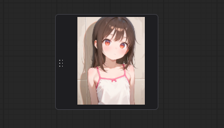

<a href="../en/index.md">English</a> | <a href="../ja/index.md">日本語</a> | <a href="../zh/index.md">繁体中文</a>

- <a href="index.md">Top</a>
- <a href="node.md">Node</a> / <a href="node_image.md">Image Node</a> / <a href="node_text.md">Text Node</a> / <a href="node_xy.md">XYPlot Node</a> / <a href="node_float.md">Float Palet</a>
- <a href="workflow.md">Workflow</a>

# Node

## :tomato: Float Palet

### D2 Queue Button

<figure>

</figure>

- Button to generate specified number of images (Batch count)
- Can be moved by dragging left edge of palette

<figure>

</figure>

- Configure visibility in ComfyUI settings under `D2` category
- Number of images can also be set from settings screen
- Separate numbers with comma (,)

---

### Prompt convert dialog

<figure>

</figure>

- Dialog for converting weights between NovelAI and StableDiffusion
- Open from `Prompt convert` button
- Hidden by default
- Enable display by activating `settings > D2 > Show prompt convert button`

---

### D2 Progress Preview

<figure>

</figure>

- Displays images during generation and after generation
- Images after generation can be clicked to launch a gallery (Lightbox style)
- Targets all output nodes, so content may sometimes be duplicated
- Enable display by activating `settings > D2 > Show progress preview` (shown by default)