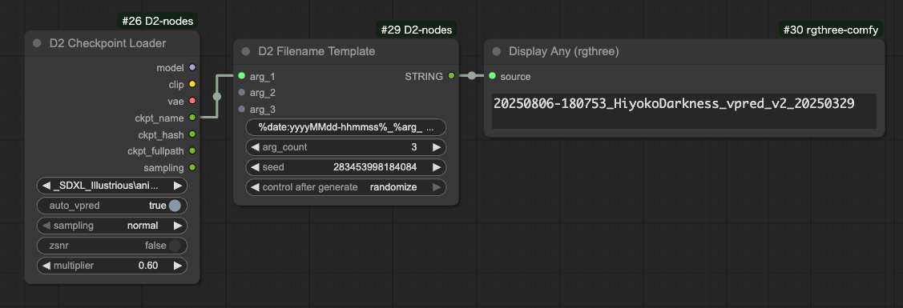
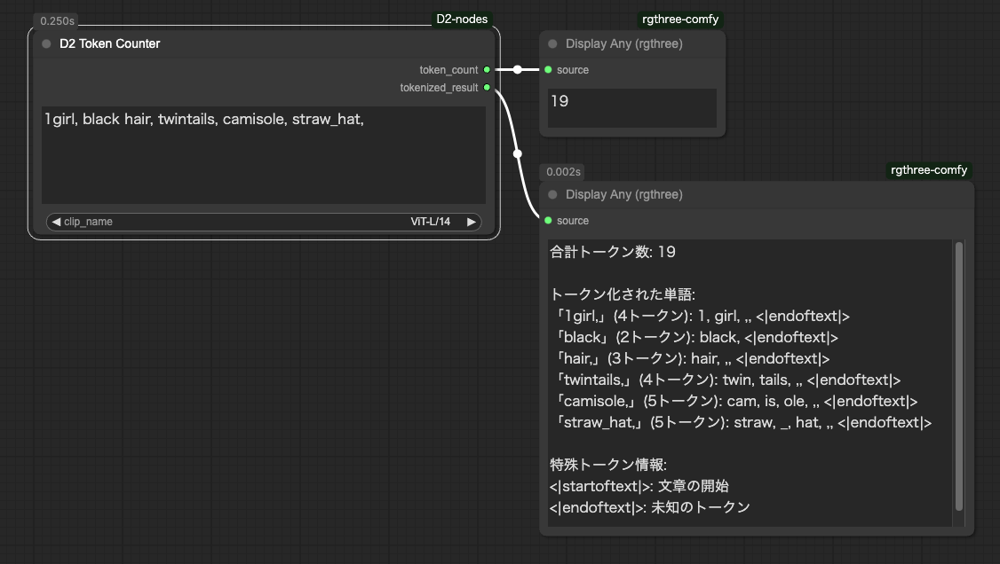

<a href="../en/index.md">English</a> | <a href="../ja/index.md">日本語</a> | <a href="../zh/index.md">繁体中文</a>

- <a href="index.md">Top</a>
- <a href="node.md">Node</a> / <a href="node_image.md">Image Node</a> / <a href="node_text.md">Text Node</a> / <a href="node_xy.md">XYPlot Node</a> / <a href="node_float.md">Float Palet</a>
- <a href="workflow.md">Workflow</a>


# Node


## :tomato: Text Node

### D2 Regex Replace

<figure>

</figure>

- Can replace using regular expressions
- Multiple conditions can be specified
- Supports reuse of regex match strings (e.g., \1, \2)
- Target string can be specified by "tag unit" or "whole"

#### Input

- `text`
    - Target string for search
- `mode`
  - `Tag`: Break down `text` by newlines and "," and replace individually
  - `Advanced`: Replace `text` as a whole
- `regex_and_output`
    - List of search strings and output strings
    - Write in following format
    - If output string is empty, matched part is deleted
    - No limit on number of entries

```
Search string 1
--
Output string 1
--
Search string 2
--
Output string 2
```

#### Output

- `text`
    - Text after replacement

#### Sample

Sample for removing Pony series quality tags.

Mode: `Tag`

Input text
```
score_9, score_8_up, (score_7_up, score_6_up:0.8) , rating_explicit, source_anime, BREAK
1girl, swimsuit
```
Regex Replace
```
.*(score_|rating_|source_).*
--
--
BREAK
--

```

Output text
```
1girl, swimsuit
```

---

### D2 Regex Switcher


- Searches input text with regex and outputs matching text
- Main purpose is switching quality tags per Checkpoint
- When matching string is found in input `text`, outputs target string and match index (starting from 0)
- Can concatenate strings at front and back

#### Input

- `text`
    - Search target string
- `prefix`
    - String to concatenate at front
- `suffix`
    - String to concatenate at back
- `regex_and_output`
    - List of search strings and output strings
    - Write in following format
- `pre_delim`
    - Character inserted between `prefix` and `regex_and_output`
    - `Comma`: `,` / `Line break`: newline / `None`: nothing
- `suf_delim`
    - Character inserted between `regex_and_output` and `suffix`

#### Output

- `combined_text`
    - String combining `prefix` + output string + `suffix`
- `prefix` / `suffix`
    - Input passthrough

---

### D2 Multi Output

<figure>

</figure>

- Node that outputs generic parameters like seed and cfg as lists

#### Input

- `type`
    - `FLOAT`: Floating point numbers. For CFG etc.
    - `INT`: Integers. For steps etc.
    - `STRING`: Strings. For sampler etc.
    - `SEED`: Can input seed values with random number button
- `Add Random`
    - Adds random numbers to input field
    - Only shown when `type` is `SEED`

---

### D2 Filename Template / D2 Filename Template2

<figure>
  
</figure>

- A node for creating filenames
- Can incorporate external elements
- `D2 Filename Template2` is a version that supports multiple lines

#### Input

- `arg_{number}`
  - Import values from other nodes
- `format`
    - `%date:{yyyy/MM/dd/hh/mm/ss}%`
      - `yyyy`: Year
      - `MM`: Month
      - `dd`: Day
      - `hh`: Hour
      - `mm`: Minute
      - `ss`: Second
    - `%node:{id}.{key}%`
      - Retrieves values by specifying node ID and item name
      - Example: `%node:8.width%`: Get width from node ID 8
    - `%arg_{number}%`
      - Embed input values
    - `%arg_{number}:ckpt_name%`
      - Embed checkpoint name with `.safetensors` removed
    - `%seed%`
      - Embed seed value
- `arg_count`
  - Increase or decrease the number of input items

#### Example
```
%date:yyyyMMdd-hhmmss%_%arg_1:ckpt_name%
👇
20241219-021926_obsessionIllustrious_v31
```


---


### D2 Prompt

<figure>
  
</figure>

- You can select LoRA from the `CHOOSE` button and insert an A1111-style LoRA prompt
- Delete comments in text
- Targets lines starting with "#", lines starting with "//", and text between "/*" and "*/"
- Displays token count at the bottom
- Uses "ViT-L/14" CLIP for token count measurement. Please use `D2 Token Counter` if you want to use other CLIP models


#### About Comment Shortcut Keys

- Comment shortcut key (ctrl + /) is available in all text boxes
- Shortcut keys can be changed in `Settings > D2 > shortcutKey`
- Delete the content above if you want to disable it

---

### D2 Token Counter

<figure>
  
</figure>

- Counts tokens in prompts
