<a href="../en/index.md">English</a> | <a href="../ja/index.md">日本語</a> | <a href="../zh/index.md">繁体中文</a>

- <a href="index.md">Top</a>
- <a href="node.md">Node</a> / <a href="node_image.md">Image Node</a> / <a href="node_text.md">Text Node</a> / <a href="node_xy.md">XYPlot Node</a> / <a href="node_float.md">Float Palet</a>
- <a href="workflow.md">Workflow</a>


# Node


## :tomato: Text Node

### D2 Regex Replace

<figure>
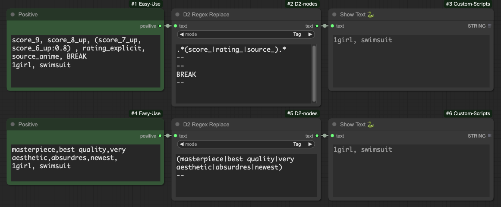
</figure>

- Can replace using regular expressions
- Multiple conditions can be specified
- Supports reuse of regex match strings (e.g., \1, \2)
- Target string can be specified by "tag unit" or "whole"

#### Input

- `text`
    - Target string for search
- `mode`
  - `Tag`: Break down `text` by newlines and "," and replace individually
  - `Advanced`: Replace `text` as a whole
- `regex_and_output`
    - List of search strings and output strings
    - Write in following format
    - If output string is empty, matched part is deleted
    - No limit on number of entries

```
Search string 1
--
Output string 1
--
Search string 2
--
Output string 2
```

#### Output

- `text`
    - Text after replacement

#### Sample

Sample for removing Pony series quality tags.

Mode: `Tag`

Input text
```
score_9, score_8_up, (score_7_up, score_6_up:0.8) , rating_explicit, source_anime, BREAK
1girl, swimsuit
```
Regex Replace
```
.*(score_|rating_|source_).*
--
--
BREAK
--

```

Output text
```
1girl, swimsuit
```

---

### D2 Regex Switcher

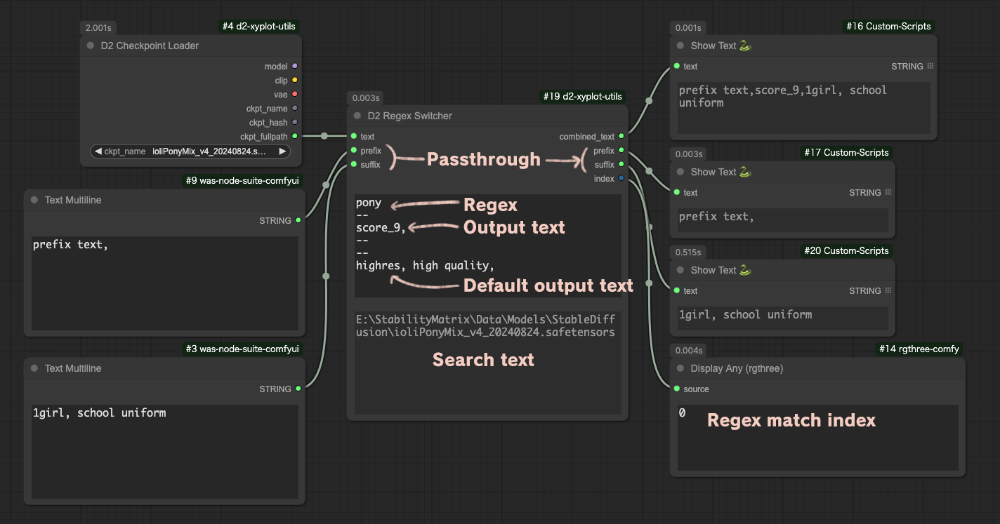

- Searches input text with regex and outputs matching text
- Main purpose is switching quality tags per Checkpoint
- When matching string is found in input `text`, outputs target string and match index (starting from 0)
- Can concatenate strings at front and back

#### Input

- `text`
    - Search target string
- `prefix`
    - String to concatenate at front
- `suffix`
    - String to concatenate at back
- `regex_and_output`
    - List of search strings and output strings
    - Write in following format
- `pre_delim`
    - Character inserted between `prefix` and `regex_and_output`
    - `Comma`: `,` / `Line break`: newline / `None`: nothing
- `suf_delim`
    - Character inserted between `regex_and_output` and `suffix`

#### Output

- `combined_text`
    - String combining `prefix` + output string + `suffix`
- `prefix` / `suffix`
    - Input passthrough

---

### D2 Multi Output

<figure>
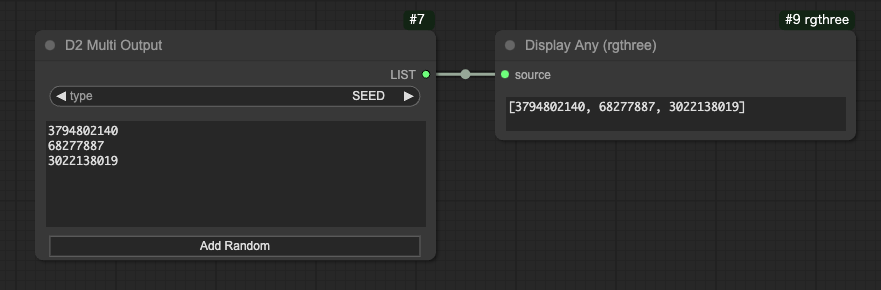
</figure>

- Node that outputs generic parameters like seed and cfg as lists

#### Input

- `type`
    - `FLOAT`: Floating point numbers. For CFG etc.
    - `INT`: Integers. For steps etc.
    - `STRING`: Strings. For sampler etc.
    - `SEED`: Can input seed values with random number button
- `Add Random`
    - Adds random numbers to input field
    - Only shown when `type` is `SEED`

---

### D2 Filename Template / D2 Filename Template2

<figure>
  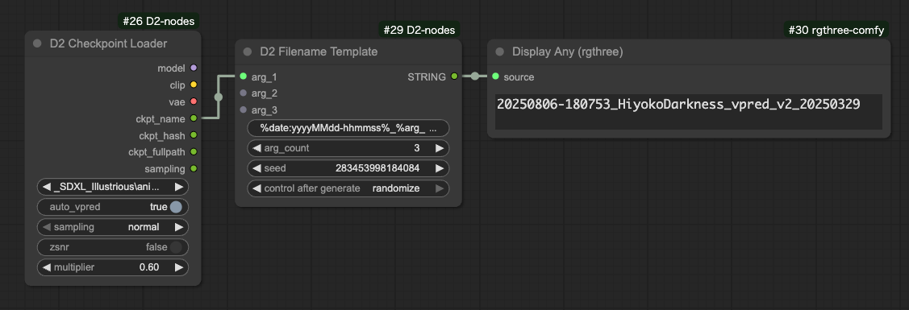
</figure>

- A node for creating string templates by incorporating date and parameters from other nodes
- `D2 Filename Template2` is a version that supports multiple lines
- It is also possible to retrieve values from arrays, dictionaries, and objects
- Preset feature for commonly used formats like Stable Diffusion webui A1111-style metadata
  - You can add presets by editing `custom_nodes/d2-nodes-comfyui/config/template_config.yaml`

#### Input

- `arg_{number}`
  - Import values from other nodes
- `format`
    - `%date:{yyyy/MM/dd/hh/mm/ss}%`
      - `yyyy`: Year
      - `MM`: Month
      - `dd`: Day
      - `hh`: Hour
      - `mm`: Minute
      - `ss`: Second
    - `%{node name}.{key}%`
      - Retrieves values by specifying node name and item name
      - Example: `%Empty Latent Image.width%`: Get width from the Empty Latent Image node
    - `%node:{id}.{key}%`
      - Retrieves values by specifying node ID and item name
      - Example: `%node:8.width%`: Get width from node ID 8
    - `%arg_{number}%`
      - Embed input values
    - `%arg_{number}:ckpt_name%`
      - Embed checkpoint name with `.safetensors` removed
    - `%arg_{number}:preset.{preset_name}%`
      - Presets can be added by editing `custom_nodes/d2-nodes-comfyui/config/template_config.yaml`
    - `%exec_{number}[{index}]%`
      - Retrieves the value at `{index}` from the **array** input to `arg_{number}`
    - `%exec_{number}['{key}']%`
      - Retrieves the value for `{key}` from the **dictionary** input to `arg_{number}`
    - `%exec_{number}.{key}%`
      - Retrieves the value for `{key}` from the **object** input to `arg_{number}`
- `arg_count`
  - Increase or decrease the number of input items
- `normalization`
  - Filename sanitization option

<figure>
  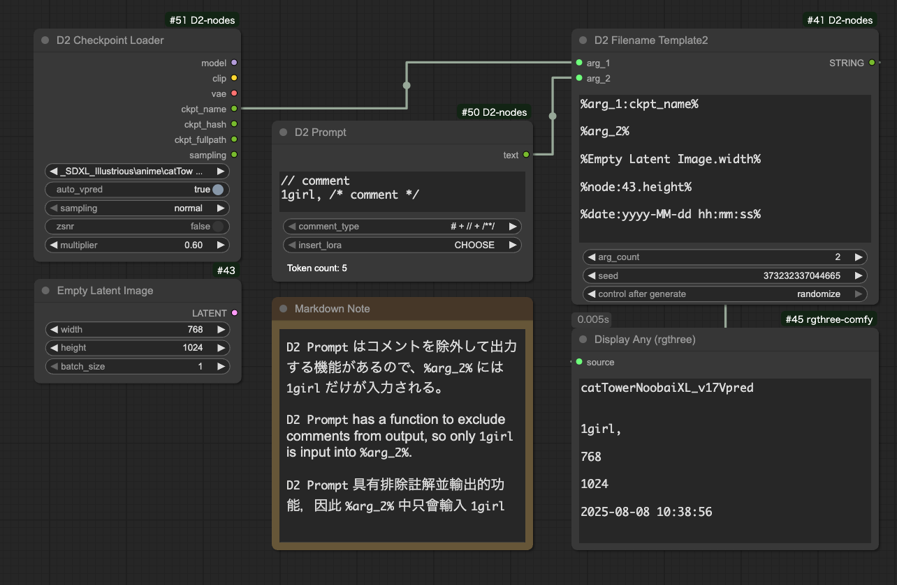
  <figucaption>Retrieving node information connected to `arg_N`, using the node name, etc.</figucaption>
</figure>

<figure>
  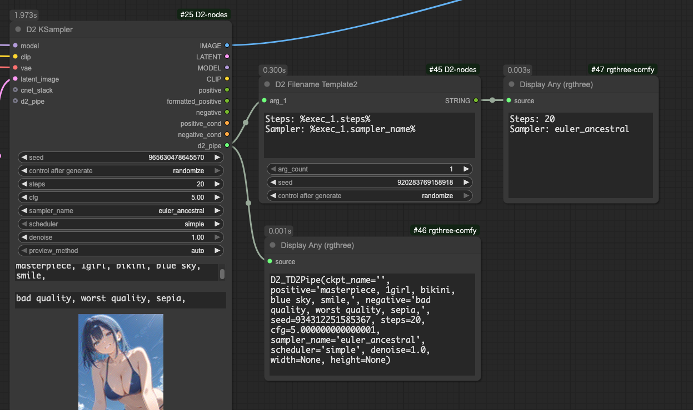
  <figucaption>Retrieving `steps` and `sampler_name` from the `d2_pipe` object, which summarizes generation parameters.</figucaption>
</figure>

<figure>
  
  <figucaption>Using the preset `a1111` with the value input to `arg_1`. Using `D2 Pipe` to add the checkpoint name.</figucaption>
</figure>

---


### D2 Prompt

<figure>
  
</figure>

- You can select LoRA from the `CHOOSE` button and insert an A1111-style LoRA prompt
- Delete comments in text
- Targets lines starting with "#", lines starting with "//", and text between "/*" and "*/"
- Displays token count at the bottom (works when `token_count` is `true`)
- Uses "ViT-L/14" CLIP for token count measurement. Please use `D2 Token Counter` if you want to use other CLIP models


#### About Comment Shortcut Keys

- Comment shortcut key (ctrl + /) is available in all text boxes
- Shortcut keys can be changed in `Settings > D2 > shortcutKey`
- Delete the content above if you want to disable it

---

### D2 Prompt Sanitizer

<figure>
  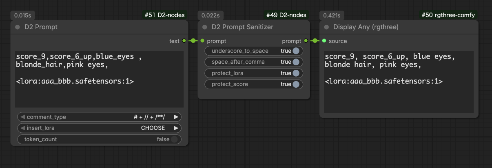
</figure>

- A node that cleans up prompt strings
- Converts `_` (underscore) to a space (`long_hair` → `long hair`)
- Ensures a single space after each `,` (comma) and tidies up surrounding whitespace (`a ,  b` → `a, b`)
- Collapses redundant consecutive commas and removes commas at the start of a line (`a,, ,b` → `a, b`)
- Each transformation can be toggled on / off individually

#### Input

- `underscore_to_space`: Convert `_` to a space
- `space_after_comma`: Tidy the whitespace around commas and normalize it to `, ` (line breaks are preserved)
- `remove_extra_comma`: Collapse redundant consecutive commas (`,,` / `, ,`) into one and remove commas at the start of a line (line breaks are preserved)
- `protect_lora`: Protect LoRA notation enclosed in `<...>` from conversion (keeps the underscores in `<lora:my_lora:1>`)
- `protect_score`: Protect Pony quality tags such as `score_9` / `score_8_up` from conversion

---

### D2 Token Counter

<figure>
  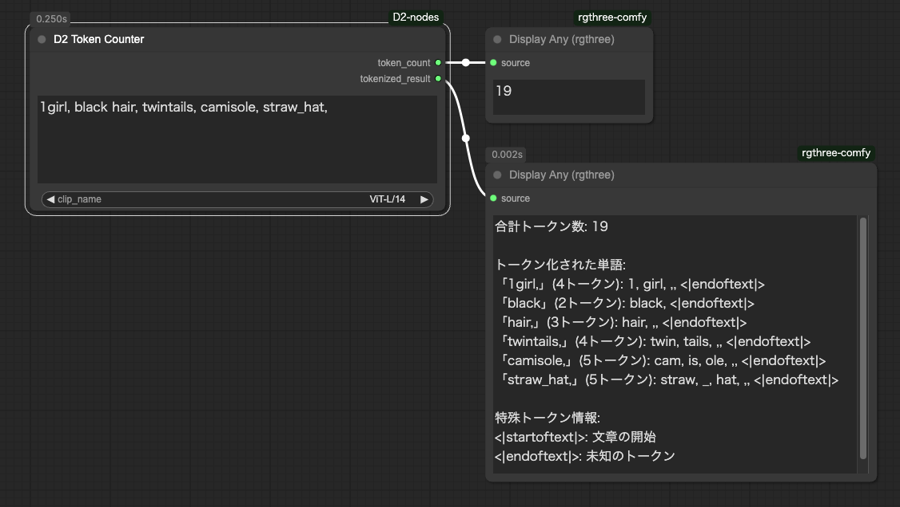
</figure>

- Counts tokens in prompts

---

### D2 Load Text

<figure>
  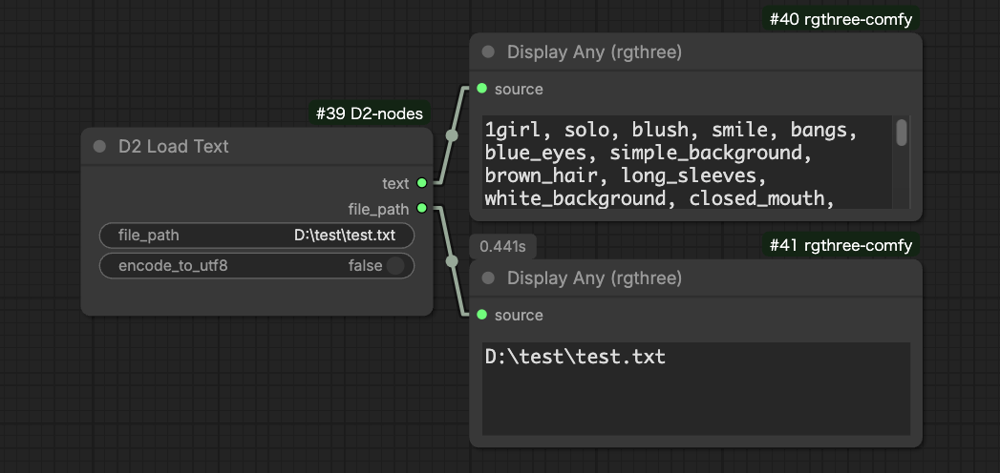
</figure>

- A general-purpose node that loads a text file
- For batch-editing training captions, use it to read the path obtained by `D2 Folder Image Queue` with `*.txt`

#### Input

- `file_path`
  - Full path of the text file to load
- `encode_to_utf8`
  - `true`: Auto-detect the character encoding and convert to utf-8 when reading
  - `false`: No conversion (read as utf-8)

#### Output

- `text`
  - The file content (returned as-is, no formatting; empty string if the file does not exist)
- `file_path`
  - Passes through the input `file_path` (for feeding into `base_filename` of `D2 Save Caption`)

---

### D2 Save Caption

<figure>
  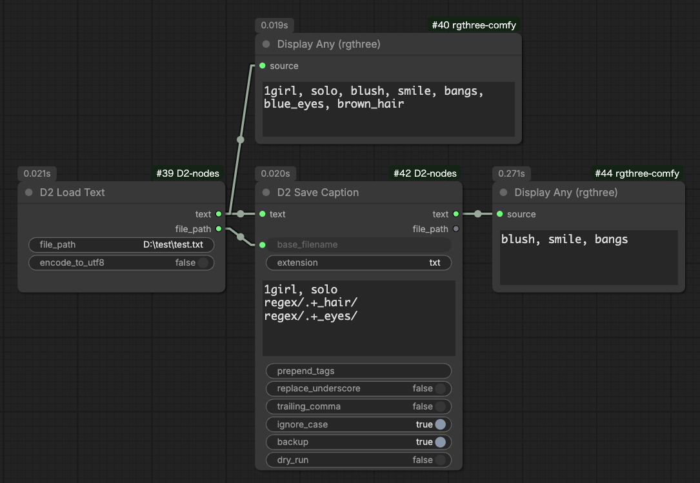
</figure>

- A node that formats tags and saves a caption file
- Saves to the path obtained by replacing the extension of `base_filename` with `extension` (e.g. `d:/images/aaa.jpg` -> `d:/images/aaa.txt`)
- Formatting runs in this order: split -> trim -> `_` replace -> exclude -> dedupe -> prepend -> trailing comma

#### Input

- `base_filename`
  - The source path for saving. Receives `image_path` of `D2 Folder Image Queue` or `file_path` of `D2 Load Text`
  - Stops with an error if empty (to prevent saving to an unintended location)
- `text`
  - The caption body (from `WD14 Tagger` or `D2 Load Text`)
- `extension`
  - Extension of the file to save (e.g. `txt`)
- `exclude_tags`
  - Tags to exclude. Separated by both commas and line breaks
  - Writing `regex/pattern/` excludes tags matching the regular expression (exclude only)
- `prepend_tags`
  - Tags to prepend. Comma-separated. Tags that already exist are not added
- `replace_underscore`
  - `true`: Convert `_` to spaces
- `trailing_comma`
  - `true`: Add a trailing comma
- `ignore_case`
  - `true`: Ignore case when matching for exclusion
- `backup`
  - `true`: If a file of the same name exists, rename the old file to `.bak` before saving
- `dry_run`
  - `true`: Do not save to file; only check the formatted result in the `text` output (preview of the conversion)

#### Output

- `text`
  - The formatted caption
- `file_path`
  - Full path of the save destination (the planned path when `dry_run`)

---

### D2 Tag Report

<figure>
  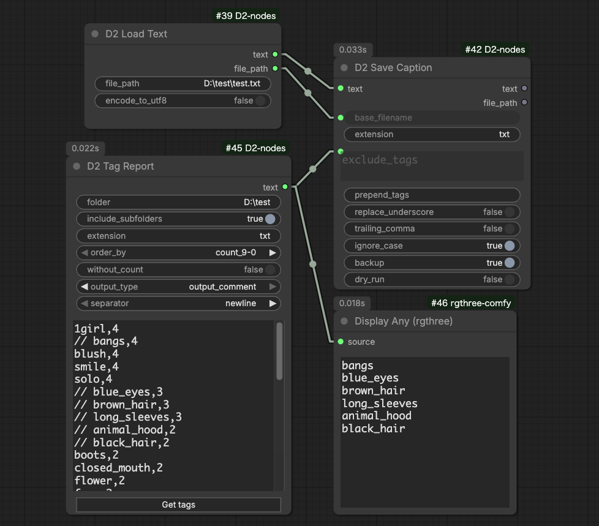
</figure>

- A node that aggregates tag frequency from captions in the specified folder and builds an exclude-tag list
- The `Get tags` button shows the aggregated result in `text`. The user edits which tags to keep/remove and passes it to `exclude_tags` of `D2 Save Caption`
- Prefixing a line with `//` or `#` makes it a comment line
- For how to use `D2 Tag Report` and `D2 Save Caption`, see this article (Japanese)
  - https://note.com/da2el_ai/n/ne1fc9b3bea89?app_launch=false

#### Input

- `folder`
  - The folder containing the caption files (full path)
- `include_subfolders`
  - `true`: Also target subfolders
- `extension`
  - Target extension (e.g. `txt`)
- `order_by`
  - `count_9-0`: Descending by occurrence count
  - `count_0-9`: Ascending by occurrence count
  - `tag_a-z`: By tag name (A->Z)
  - `tag_z-a`: By tag name (Z->A)
- `without_count`
  - `true`: Do not show occurrence counts in the report
- `output_type`
  - `remove_comment`: Remove comment lines and output the rest (workflow: mark tags to remove with comments)
  - `output_comment`: Output only comment lines (workflow: comment out only the tags to remove)
- `separator`
  - `newline`: Output line-separated (recommended, so entries containing commas such as `regex/pattern/` are not broken)
  - `comma`: Output as a single line separated by comma + space

#### Output

- `text`
  - The edited tag list (passed to `exclude_tags` of `D2 Save Caption`)
