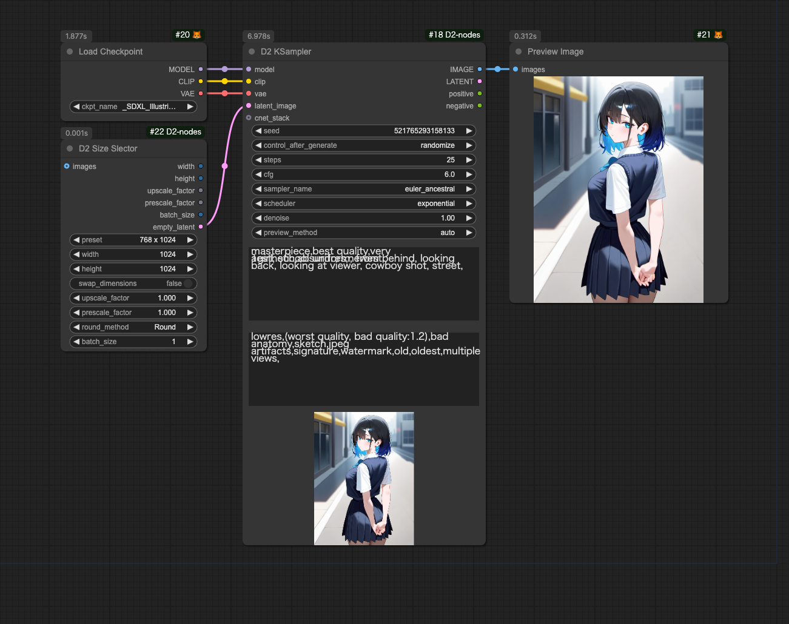
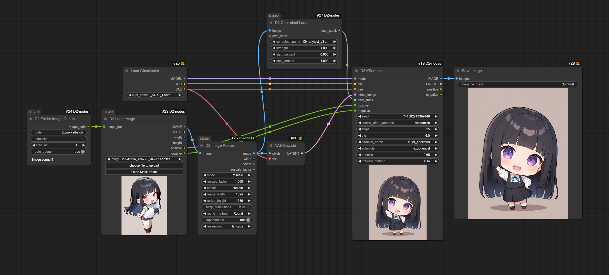
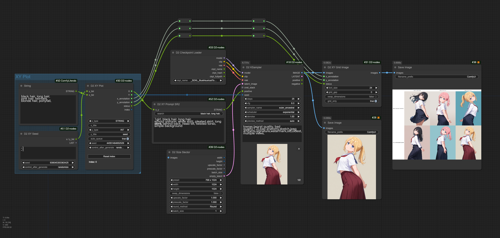
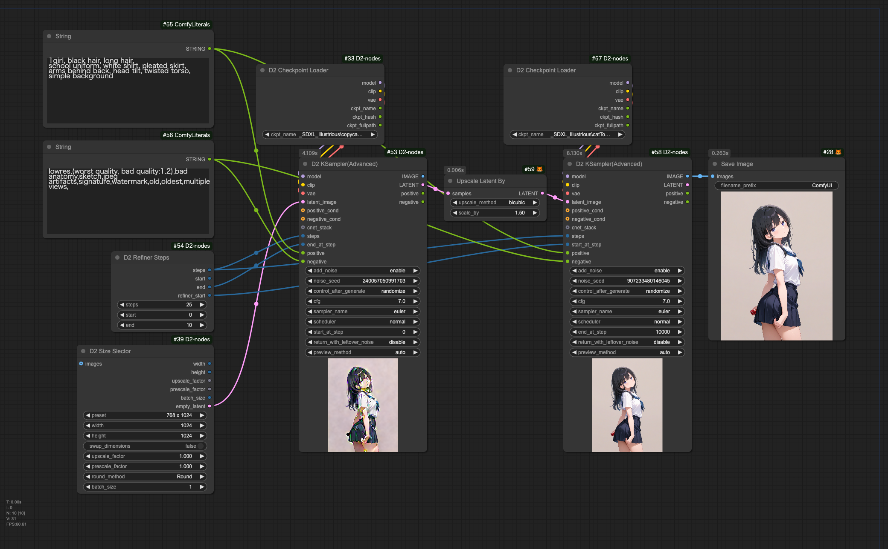

<a href="../en/index.md">English</a> | <a href="../ja/index.md">日本語</a> | <a href="../zh/index.md">繁体中文</a>

- <a href="index.md">Top</a>
- <a href="node.md">Node</a>
- <a href="workflow.md">Workflow</a>

# Workflow

Drop images into ComfyUI to recreate workflows.

## :card_index_dividers: Simple txt2img

- Simple txt2img without Lora or Controlnet.

## :card_index_dividers: Batch Upscale Images in Folder

- Retrieves all images from folder and extracts prompts
- Gets Controlnet anyTest
- Upscales by 1.5x

## :card_index_dividers: XY Plot: Prompt S/R

- Basic Prompt S/R

## :card_index_dividers: XY Plot: Comparing Animagine, Pony, and Illustrious Checkpoints

- Animagine, Pony, and Illustrious series have different quality tags, but automatically switches based on checkpoint path
- Files need to be organized in folders by series as filenames may not contain series names

## :card_index_dividers: Refiner: Checkpoint Switching Hires.fix

