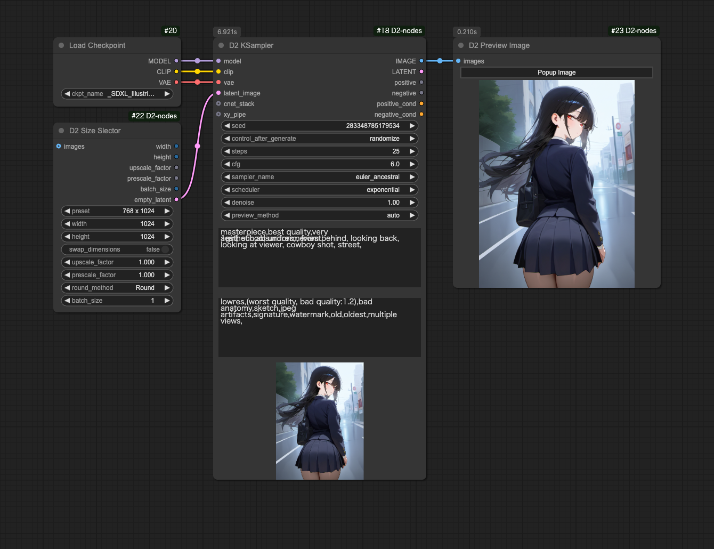
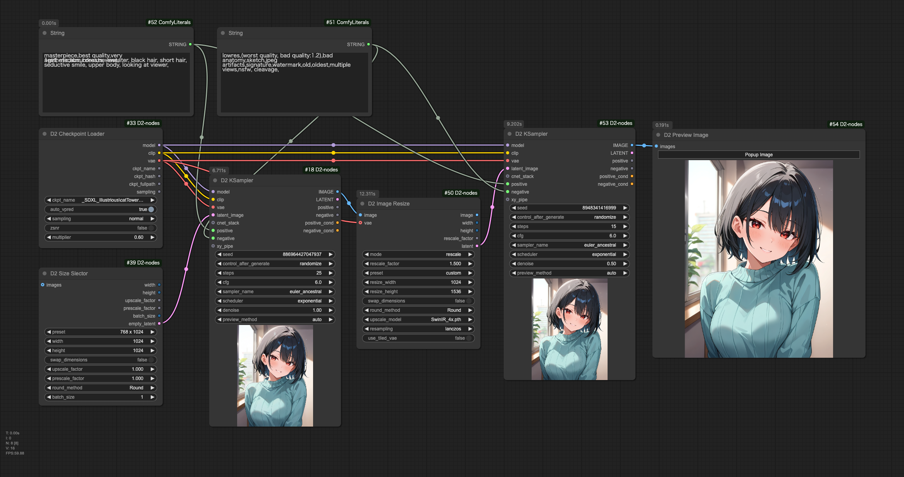
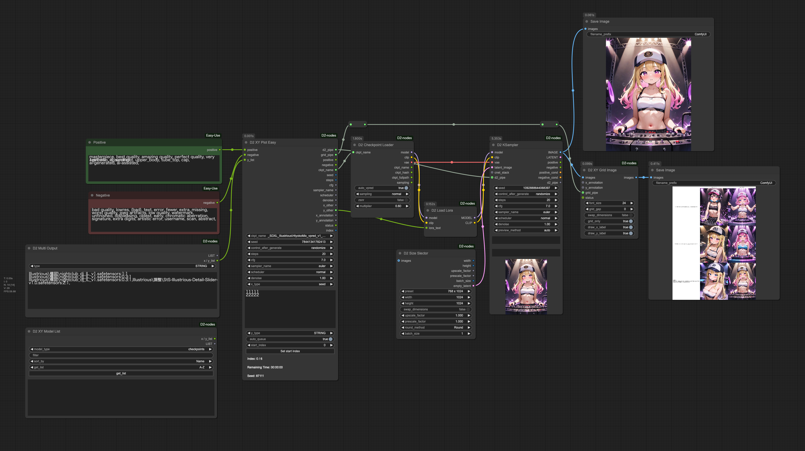

<a href="../en/index.md">English</a> | <a href="../ja/index.md">日本語</a> | <a href="../zh/index.md">繁体中文</a>

- <a href="index.md">Top</a>
- <a href="node.md">Node</a> / <a href="node_image.md">Image Node</a> / <a href="node_text.md">Text Node</a> / <a href="node_xy.md">XYPlot Node</a> / <a href="node_float.md">Float Palet</a>
- <a href="workflow.md">Workflow</a>

# Workflow

Drop images into ComfyUI to recreate workflows.

## :card_index_dividers: Simple txt2img

- Simple txt2img without using Lora or Controlnet.

## :card_index_dividers: txt2img + Hires fix

- Hires fix using two D2 KSamplers with D2 Image Resize in between, using SwinR_4x.

## :card_index_dividers: Batch Upscale Images in Folder

- Retrieves all images and prompts from folder
- Uses Controlnet anyTest
- Upscales by 1.5x
- Specify the number of outputs using D2 XY Seed2

## :card_index_dividers: XY Plot: Checkpoint & Prompt S/R

- Simple XY Plot using D2 XY Plot Easy

## :card_index_dividers: XY Plot: Lora

- Lora test

## :card_index_dividers: Checkpoint Test

- Batch generates checkpoint test images
- Generates 4 different prompts and combines them into a single image
- Unlike XY Plot, saves separate images for each checkpoint

## :card_index_dividers: XY Plot: Prompt S/R

- XY plot that switches quality tags based on Checkpoint type (SDXL / Pony / Illustrious)
- Animagine, Pony, and Illustrious series have different quality tags, but automatically switches based on checkpoint path
- Files need to be organized in series-specific folders as filenames may not always contain series names

## :card_index_dividers: Refiner: Checkpoint switching Hires.fix

