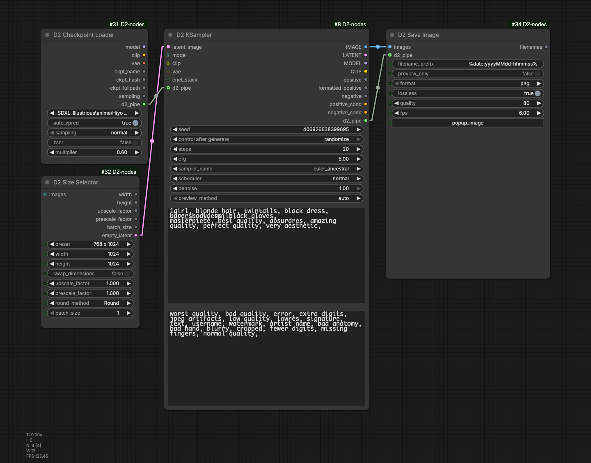
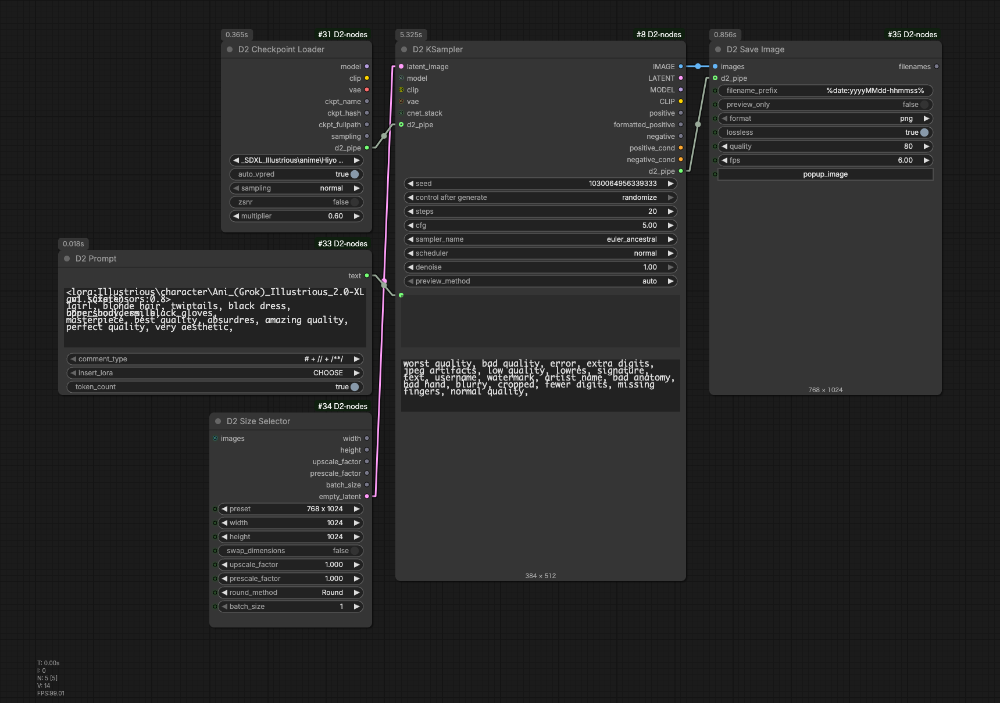
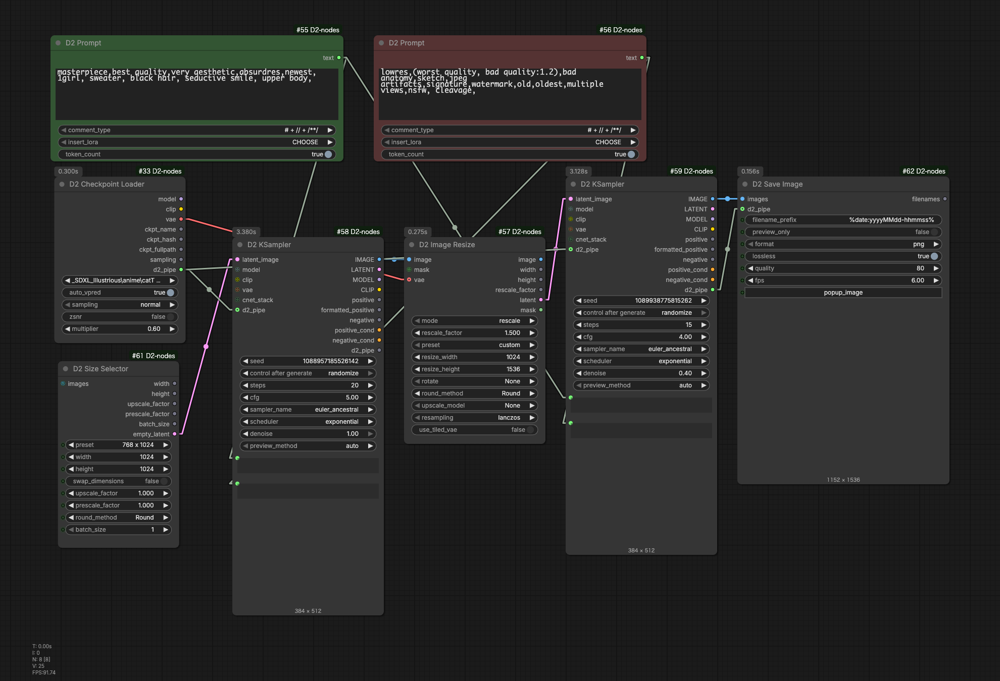
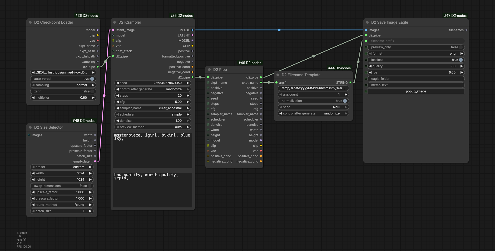
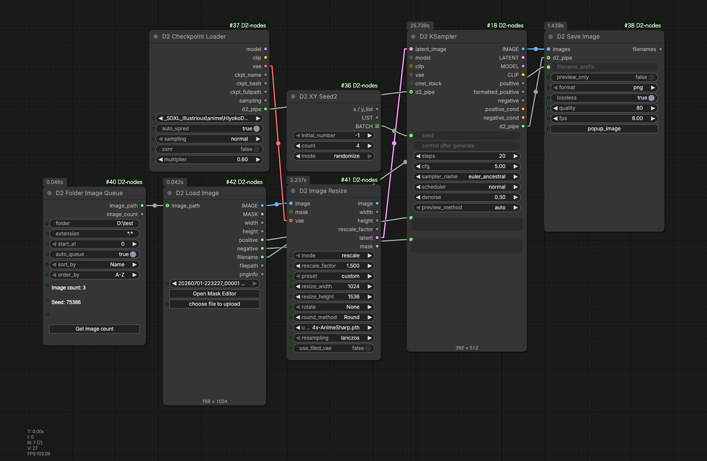
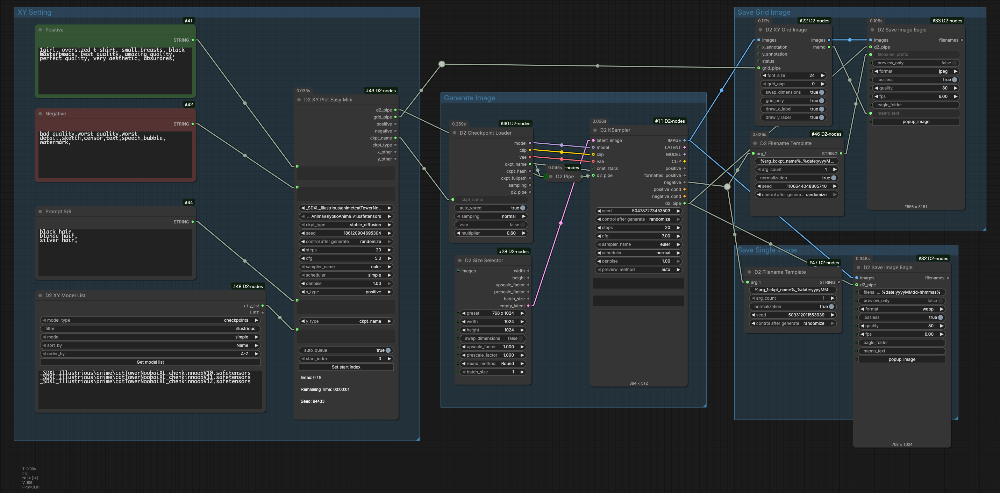
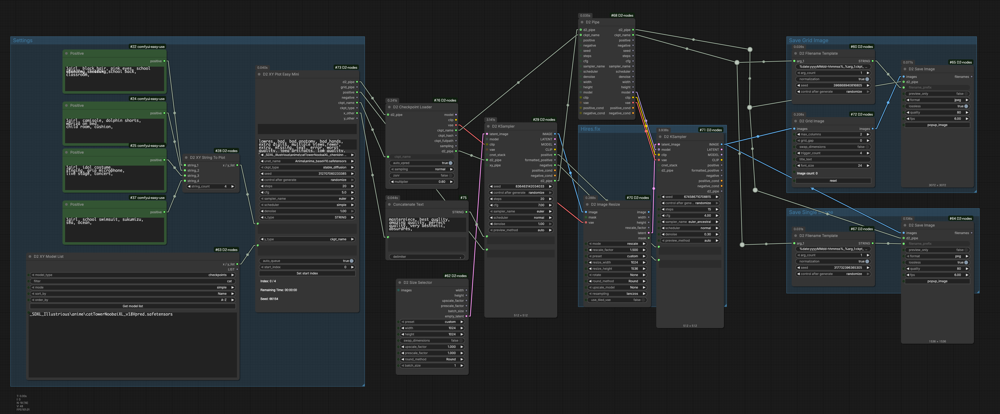

<a href="../en/index.md">English</a> | <a href="../ja/index.md">日本語</a> | <a href="../zh/index.md">繁体中文</a>

- <a href="index.md">Top</a>
- <a href="node.md">Node</a> / <a href="node_image.md">Image Node</a> / <a href="node_text.md">Text Node</a> / <a href="node_xy.md">XYPlot Node</a> / <a href="node_float.md">Float Palet</a>
- <a href="workflow.md">Workflow</a>

# Workflow

> [!TIP]
> **Drop images into ComfyUI to recreate workflows.**

## :card_index_dividers: Simple txt2img

> <a href="../../workflow/simple_t2i_20260701.json">Download workflow</a>

- Simple txt2img without using Lora or Controlnet.
- Model / CLIP / VAE are passed through d2_pipe

---

## :card_index_dividers: txt2img with LoRA

> <a href="../../workflow/lora_t2i_20260701.json">Download workflow</a>

- txt2img that uses Lora with the same format as StableDiffusion webui A1111.
- You can call Lora from the `CHEESE` button of D2 Prompt
- Model / CLIP / VAE are passed through d2_pipe

---

## :card_index_dividers: txt2img + Hires fix

> <a href="../../workflow/hiresfix_20260701.json">Download workflow</a>

- Hires fix using two D2 KSamplers with D2 Image Resize in between, using SwinR_4x.
- Model / CLIP / VAE are passed through d2_pipe

---

## :card_index_dividers: Include generation parameters in filename

> <a href="../../workflow/filename_template_20260701.json">Download workflow</a>

- This example uses `D2 Save Image Eagle` for saving files
- Generate filenames using `D2 Filename Template`
- Automatically creates Eagle memos with information from `d2_pipe`

---

## :card_index_dividers: Batch Upscale Images in Folder

> <a href="../../workflow/folder_image_queue_upscale_20260701.json">Download workflow</a>

- Retrieves all images from folder using `D2 Folder Image Queue` and gets prompts and filenames using `D2 Load Image`
- Uses `4x-AnimeSharp` upscale model (of course, `None` can also be used)
- Upscales by 1.5x
- Outputs 4 images at a time by passing 4 seeds with `D2 XY Seed2`
- Model / CLIP / VAE are passed through d2_pipe

---

## :card_index_dividers: XY Plot: Checkpoint & Prompt S/R

> <a href="../../workflow/xy_easy_20260701.json">Download workflow</a>

- XY Plot using D2 XY Plot Easy Mini
- Parameters in `D2 KSampler` are overwritten by `D2 XYPlot Easy Mini`
- Grid images are saved in JPEG format as they can be large
- This sample uses `D2 Save Image Eagle` for saving images
- For how to use XY Plot with Diffusion Models, see the following article
  - https://note.com/da2el_ai/n/n4bc9002c61b1

---

## :card_index_dividers: Checkpoint Test

> <a href="../../workflow/checkpoint_test_20260701.json">Download workflow</a>

- Batch generates checkpoint test images
- Generates 4 different prompts and combines them into a single image
- The number of prompts matches the `trigger_count` in `D2 Grid Image` (4 in this sample)
- The first `D2 KSampler` uses generation parameters received from `D2 XY Plot Easy Mini`, but the second `D2 KSampler` uses its own settings
- Uses `D2 Filename Template` to include checkpoint name in the filename
