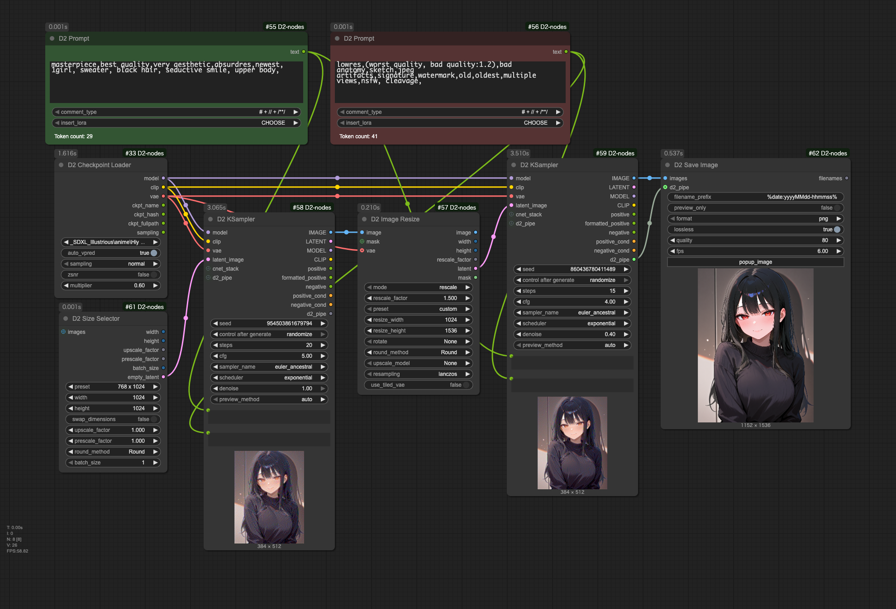
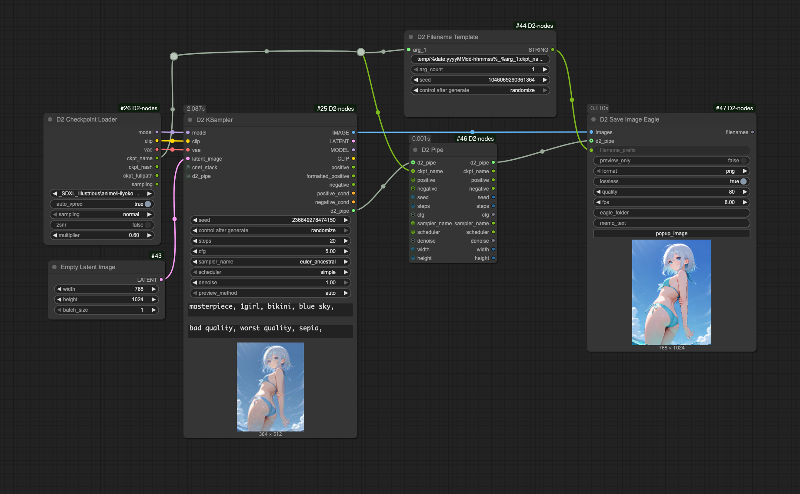
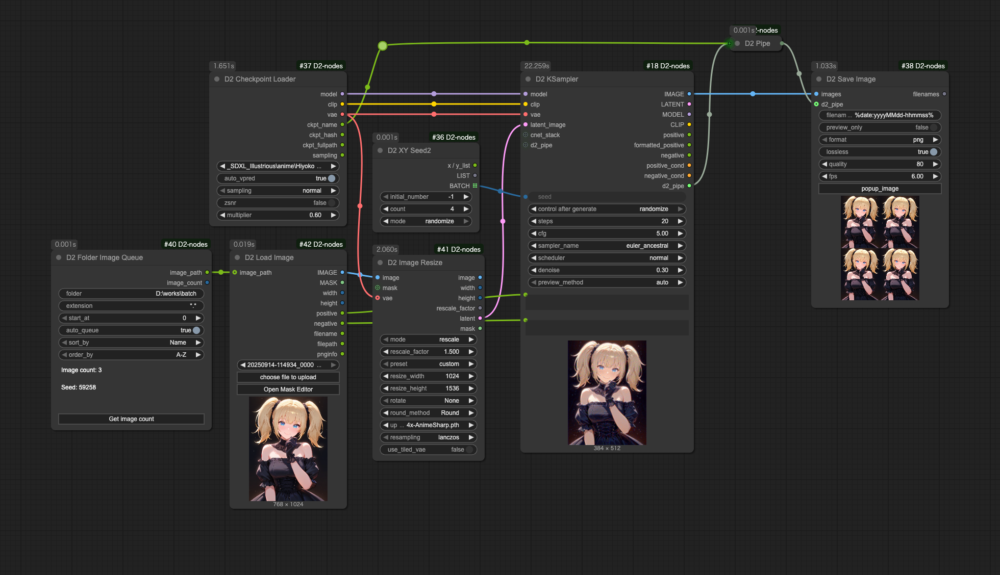
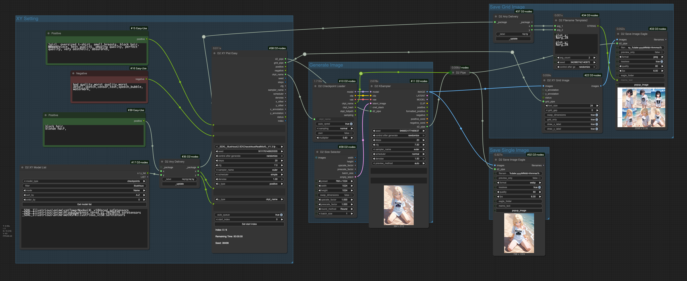
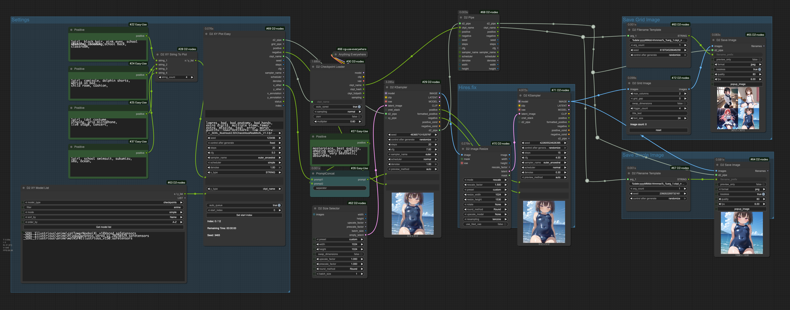

<a href="../en/index.md">English</a> | <a href="../ja/index.md">日本語</a> | <a href="../zh/index.md">繁体中文</a>

- <a href="index.md">Top</a>
- <a href="node.md">Node</a> / <a href="node_image.md">Image Node</a> / <a href="node_text.md">Text Node</a> / <a href="node_xy.md">XYPlot Node</a> / <a href="node_float.md">Float Palet</a>
- <a href="workflow.md">Workflow</a>


# Workflow


> [!TIP]
> **Drop images into ComfyUI to recreate workflows.**


## :card_index_dividers: Simple txt2img

<a href="../../workflow/simple_t2i_20250914.png"></a>

- Simple txt2img without using Lora or Controlnet.


## :card_index_dividers: txt2img with LoRA

<a href="../../workflow/lora_t2i_20250914.png"></a>

- txt2img that uses Lora with the same format as StableDiffusion webui A1111.
- D2 Prompt makes it easier to use Lora


## :card_index_dividers: txt2img + Hires fix

<a href="../../workflow/hiresfix_20250914.png"></a>

- Hires fix using two D2 KSamplers with D2 Image Resize in between, using SwinR_4x.


## :card_index_dividers: Include generation parameters in filename

<a href="../../workflow/filename_template_20250914.png"></a>

- This example uses `D2 Save Image Eagle` for saving files
- Generate filenames using `D2 Filename Template`
- Automatically creates Eagle memos with information from `d2_pipe`


## :card_index_dividers: Batch Upscale Images in Folder

<a href="../../workflow/folder_image_queue_upscale_20250914.png"></a>

- Retrieves all images and prompts from folder using `D2 Folder Image Queue` and `D2 Load Image`
- Uses `4x-AnimeSharp` upscale model (of course, `None` can also be used)
- Upscales by 1.5x
- Outputs 4 images at a time using `D2 XY Seed2`


## :card_index_dividers: XY Plot: Checkpoint & Prompt S/R

<a href="../../workflow/xy_easy_20250914.png"></a>

- XY Plot using D2 XY Plot Easy
- Parameters in `D2 KSampler` are overwritten by `D2 XYPlot Easy`
- Grid images are saved in JPEG format as they can be large
- This sample uses `D2 Save Image Eagle` for saving images
- Creates XY plot parameters using `D2 Filename Template2`. The Eagle memo records the following:

```
plot_x:
black hair,
blonde hair,

plot_y:
_SDXL_Illustrious\anime\catTowerNoobaiXL_v18Vpred.safetensors
_SDXL_Illustrious\anime\HiyokoDarkness_vpred_v2_20250329.safetensors
_SDXL_Illustrious\anime\waiNSFWIllustrious_v150.safetensors
```

### To compare Loras

<figure>

</figure>

1. Change `D2 XY Model List` as follows:
    - `model_type`: `loras`
    - `mode`: `a1111`
1. Click `Get model list` to retrieve the Lora list
1. Keep only the necessary Loras and add trigger words
1. The first line describes the prompt to be replaced
1. Change `D2 XY Plot Easy` as follows:
    - `y_type`: `positive`


## :card_index_dividers: Checkpoint Test

<a href="../../workflow/checkpoint_test_20250914.png"></a>

- Batch generates checkpoint test images
- Generates 4 different prompts and combines them into a single image
- Unlike XY Plot, saves separate images for each checkpoint
- The first `D2 KSampler` uses generation parameters received from `D2 XY Plot Easy`, but the second `D2 KSampler` uses its own settings
- The number of prompts matches the `trigger_count` in `D2 Grid Image` (4 in this sample)
- Uses `D2 Filename Template` to include checkpoint name in the filename


## :card_index_dividers: XY Plot: Prompt S/R

<a href="../../workflow/xy_prompt_sr_20250121.png"></a>

- XY plot that switches quality tags based on Checkpoint type (SDXL / Pony / Illustrious)
- Animagine, Pony, and Illustrious series have different quality tags, but automatically switches based on checkpoint path
- Files need to be organized in series-specific folders as filenames may not always contain series names


## :card_index_dividers: Refiner: Checkpoint switching Hires.fix

<a href="../../workflow/Refiner_20241218.png"></a>
