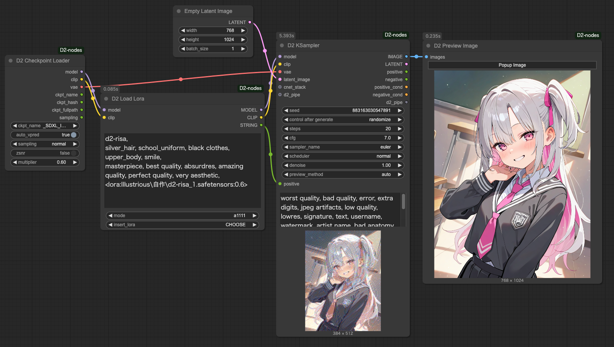
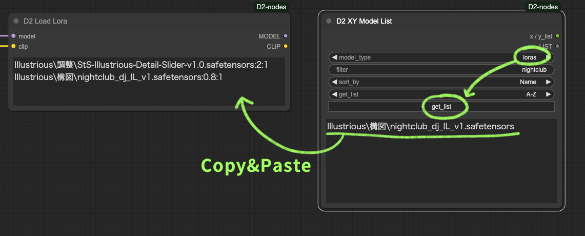

<a href="../en/index.md">English</a> | <a href="../ja/index.md">日本語</a> | <a href="../zh/index.md">繁体中文</a>

- <a href="index.md">Top</a>
- <a href="node.md">Node</a> / <a href="node_image.md">Image Node</a> / <a href="node_text.md">Text Node</a> / <a href="node_xy.md">XYPlot Node</a> / <a href="node_float.md">Float Palet</a>
- <a href="workflow.md">Workflow</a>


<h1>
Node
</h1>


## :tomato: Sampler Nodes


### D2 KSampler / D2 KSampler(Advanced)

<figure>

</figure>

- プロンプトを STRING で入力できる KSampler

#### Input

- `cnet_stack`
  - `D2 Controlnet Loader` 接続用
- `model` / `clip` / `vae` / ..etc
    - 標準の KSampler と同じ
- `negative` / `positive`
    - STRING 形式のプロンプト

#### Output

- `IMAGE`
    - 画像出力
- `positive` / `negative`
    - Input のパススルー

---

### D2 Pipe

<figure>

</figure>

- `d2_pipe` の内容を変更・取り出すためのノード
- `d2_pipe` は D2 XY Plot Easy、D2 KSampler、D2 Send Eagle などでパラメーターをまとめて渡すためのもの


---


## :tomato: Loader Node


### D2 Checkpoint Loader


- モデルファイルのフルパスを出力する Checkpoint Loader
- ファイル名に「vpred」が入っていたら自動的に v_prediction 設定を適用することが可能

#### Input

- `ckpt_name`
  - チェックポイント名
- `auto_vpred`
  - `true`: ファイル名に「vpred」が入っていたら自動的に v_prediction 設定を適用する
- `sampling` / `zsnr`
  - ModelSamplingDiscrete と同じ設定（詳しくは知りません）
- `multiplier`
  - RescaleCFG と同じ設定（詳しくは知りません）

#### Output

- `model` / `clip` / `vae`
    - 従来の CheckpointLoader と同じ。
- `ckpt_name` / `ckpt_hash` / `ckpt_fullpath`
    - Checkpoint 名、ハッシュ、フルパス。


---


### D2 Controlnet Loader

<figure>

</figure>

- `D2 KSampler` に接続してシンプルなワークフローが作れる Controlnet Loader

#### Input

- `cnet_stack`
  - `D2 Controlnet Loader` 接続用

#### Output

- `cnet_stack`
  - `D2 KSampler` または `D2 Controlnet Loader` 接続用


---


### D2 Load Lora

<figure>


</figure>

- テキストでLoraを指定できるLoraローダー
- model_weight / clip_weight も指定可能
- Loraのファイル名を取得する機能は無いので、`D2 XY Model List` で取得してコピー＆ペーストをしてください

#### Format

**例：lora:foo / model_weight:1 / clip_weight:1**
model_weight が指定されていない場合は「1」が適用される
```
foo
```
**例：lora:foo / model_weight:0.5 / clip_weight:0.5**
clip_weight が指定されていない場合は model_weight と同じ値が適用される
```
foo:1
```
**例：lora:foo / model_weight:2 / clip_weight:1**
```
foo:2:1
```
**例：2種類のLoraを使う(1)**
改行で区切る
```
foo:0.5
bar
```
**例：2種類のLoraを使う(2)**
1行に2種類記述するときは「,」で区切る
```
foo:0.5,bar
```

(2)の記法は D2 XYPlot Easy などでLoraを検証したい時に役に立つ記法です。
<a href="workflow.md">サンプルワークフロー</a>を参照してください。

**例：コメントアウト**
「//」または「#」で開始する行は無視されます。
```
//foo:0.5
#bar
```


---


## :tomato: Size Node


### D2 Get Image Size

<figure>

</figure>

- サイズの出力と表示を両方行う


---


### D2 Size Selector

<figure>

</figure>

- 画像サイズをプリセットから選択できるノード
- 画像からサイズを取得することも可能
- 数値の丸め方を `Ceil / Float / None` から選択可能

#### Input

- `images`
    - 画像からサイズを取得する時に使用
    - `preset` を `custom` にする必要がある
- `preset`
    - サイズのプリセット
    - この下の `width` `height` や `images` のサイズを使う時は `custom` にする必要がある
    - プリセットを変更したい時は `/custom_nodes/D2-nodes-ComfyUI/config/sizeselector_config.yaml` を編集
- `width` / `height`
    - 縦横サイズ
    - `preset` を `custom` にする必要がある
- `swap_dimensions`
    - width / height を入れ替える
- `upscale_factor`
    - 他のリサイズ系ノードに渡す数値。このノードでは何もしない
- `prescale_factor`
    - この倍率でリサイズしてから width / height を出力する
- `round_method`
    - `Round` : 四捨五入する
    - `Floor` : 切り落とす
    - `None` : 何もしない 
- `batch_size`
    - empty_latent にセットする batch size

#### Output

- `width / height`
    - 入力された `width`、`height` に `prescale_factor` を乗算する
- `upscale_factor` / `prescale_factor`
    - Input されたものをパススルーする
- `batch_size`
    - Input されたものをパススルーする
- `empty_latent`
    - 指定されたサイズ、batch size で作成した latent を出力


---

### D2 Image Resize

<figure>

</figure>

- 画像の単純なリサイズ
- 小数点３位まで指定可能
- 四捨五入、切り捨て、切り上げが選択できる
- アップスケールモデルを使ったアップスケールが可能
- Latent出力も可能（VAEが必要）


---

### D2 Resize Calculator

<figure>

</figure>

- 四捨五入、切り捨て、切り上げが選択できる

---


## :tomato: Refiner Node


### D2 Refiner Steps

<figure>

</figure>

- Refiner 用の steps を出力するノード


#### Input

- `steps`
    - 総 step 数
- `start`
    - 最初の KSampler の開始する steps
- `end`
    - 最初の KSampler の終了する steps

#### Output

- `steps` / `start` / `end`
    - Input のパススルー
- `refiner_start`
    - 2 つめの KSampler の開始する steps


---

### D2 Refiner Steps A1111

<figure>

</figure>

- img2img で Refiner するために denoise も指定できるノード


#### Input

- `steps`
    - 総 step 数
- `denoise`
    - img2img の denoise を指定する
- `switch_at`
    - 総 steps 数の何割で次の KSampler に切り替えるか

#### Output

- `steps` /
    - Input のパススルー
- `start`
    - 最初の KSampler の開始 steps
- `end`
    - 最初の KSampler の終了 steps
- `refiner_start`
    - 2 つめの KSampler の開始する steps

---


### D2 Refiner Steps Tester

- steps を確認するためのノード


---


## :tomato: Merge Node


### D2 Model and CLIP Merge SDXL

<figure>
  
</figure>

- ModelMergeSDXL と CLIPMergeSimple を合体させたノード
- XYPlot で使いやすいように、各 weight をカンマ区切りで指定可能にした
- この図では `0.85,0.85,1,1,0.4,0.4,1,0.4,0.4,0.4,1,0.4,0.4,0.4,0,0.55,0.85,0.85,0.85,0.85,0.85,0.85,1,1,0.65` を指定している


