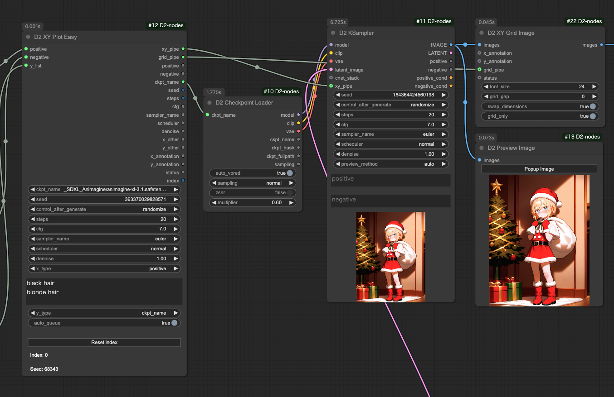

<a href="../en/index.md">English</a> | <a href="../ja/index.md">日本語</a> | <a href="../zh/index.md">繁体中文</a>

- <a href="index.md">Top</a>
- <a href="node.md">Node</a>
- <a href="workflow.md">Workflow</a>


<h1>
Node
</h1>


## :tomato: Sampler Nodes


### D2 KSampler / D2 KSampler(Advanced)

<figure>

</figure>

- プロンプトを STRING で入力できる KSampler

#### Input

- `cnet_stack`
  - `D2 Controlnet Loader` 接続用
- `model` / `clip` / `vae` / ..etc
    - 標準の KSampler と同じ
- `negative` / `positive`
    - STRING 形式のプロンプト

#### Output

- `IMAGE`
    - 画像出力
- `positive` / `negative`
    - Input のパススルー

---

## :tomato: Loader Node


### D2 Checkpoint Loader


- モデルファイルのフルパスを出力する Checkpoint Loader
- ファイル名に「vpred」が入っていたら自動的に v_prediction 設定を適用することが可能

#### Input

- `ckpt_name`
  - チェックポイント名
- `auto_vpred`
  - `true`: ファイル名に「vpred」が入っていたら自動的に v_prediction 設定を適用する
- `sampling` / `zsnr`
  - ModelSamplingDiscrete と同じ設定（詳しくは知りません）
- `multiplier`
  - RescaleCFG と同じ設定（詳しくは知りません）

#### Output

- `model` / `clip` / `vae`
    - 従来の CheckpointLoader と同じ。
- `ckpt_name` / `ckpt_hash` / `ckpt_fullpath`
    - Checkpoint 名、ハッシュ、フルパス。


---


### D2 Controlnet Loader

<figure>

</figure>

- `D2 KSampler` に接続してシンプルなワークフローが作れる Controlnet Loader

#### Input

- `cnet_stack`
  - `D2 Controlnet Loader` 接続用

#### Output

- `cnet_stack`
  - `D2 KSampler` または `D2 Controlnet Loader` 接続用


---

## :tomato: Image Node

### D2 Preview Image

<figure>


</figure>

- `Popup Image` ボタンをクリックすると全画面ギャラリーが表示される

---

### D2 Load Image

<figure>

</figure>

- 画像からプロンプトを取得できる Load Image ノード
- StableDiffusion webui A1111、NovelAI で作成した画像にも対応
- マスクエディターを開くボタンが付いてる

#### Input

- `image_path`
  - 画像のパスを入力するとファイルを読み込む
  - `D2 Folder Image Queue` との接続に使用する

#### Output

- `IMAGE / MASK`
    - 画像とマスク
- `width / height`
    - 画像サイズ
- `positive` / `negative`
    - プロンプト

※ワークフローの構成によってはプロンプトを取得できない場合もあります。例えば「KSampler」という文字が含まれたノード（例：Tiled KSampler）が無いと取得できません。


---

### D2 Load Folder Images

<figure>

</figure>

- フォルダー内の画像を一括ロードしてまとめて出力する
- `D2 Grid Image` などで使う
- 順次処理をしたいなら `D2 Folder Image Queue` を使う

#### Input

- `folder`
  - フォルダーをフルパスで指定
- `extension`
  - JPEG画像だけを読み込むなら `*.jpg` のように指定する
  - `*silver*.webp` のような指定も可能


---


### D2 Folder Image Queue

<figure>

</figure>

- フォルダ内の画像のパスを出力する
- Queue を実行すると画像枚数分の Queue を自動的に実行する

#### Input

- `folder`
  - 画像フォルダ
- `extension`
  - ファイル名のフィルタを指定
  - `*.*`: 全ての画像
  - `*.png`: PNG形式のみ対象
- `start_at`
  - 処理を開始する画像番号
- `auto_queue`
  - `true`: 残りの Queue を自動的に実行する
  - `false`: 1回だけ実行する

#### Output

- `image_path`
  - 画像のフルパス


---

### D2 Grid Image

<figure>

</figure>

- グリッド画像を出力する
- 横方向、縦方向、どちらも可能

#### Input

- `max_columns`
  - 横方向に整列する画像の枚数
  - `swap_dimensions` が `true` の時は縦方向の枚数
- `grid_gap`
  - 画像の間隔
- `swap_dimensions`
  - `true`: 縦方向
  - `false`: 横方向
- `trigger`
  - `true`: グリッド画像を出力する
  - `false`: 画像を保持するだけでグリッド画像は出力しない


---

### D2 Image Stack

<figure>

</figure>

- 入力された複数の画像をまとめて出力する
- 最大50個入力できる

#### Input

- `image_count`
  - 入力数を増減できる。最大50


---


### D2 EmptyImage Alpha

<figure>

</figure>

- EmptyImage にαチャンネル（透明度）を追加

---


## :tomato: Size Node


### D2 Get Image Size

<figure>

</figure>

- サイズの出力と表示を両方行う


---


### D2 Size Selector

<figure>

</figure>

- 画像サイズをプリセットから選択できるノード
- 画像からサイズを取得することも可能
- 数値の丸め方を `Ceil / Float / None` から選択可能

#### Input

- `images`
    - 画像からサイズを取得する時に使用
    - `preset` を `custom` にする必要がある
- `preset`
    - サイズのプリセット
    - この下の `width` `height` や `images` のサイズを使う時は `custom` にする必要がある
    - プリセットを変更したい時は `/custom_nodes/D2-nodes-ComfyUI/config/sizeselector_config.yaml` を編集
- `width` / `height`
    - 縦横サイズ
    - `preset` を `custom` にする必要がある
- `swap_dimensions`
    - width / height を入れ替える
- `upscale_factor`
    - 他のリサイズ系ノードに渡す数値。このノードでは何もしない
- `prescale_factor`
    - この倍率でリサイズしてから width / height を出力する
- `round_method`
    - `Round` : 四捨五入する
    - `Floor` : 切り落とす
    - `None` : 何もしない 
- `batch_size`
    - empty_latent にセットする batch size

#### Output

- `width / height`
    - 入力された `width`、`height` に `prescale_factor` を乗算する
- `upscale_factor` / `prescale_factor`
    - Input されたものをパススルーする
- `batch_size`
    - Input されたものをパススルーする
- `empty_latent`
    - 指定されたサイズ、batch size で作成した latent を出力


---

### D2 Image Resize

<figure>

</figure>

- 画像の単純なリサイズ
- 小数点３位まで指定可能
- 四捨五入、切り捨て、切り上げが選択できる
- アップスケールモデルを使ったアップスケールが可能
- Latent出力も可能（VAEが必要）


---

### D2 Resize Calculator

<figure>

</figure>

- 四捨五入、切り捨て、切り上げが選択できる

---


## :tomato: Text Node


### D2 Regex Replace

<figure>
  
</figure>

- 正規表現を使って置換ができる
- 複数の条件を指定できる
- 正規表現によるマッチ文字列の再利用ができる（\1、\2 など）
- 対象文字列を「タグ単位」と「全体」で指定できる

#### Input

- `text`
    - 検索対象文字列
- `mode`
  - `Tag`: `text` を改行と「,」で分解し、個別に置換する
  - `Advanced`: `text` をまとめて置換する
- `regex_and_output`
    - 検索文字列と出力文字列の一覧
    - 下記のフォーマットで記入する
    - 出力文字列に何も記載されてない時はマッチした部分を削除する
    - 個数に上限は無い

```
検索文字 1
--
出力文字列 1
--
検索文字 2
--
出力文字列 2
```

#### Output

- `text`
    - 置換処理をしたテキスト

#### Sample

Pony系列のクオリティタグを削除するサンプル。

Mode: `Tag`

Input text
```
score_9, score_8_up, (score_7_up, score_6_up:0.8) , rating_explicit, source_anime, BREAK
1girl, swimsuit
```
Regex Replace
```
.*(score_|rating_|source_).*
--
--
BREAK
--

```

Output text
```
1girl, swimsuit
```


---


### D2 Regex Switcher

  

- 入力テキストを正規表現で検索し、該当したテキストを出力
- 主な目的は Checkpoint 毎のクオリティタグの切り替え
- 入力した `text` の中に合致する文字列を発見すると、対象文字列と、何番目に合致したか（0 から開始）を出力する
- 上の画像では `ioliPonyMixV4.safetensors` を受け取り、検索条件 `pony` に合致したので `score_9` が出力されている
- 最初の検索条件に合致したので `index` は `0` が出力される
- 全ての条件に合致しないと `-1` が出力される
- 文字列の前方結合、後方結合もできる。

#### Input

- `text`
    - 検索対象文字列
- `prefix`
    - 前方に結合する文字列
- `suffix`
    - 後方に結合する文字列
- `regex_and_output`
    - 検索文字列と出力文字列の一覧
    - 下記のフォーマットで記入する
- `pre_delim`
    - `prefix` と `regex_and_output` を接続する時に挟む文字
    - `Comma`: `,` / `Line break`: 改行 / `None`: 何も挟まない
- `suf_delim`
    - `suffix` と `regex_and_output` を接続する時に挟む文字

```
検索文字 1（正規表現も使用可能）
--
出力文字列 1
--
検索文字 2（正規表現も使用可能）
--
出力文字列 2
--
--
合致するものが無い時に出力する文字
```

#### Output

- `combined_text`
    - `prefix` + 出力文字列 + `suffix` を結合した文字列
- `prefix` / `suffix`
    - Input のパススルー

#### 使用例

  

この例では合致した番号（`index`）を [Easy Use](https://github.com/yolain/ComfyUI-Easy-Use) の Text Index Switch に渡して切り替えている。

合致しないと `-1` になってしまうので、全ての文字列に合致する正規表現 `.+` を使ってデフォルト出力の代わりにしている。


---


### D2 Multi Output

<figure>
  
</figure>

- seed や cfg など汎用的なパラメータをリスト出力するノード

#### Input

- `type`
    - `FLOAT`: 浮動小数点数。CFG など
    - `INT`: 整数。steps など
    - `STRING`: 文字列。sampler など
    - `SEED`: 乱数生成ボタンで seed 値を入力できる
- `Add Random`
    - 入力欄に乱数を追加する
    - `type` が `SEED` の時だけ表示される


---

## :tomato: XY Plot Node


### D2 XY Plot Easy

<figure>

</figure>

- KSampler の項目に限定したシンプルなワークフローの XY Plot が作れるノード

#### Input

- `positive` / `negative` / `seed` / `steps` / `cfg` / `sampler_name` / `scheduler` / `denoise`
  - KSampler に渡すための設定
- `ckpt_name`
  - D2 Checkpoint Loader に渡す設定
- `x_type` / `y_type`
  - XY Plot を実行する項目を指定
  - `STRING`、`INT`、`FLOAT` を指定すると `x_other`、`y_other` から出力する
- `x_list` / `y_list`
  - XY Plot の変更内容
  - 改行区切りテキストなので他のノードを使って入力することも可能
- `auto_queue`
  - `true`: 必要な回数の Queue を自動的に実行
  - `false`: 手動で Queue を実行する
- `Reset index`
  - 途中で停止した時はこのボタンで index をリセットする

#### Output

- `xy_pipe`
  - D2 KSampler で使用するパラメーターをまとめて出力
- `grid_pipe`
  - D2 Grid Image で使用するパラメーター `x_annotation` `y_annotation` `status` をまとめて出力
- `positive` / `negative` / `seed` / `steps` / `cfg` / `sampler_name` / `scheduler` / `denoise`
  - KSampler に渡すパラメーター
- `ckpt_name`
  - D2 Checkpoint Loader に渡す設定
- `x_other` / `y_other`
  - `x_type` `x_type` を `STRING` `INT` `FLOAT` に指定するとここから出力する
- `x_annotation` / `y_annotation`
  - `D2 XY Grid Image` に接続する見出しテキスト
- `status`
  - `D2 XY Grid Image` に接続する制御信号
- `index`
  - 現在の処理回数


---


### D2 XY Plot

<figure>

</figure>

- 汎用的なXY Plotのワークフローが作れるノード
- X / Y 入力はシンプルな改行区切りテキストだから他のノードと組み合わせやすい

#### Input

- `x_type` / `y_type`
  - `x_list` `y_list` のデータ型を `STRING` `INT` `FLOAT` から指定する
- `x_title` / `y_title`
  - 見出しテキストに追加するテキスト
- `x_list` / `y_list`
  - XY Plot の変更内容
  - 改行区切りテキストなので他のノードを使って入力することも可能
- `auto_queue`
  - `true`: 必要な回数の Queue を自動的に実行
  - `false`: 手動で Queue を実行する
- `Reset index`
  - 途中で停止した時はこのボタンで index をリセットする

#### Output

- `X` / `Y`
  - `x_list` `x_list` から取得した要素
- `x_annotation` / `y_annotation`
  - `D2 XY Grid Image` に接続する見出しテキスト
- `status`
  - `D2 XY Grid Image` に接続する制御信号
- `index`
  - 現在の処理回数


---


### D2 XY Grid Image

<figure>

</figure>

- `D2 XY Plot` と接続して仕様するグリッド画像作成ノード

#### Input

- `x_annotation` / `y_annotation`
  - `D2 XY Grid Image` に接続する見出しテキスト
- `status`
  - `D2 XY Grid Image` に接続する制御テキスト
  - `INIT`: 初期化
  - `FINISH`: グリッド画像を出力する
  - `{空文字}`: それ以外の状態
- `font_size`
  - 見出しテキストの文字サイズ
- `grid_gap`
  - 画像の間隔
- `swap_dimensions`
  - `true`: 縦方向のグリッド
  - `false`: 横方向のグリッド
- `grid_only`
  - `true`: グリッド画像のみ出力する
  - `false`: 個別画像も出力する


---


### D2 XY Prompt SR

<figure>
  
</figure>

- 入力テキストを検索・置換して `D2 XY Plot` に渡す
- リスト出力も可能

#### Input

- `prompt`
    - プロンプト。改行を含めても OK
- `search_txt`
    - 検索対象テキスト。複数単語を含めても OK。
    - 改行は使えない
- `replace`
    - 置換用テキスト
    - 改行で区切っているので「,」が含まれていても OK

#### Output

- `x / y_list`
  - `D2 XY Plot` に接続する
- `LIST`
  - 置換後のテキストをリスト形式で出力


---


### D2 XY Prompt SR2

<figure>
  
</figure>

- `D2 XY Plot` から受け取ったプロンプトを検索・置換して KSampler に渡す
- Stable Diffusion webui A1111 の Prompt S/R を再現したいならこちらを使う 

#### Input

- `x_y`
  - `D2 XY Plot` から受け取った置換用テキスト
- `prompt`
    - 置換対象テキスト
- `search`
    - 検索テキスト。複数単語を含めても OK。
    - 改行は使えない

---


### D2 XY Seed

<figure>
  
</figure>

- `-1` を指定するとランダム数値を出力する
- それ以外の数値はそのまま出力する
- `D2 XY Plot` 側は `x / y_type` を `INT` にする必要がある


---


### D2 XY Checkpoint List / D2 XY Lora List

<figure>
  
</figure>

- Checkpoint / Lora を `D2 XY Plot` に渡すノード
- 最大50個まで指定できる

---


### D2 XY Model List

<figure>
  
</figure>

- Checkpoint / Lora を `D2 XY Plot` に渡すノード
- 大量のモデルリストを取得したいけど `D2 Checkpoint List` で1個ずつ選ぶのが面倒くさい、という時に遣う
- `get_list` をクリックするとモデル一覧を取得するので、編集して必要なものだけ残して利用してください

#### input
- `model_type`
  - `checkpoints` または `lolas` を選択
- `filter`
  - 絞り込み文字列を入力
  - 正規表現が利用可能
  - 検索文字に `\` を含める時は `\\` と書く
- `get_list`
  - モデル一覧取得ボタン


---


### D2 XY Folder Images

<figure>
  
</figure>

- 指定したフォルダー内の画像パスを `D2 XY Plot` に渡すノード


---


### D2 XY Annotation

<figure>
  
</figure>

- `D2 XY Plot` を使わない時や、特殊な XY Plot を行う時に見出しを付けるために使う


---


### D2 XY List To Plot

<figure>
  
</figure>

- リストを出力するノードから `D2 XY Plot` に使えるように変換する
- 内部的には `"\n".join(list)` をしているだけなので、リストの内容に改行が含まれていると意図しない動作になります

---


## :tomato: Refiner Node


### D2 Refiner Steps

<figure>

</figure>

- Refiner 用の steps を出力するノード


#### Input

- `steps`
    - 総 step 数
- `start`
    - 最初の KSampler の開始する steps
- `end`
    - 最初の KSampler の終了する steps

#### Output

- `steps` / `start` / `end`
    - Input のパススルー
- `refiner_start`
    - 2 つめの KSampler の開始する steps


---

### D2 Refiner Steps A1111

<figure>

</figure>

- img2img で Refiner するために denoise も指定できるノード


#### Input

- `steps`
    - 総 step 数
- `denoise`
    - img2img の denoise を指定する
- `switch_at`
    - 総 steps 数の何割で次の KSampler に切り替えるか

#### Output

- `steps` /
    - Input のパススルー
- `start`
    - 最初の KSampler の開始 steps
- `end`
    - 最初の KSampler の終了 steps
- `refiner_start`
    - 2 つめの KSampler の開始する steps

---


### D2 Refiner Steps Tester

- steps を確認するためのノード


---


## :tomato: Float Palet


### D2 Queue Button

<figure>
  
</figure>

- 指定した枚数（Batch count）を生成するボタン
- パレットの左端をドラッグすると移動できる

<figure>
  
</figure>

- 非表示にするには ComfyUI の設定画面のカテゴリ `D2` から設定する
- 枚数も設定画面から指定できる
- 枚数はカンマ（,）で区切る


---


### Prompt convert dialog

<figure>

</figure>

- NovelAI と StableDiffusion の weight を相互変換するダイアログ
- `Prompt convert` ボタンから開く
- 初期状態では非表示になっている
- `settings > D2 > Show prompt convert button` を有効にすると表示する


