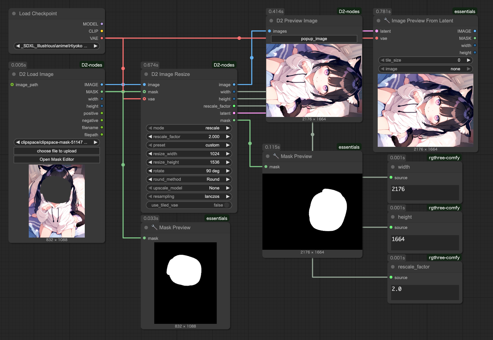

<a href="../en/index.md">English</a> | <a href="../ja/index.md">日本語</a> | <a href="../zh/index.md">繁体中文</a>

- <a href="index.md">Top</a>
- <a href="node.md">Node</a> / <a href="node_image.md">Image Node</a> / <a href="node_text.md">Text Node</a> / <a href="node_xy.md">XYPlot Node</a> / <a href="node_float.md">Float Palet</a>
- <a href="workflow.md">Workflow</a>


<h1>
Node
</h1>


## :tomato: Sampler Nodes


### D2 KSampler / D2 KSampler(Advanced)

<figure>

</figure>

#### 標準のKSamplerとの違い

- 画像を直接出力する（VAE Decoderが不要）
- プロンプトを文字列で入力できる
- A1111方式のLoRA読み込みプロンプトに対応
    - 例: `<lora:foo.safetensors:1>`
    - 書式は <a href="node.md#d2-load-lora">`D2 Load Lora`</a> を参照
    - `D2 KSampler Advanced` に `positive_cond` / `negative_cond` を入力した場合はCLIPにLoRAは適用されません。MODELのみ適用されます。
- Controlnet専用の入力があり、シンプルに適用できる
- 生成パラメーターをまとめた `d2_pipe` に対応
    - `D2 XY Plot` `D2 XY Plot Easy` `D2 XY Plot Easy Mini` から簡単に受け取れる
    - `D2 Send Eagle` へ簡単にパラメーターを渡せる
- プロンプトの重みアルゴリズムを変更できる（weight_interpretation）

#### 注意点

- `d2_pipe` が接続されている場合は `d2_pipe` のパラメーターが優先されます
- 例えば `D2 KSampler` で **steps:20** を指定して、`D2 XYPlot Easy` で **steps:15** を指定。`d2_pipe` が接続されている状態だと　`D2 XYPlot Easy` の **steps:15** が採用されます。

#### Input

- 標準のKSamplerと同じもの
    - `model` / `clip` / `latent_image` / `seed` / `steps` / `cfg` / `sampler_name` / `scheduler` / `denoise`
- D2 KSampler で追加したもの
    - `vae`
    - `cnet_stack`: `D2 Controlnet Loader` 接続用
    - `d2_pipe`: 生成パラメーターをまとめたもの。`D2 XY Plot` などから受け取る
    - `preview_method`: 生成時のプレビュー表示方式
    - `positive` / `negative`: 文字列形式のプロンプト入力
- D2 KSampler Advanced で追加したもの
    - `token_normalization` / `weight_interpretation`
        - プロンプトのウェイト調整方法。D2 KSampler Advancedで利用可能
        - 利用するには [Advanced CLIP Text Encode](https://github.com/BlenderNeko/ComfyUI_ADV_CLIP_emb/) が必要


#### Output

- 標準のKSamplerと同じもの
    - `LATENT`
- D2 KSampler で追加したもの
    - `IMAGE`: 生成画像
    - `MODEL` / `CLIP`: LoRA適用済み
    - `positive` / `negative`: Inputのものをそのまま出力
    - `formatted_positive`: A1111方式のLoRA書式を削除したpositiveプロンプト
    - `positive_cond` / `negative_cond`: Controlnet適用済みのCONDITIONING
    - `d2_pipe`: 生成パラメーターをまとめたもの


---


### D2 Pipe

<figure>

</figure>

- `d2_pipe` の内容を変更・取り出すためのノード
- `d2_pipe` は D2 XY Plot Easy、D2 KSampler、D2 Send Eagle などでパラメーターをまとめて渡すためのもの


---


## :tomato: Loader Node


### D2 Checkpoint Loader


- モデルファイルのフルパスを出力する Checkpoint Loader
- ファイル名に「vpred」が入っていたら自動的に v_prediction 設定を適用することが可能

#### Input

- `ckpt_name`
  - チェックポイント名
- `auto_vpred`
  - `true`: ファイル名に「vpred」が入っていたら自動的に v_prediction 設定を適用する
- `sampling` / `zsnr`
  - ModelSamplingDiscrete と同じ設定（詳しくは知りません）
- `multiplier`
  - RescaleCFG と同じ設定（詳しくは知りません）

#### Output

- `model` / `clip` / `vae`
    - 従来の CheckpointLoader と同じ。
- `ckpt_name` / `ckpt_hash` / `ckpt_fullpath`
    - Checkpoint 名、ハッシュ、フルパス。


---


### D2 Controlnet Loader

<figure>

</figure>

- `D2 KSampler` に接続してシンプルなワークフローが作れる Controlnet Loader

#### Input

- `cnet_stack`
  - `D2 Controlnet Loader` 接続用

#### Output

- `cnet_stack`
  - `D2 KSampler` または `D2 Controlnet Loader` 接続用


---


### D2 Load Lora

<figure>

</figure>

- テキストでLoraを指定できるLoraローダー
- model_weight / clip_weight も指定可能

<figure>

</figure>

- StableDiffusion webui A1111 と同じ書式を使うモード（a1111）と、LoRA名を並べるだけのモード（simple）がある
- 具体的な使い方は<a href="workflow.md">サンプルワークフロー</a>を参照


#### Input

- `mode`
  - `a1111`: StableDiffusion webui A1111と同じ書式が使用可能なモード
  - `simple`: LoRA名を並べるだけのシンプルなモード。このモードでは output の `STRING` は使わない

#### Output

- `MODEL` / `CLIP`: LoRA適用済みのMODEL、CLIP
- `prompt`: 入力されたテキストをそのまま出力
- `formatted_prompt`: LoRA指定部分が削除されたテキスト


#### モードによる書式の違い

**mode: a1111**
`<lora:〜>` と表記する。

```
<lora:lora_name:1>
```

**mode: simple**
前後の装飾は不要
```
lora_name:1
```

#### Weight指定方法
`{lora_name}:{model_weight}:{clip_weight}` という書式で記述する。
```
foo:0.8:1
```
clip_weight が指定されていない場合は model_weight と同じ値が適用される。
下記は同じ意味になる。
```
foo:0.8
foo:0.8:0.8
```
weight が指定されていない場合は「1」が適用される
下記は同じ意味になる。
```
foo
foo:1:1
```

#### simpleモードで複数のLoRAを指定する方法

改行で区切る
```
foo:0.5
bar
```
1行に2種類記述するときは「,」で区切る
```
foo:0.5,bar
```

#### コメントアウト
「//」または「#」で開始する行は無視されます。
```
//foo:0.5
#bar
```


---


## :tomato: Size Node


### D2 Get Image Size

<figure>

</figure>

- サイズの出力と表示を両方行う


---


### D2 Size Selector

<figure>

</figure>

- 画像サイズをプリセットから選択できるノード
- 画像からサイズを取得することも可能
- 数値の丸め方を `Ceil / Float / None` から選択可能

#### Input

- `images`
    - 画像からサイズを取得する時に使用
    - `preset` を `custom` にする必要がある
- `preset`
    - サイズのプリセット
    - この下の `width` `height` や `images` のサイズを使う時は `custom` にする必要がある
    - プリセットを変更したい時は `/custom_nodes/D2-nodes-ComfyUI/config/sizeselector_config.yaml` を編集
- `width` / `height`
    - 縦横サイズ
    - `preset` を `custom` にする必要がある
- `swap_dimensions`
    - width / height を入れ替える
- `upscale_factor`
    - 他のリサイズ系ノードに渡す数値。このノードでは何もしない
- `prescale_factor`
    - この倍率でリサイズしてから width / height を出力する
- `round_method`
    - `Round` : 四捨五入する
    - `Floor` : 切り落とす
    - `None` : 何もしない 
- `batch_size`
    - empty_latent にセットする batch size

#### Output

- `width / height`
    - 入力された `width`、`height` に `prescale_factor` を乗算する
- `upscale_factor` / `prescale_factor`
    - Input されたものをパススルーする
- `batch_size`
    - Input されたものをパススルーする
- `empty_latent`
    - 指定されたサイズ、batch size で作成した latent を出力


---

### D2 Image Resize

<figure>

</figure>

- 画像とマスクのリサイズおよび回転
- 倍率は小数点３位まで指定可能
- 小数点の四捨五入、切り捨て、切り上げが選択できる
- アップスケールモデルを使ったアップスケールが可能
- Latent出力も可能（VAEが必要）
- 回転は 90 / 180 / 270 度の3種類から選択可能

---

### D2 Resize Calculator

<figure>

</figure>

- 四捨五入、切り捨て、切り上げが選択できる

---


## :tomato: Refiner Node


### D2 Refiner Steps

<figure>

</figure>

- Refiner 用の steps を出力するノード


#### Input

- `steps`
    - 総 step 数
- `start`
    - 最初の KSampler の開始する steps
- `end`
    - 最初の KSampler の終了する steps

#### Output

- `steps` / `start` / `end`
    - Input のパススルー
- `refiner_start`
    - 2 つめの KSampler の開始する steps


---

### D2 Refiner Steps A1111

<figure>

</figure>

- img2img で Refiner するために denoise も指定できるノード


#### Input

- `steps`
    - 総 step 数
- `denoise`
    - img2img の denoise を指定する
- `switch_at`
    - 総 steps 数の何割で次の KSampler に切り替えるか

#### Output

- `steps` /
    - Input のパススルー
- `start`
    - 最初の KSampler の開始 steps
- `end`
    - 最初の KSampler の終了 steps
- `refiner_start`
    - 2 つめの KSampler の開始する steps

---


### D2 Refiner Steps Tester

- steps を確認するためのノード


---


## :tomato: Other Node


### D2 Model and CLIP Merge SDXL

<figure>
  
</figure>

- ModelMergeSDXL と CLIPMergeSimple を合体させたノード
- XYPlot で使いやすいように、各 weight をカンマ区切りで指定可能にした
- この図では `0.85,0.85,1,1,0.4,0.4,1,0.4,0.4,0.4,1,0.4,0.4,0.4,0,0.55,0.85,0.85,0.85,0.85,0.85,0.85,1,1,0.65` を指定している

---


### D2 Any Delivery

<figure>
  
</figure>

- 複数の要素をまとめて受け渡すことができるノード
- `D2 Any Delivery` 同士を繋いで、データをパッケージとして受け渡しできる
- 必要な入出力を `_label` に記入し、動的に追加することができる
- ComfyUI のアップデートで <a href="https://github.com/Trung0246/ComfyUI-0246" target="_blank">ComfyUI-0246</a> の `Highway` が使えなくなってしまったので作りました
  - 本家がアップデートしたらそっちを使うほうがいいと思います

#### Input

- `_package`
  - 他の `D2 Any Delivery` から受け取るパッケージ
- `_label`
  - 入出力の定義を記入する
  - `>width; >height; <width` のように指定する
  - `>` で始まる項目は input として追加される
  - `<` で始まる項目は output として追加される
  - `;` で区切って複数指定可能
- `_update`
  - `_label` の内容に従って入出力を更新する

#### Output

- `_package`
  - 他の D2_AnyDelivery へ渡すパッケージ
  - input で受け取った値がすべて格納される
- `_label` で `<` を付けて指定した項目
  - `_package` から取り出された値が出力される

#### _label 記入例

入力に `width` `height` を追加
```
>width; >height
```

出力に `width` `height` を追加
```
<width; <height
```

入力に `prompt` `seed`、出力に `width` `height` を追加
```
>prompt; >seed; <width; <height
```
