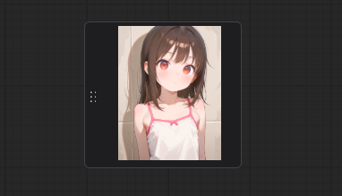

<a href="../en/index.md">English</a> | <a href="../ja/index.md">日本語</a> | <a href="../zh/index.md">繁体中文</a>

- <a href="index.md">Top</a>
- <a href="node.md">Node</a> / <a href="node_image.md">Image Node</a> / <a href="node_text.md">Text Node</a> / <a href="node_xy.md">XYPlot Node</a> / <a href="node_float.md">Float Palet</a>
- <a href="workflow.md">Workflow</a>

<h1>
Node
</h1>

## :tomato: Float Palet

### D2 Queue Button

<figure>
  
</figure>

- 指定した枚数（Batch count）を生成するボタン
- パレットの左端をドラッグすると移動できる

<figure>
  
</figure>

- 非表示にするには ComfyUI の設定画面のカテゴリ `D2` から設定する
- 枚数も設定画面から指定できる
- 枚数はカンマ（,）で区切る

---

### Prompt convert dialog

<figure>

</figure>

- NovelAI と StableDiffusion の weight を相互変換するダイアログ
- `Prompt convert` ボタンから開く
- 初期状態では非表示になっている
- `settings > D2 > Show prompt convert button` を有効にすると表示する

---

### D2 Progress Preview

<figure>

</figure>

- 生成中イメージ、生成後のイメージを表示
- 生成後のイメージはクリックするとギャラリー（Lightbox風）が起動する
- 全ての出力ノードを対象としているので、内容が重複することがあります
- `settings > D2 > Show progress preview` を有効にすると表示する（デフォルトでは表示）

