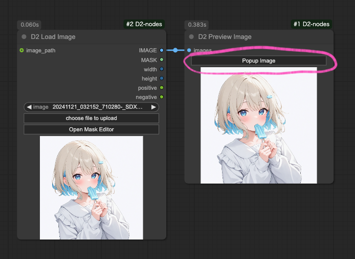
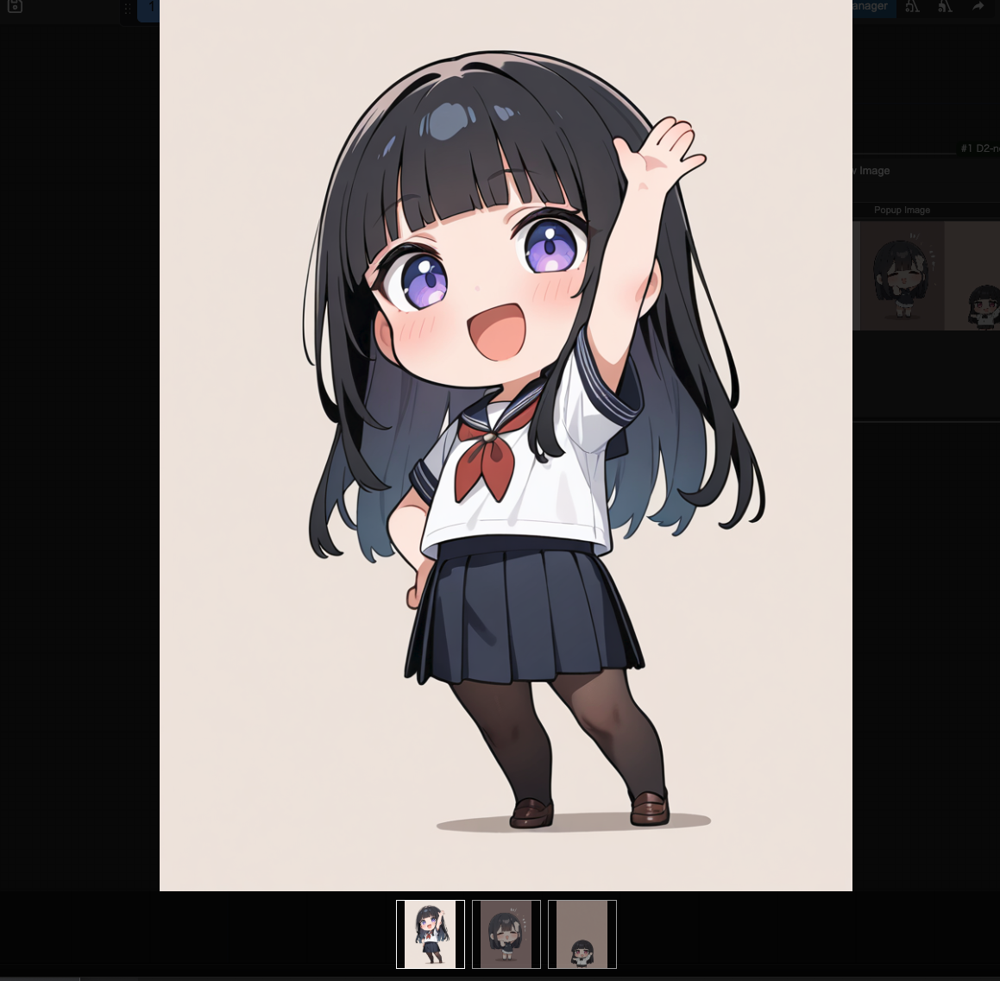
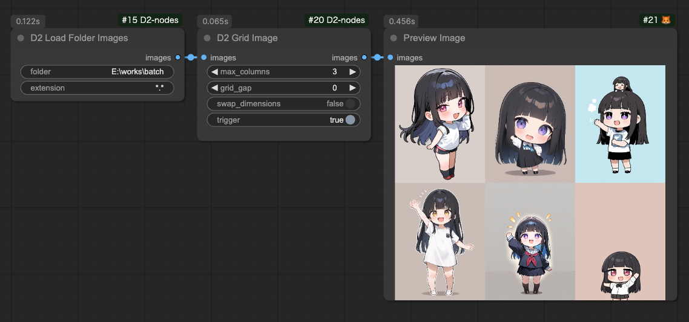
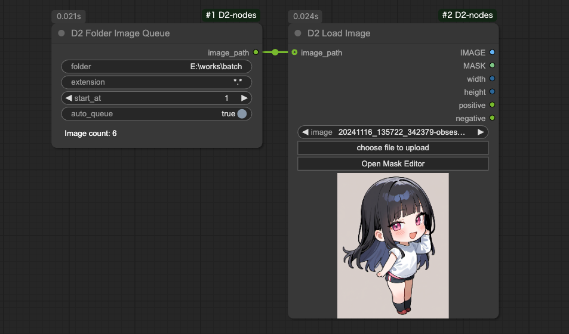
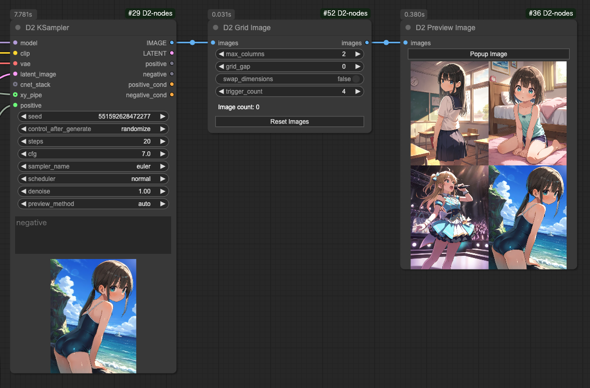
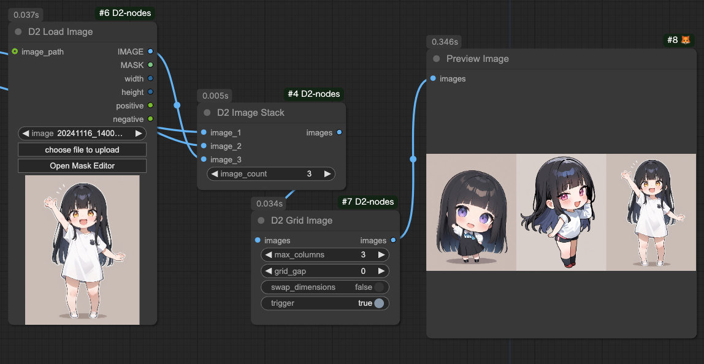

<a href="../en/index.md">English</a> | <a href="../ja/index.md">日本語</a> | <a href="../zh/index.md">繁体中文</a>

- <a href="index.md">Top</a>
- <a href="node.md">Node</a> / <a href="node_image.md">Image Node</a> / <a href="node_text.md">Text Node</a> / <a href="node_xy.md">XYPlot Node</a> / <a href="node_float.md">Float Palet</a>
- <a href="workflow.md">Workflow</a>

<h1>
Node
</h1>

## :tomato: Image Node

### D2 Preview Image

<figure>

</figure>

- `Popup Image` ボタンをクリックすると全画面ギャラリーが表示される

---

### D2 Load Image

<figure>

</figure>

- 画像からプロンプトを取得できる Load Image ノード
- StableDiffusion webui A1111、NovelAI で作成した画像にも対応
- マスクエディターを開くボタンが付いてる

#### Input

- `image_path`
  - 画像のパスを入力するとファイルを読み込む
  - `D2 Folder Image Queue` との接続に使用する

#### Output

- `IMAGE / MASK`
    - 画像とマスク
- `width / height`
    - 画像サイズ
- `positive` / `negative`
    - プロンプト

※ワークフローの構成によってはプロンプトを取得できない場合もあります。例えば「KSampler」という文字が含まれたノード（例：Tiled KSampler）が無いと取得できません。

---

### D2 Load Folder Images

<figure>

</figure>

- フォルダー内の画像を一括ロードしてまとめて出力する
- `D2 Grid Image` などで使う
- 順次処理をしたいなら `D2 Folder Image Queue` を使う

#### Input

- `folder`
  - フォルダーをフルパスで指定
- `extension`
  - JPEG画像だけを読み込むなら `*.jpg` のように指定する
  - `*silver*.webp` のような指定も可能

---

### D2 Folder Image Queue

<figure>

</figure>

- フォルダ内の画像のパスを出力する
- Queue を実行すると画像枚数分の Queue を自動的に実行する

#### Input

- `folder`
  - 画像フォルダ
- `extension`
  - ファイル名のフィルタを指定
  - `*.*`: 全ての画像
  - `*.png`: PNG形式のみ対象
- `start_at`
  - 処理を開始する画像番号
- `auto_queue`
  - `true`: 残りの Queue を自動的に実行する
  - `false`: 1回だけ実行する

#### Output

- `image_path`
  - 画像のフルパス

---

### D2 Grid Image

<figure>

</figure>

- グリッド画像を出力する
- 横方向、縦方向、どちらも可能

#### Input

- `max_columns`
  - 横方向に整列する画像の枚数
  - `swap_dimensions` が `true` の時は縦方向の枚数
- `grid_gap`
  - 画像の間隔
- `swap_dimensions`
  - `true`: 縦方向
  - `false`: 横方向
- `trigger_count`
  - 入力画像がここで指定した枚数になったらグリッド画像を出力する
- `Image count`
  - 入力した画像の枚数
- `Reset Images`
  - 入力した画像を破棄する

---

### D2 Image Stack

<figure>

</figure>

- 入力された複数の画像をまとめて出力する
- 最大50個入力できる

#### Input

- `image_count`
  - 入力数を増減できる。最大50

---

### D2 EmptyImage Alpha

<figure>

</figure>

- EmptyImage にαチャンネル（透明度）を追加

