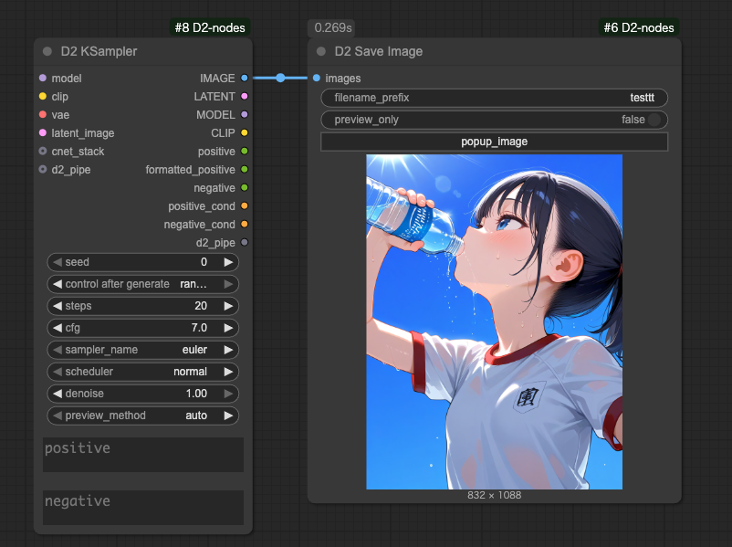

<a href="../en/index.md">English</a> | <a href="../ja/index.md">日本語</a> | <a href="../zh/index.md">繁体中文</a>

- <a href="index.md">Top</a>
- <a href="node.md">Node</a> / <a href="node_image.md">Image Node</a> / <a href="node_text.md">Text Node</a> / <a href="node_xy.md">XYPlot Node</a> / <a href="node_float.md">Float Palet</a>
- <a href="workflow.md">Workflow</a>

<h1>
Node
</h1>

## :tomato: Image Node

### D2 Preview Image

<figure>

</figure>

- `Popup Image`: ボタンをクリックすると全画面ギャラリーが表示される

---

### D2 Save Image

<figure>

</figure>

- `D2 Preview Image` と同じく、全画面ギャラリー機能を搭載した画像保存ノード

#### Input

- `Popup Image`: ボタンをクリックすると全画面ギャラリーが表示される
- `preview_only`: true 時は画像を保存せず、プレビュー表示だけになる

---

### D2 Load Image

<figure>

</figure>

- 画像からプロンプトを取得できる Load Image ノード
- StableDiffusion webui A1111、NovelAI で作成した画像にも対応
- マスクエディターを開くボタンが付いてる

#### Input

- `image_path`
  - 画像のパスを入力するとファイルを読み込む
  - `D2 Folder Image Queue` との接続に使用する

#### Output

- `IMAGE / MASK`
    - 画像とマスク
- `width / height`
    - 画像サイズ
- `positive` / `negative`
    - プロンプト

※ワークフローの構成によってはプロンプトを取得できない場合もあります。例えば「KSampler」という文字が含まれたノード（例：Tiled KSampler）が無いと取得できません。

---

### D2 Load Folder Images

<figure>

</figure>

- フォルダー内の画像を一括ロードしてまとめて出力する
- `D2 Grid Image` などで使う
- 順次処理をしたいなら `D2 Folder Image Queue` を使う

#### Input

- `folder`
  - フォルダーをフルパスで指定
- `extension`
  - JPEG画像だけを読み込むなら `*.jpg` のように指定する
  - `*silver*.webp` のような指定も可能

---

### D2 Folder Image Queue

<figure>

</figure>

- フォルダ内の画像のパスを出力する
- Queue を実行すると画像枚数分の Queue を自動的に実行する

#### Input

- `folder`
  - 画像フォルダ
- `extension`
  - ファイル名のフィルタを指定
  - `*.*`: 全ての画像
  - `*.png`: PNG形式のみ対象
- `start_at`
  - 処理を開始する画像番号
- `auto_queue`
  - `true`: 残りの Queue を自動的に実行する
  - `false`: 1回だけ実行する

#### Output

- `image_path`
  - 画像のフルパス

---

### D2 Grid Image

<figure>

</figure>

- グリッド画像を出力する
- 横方向、縦方向、どちらも可能

#### Input

- `max_columns`
  - 横方向に整列する画像の枚数
  - `swap_dimensions` が `true` の時は縦方向の枚数
- `grid_gap`
  - 画像の間隔
- `swap_dimensions`
  - `true`: 縦方向
  - `false`: 横方向
- `trigger_count`
  - 入力画像がここで指定した枚数になったらグリッド画像を出力する
- `Image count`
  - 入力した画像の枚数
- `Reset Images`
  - 入力した画像を破棄する

---

### D2 Image Stack

<figure>

</figure>

- 入力された複数の画像をバッチにまとめる
- D2 Grid Image などで使える
- 最大50個入力まで

---

### D2 Image Mask Stack

<figure>

</figure>

- 入力された複数の画像とマスクをバッチにまとめる
- D2 Image Stack にマスクを追加したもの

---

### D2 EmptyImage Alpha

<figure>

</figure>

- EmptyImage にαチャンネル（透明度）を追加

---

### D2 Mosaic Filter

<figure>

</figure>

- モザイクフィルターをかける
- 透明度、明るさ、色の反転などを設定可能

---

### D2 Cut By Mask

<figure>

</figure>

- マスクで画像をカットする
- 出力する形状、サイズ、余白などを指定できる

#### Input

- `images`: 切り出し元画像
- `mask`: マスク
- `cut_type`: 切り取る画像の形状
    - `mask`: マスクの形状通りに切り取る
    - `rectangle`: マスク形状から長方形を算出して切り取る
    - `square_thumb`: 最大サイズの正方形で切り取る。サムネイル向けモード
- `output_size`: 出力する画像サイズ
    - `mask_size`: マスクのサイズ
    - `image_size`: 入力画像のサイズ（入力画像の位置を保持した状態で周囲が透明になる）
- `padding`: マスクエリアを拡張するピクセル数（初期値 0）
- `min_width`: マスクサイズの最小幅（初期値 0）
- `min_height`: マスクサイズの最小高さ（初期値 0）
- `output_alpha`: 出力画像にαチャンネルを含めるか

#### output
- `image`: マスク領域で切り取った画像
- `mask`: マスク
- `rect`: 切り取った短形領域

---

### D2 Paste By Mask

<figure>

</figure>

- D2 Paste By Mask で作成したマスクや短形領域を使って画像を合成する
- ボカし幅、貼り付け形状などが指定できる

#### Input

- `img_base`: 下地になる画像（batch対応）
- `img_paste`: 貼りつける画像（batch対応）
- `paste_mode`: img_paste のトリミング方法と貼り付け座標を決める
    - `mask`: img_paste を mask_opt でマスキングして x=0, y=0 の位置に貼りつける（マスク形状貼り付け）
    - `rect_full`: img_paste を rect_opt のサイズでトリミングして rect_opt の位置に貼りつける（短形貼り付け）
    - `rect_position`: img_paste を rect_opt の位置に貼りつける（短形貼り付け）
    - `rect_pos_mask`: img_paste を mask_opt でマスキングして rect_opt の位置に貼りつける（マスク形状貼り付け）
- `multi_mode`: img_base, img_paste のどちらか、または両方が複数枚だった時の処理
    - `pair_last`: img_base, img_paste を先頭から同じインデックスのペアで処理する。片方の数が少ない時は最後の画像が採用される
    - `pair_only`: pair_lastと同じ。片方の数が少ない時は処理前にエラーを表示して止まる
    - `cross`: 全ての組み合わせを処理する

input `optional`:
- `mask_opt`: マスク
- `rect_opt`: 短形領域
- `feather`: エッジをボカすpx数（初期値 0）

#### output

- `image`: 合成した画像

#### multi_mode について

`pair_last` `pair_only` は `img_base` と `img_paste` の同じ順番の画像でペアとして出力する。

<figure>

</figure>

`cross` は全ての組み合わせを出力する。

<figure>

</figure>
