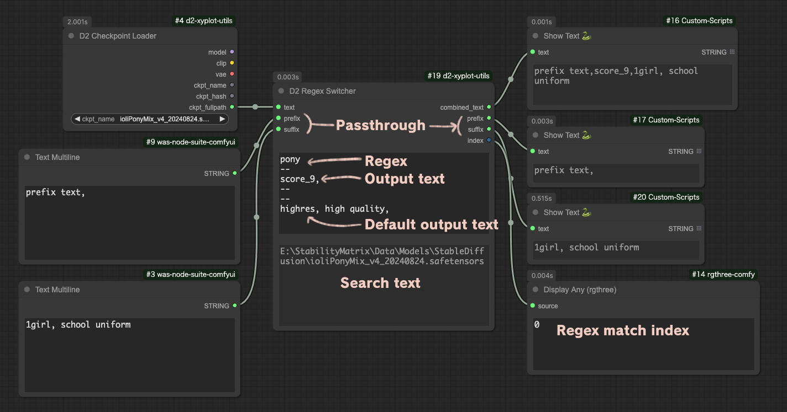
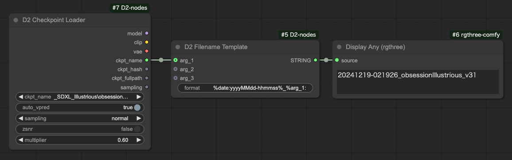
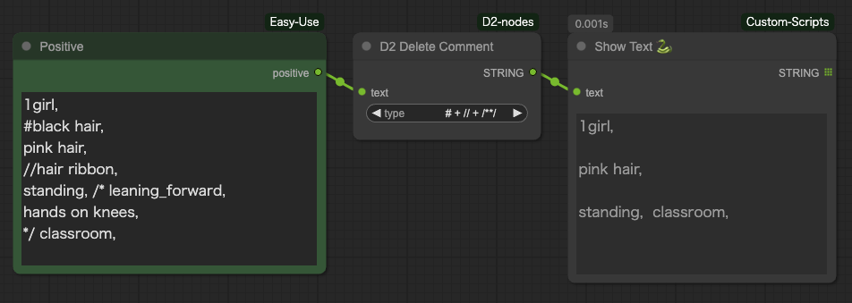

<a href="../en/index.md">English</a> | <a href="../ja/index.md">日本語</a> | <a href="../zh/index.md">繁体中文</a>

- <a href="index.md">Top</a>
- <a href="node.md">Node</a> / <a href="node_image.md">Image Node</a> / <a href="node_text.md">Text Node</a> / <a href="node_xy.md">XYPlot Node</a> / <a href="node_float.md">Float Palet</a>
- <a href="workflow.md">Workflow</a>


<h1>
Node
</h1>


## :tomato: Text Node


### D2 Regex Replace

<figure>
  
</figure>

- 正規表現を使って置換ができる
- 複数の条件を指定できる
- 正規表現によるマッチ文字列の再利用ができる（\1、\2 など）
- 対象文字列を「タグ単位」と「全体」で指定できる

#### Input

- `text`
    - 検索対象文字列
- `mode`
  - `Tag`: `text` を改行と「,」で分解し、個別に置換する
  - `Advanced`: `text` をまとめて置換する
- `regex_and_output`
    - 検索文字列と出力文字列の一覧
    - 下記のフォーマットで記入する
    - 出力文字列に何も記載されてない時はマッチした部分を削除する
    - 個数に上限は無い

```
検索文字 1
--
出力文字列 1
--
検索文字 2
--
出力文字列 2
```

#### Output

- `text`
    - 置換処理をしたテキスト

#### Sample

Pony系列のクオリティタグを削除するサンプル。

Mode: `Tag`

Input text
```
score_9, score_8_up, (score_7_up, score_6_up:0.8) , rating_explicit, source_anime, BREAK
1girl, swimsuit
```
Regex Replace
```
.*(score_|rating_|source_).*
--
--
BREAK
--

```

Output text
```
1girl, swimsuit
```


---


### D2 Regex Switcher

  

- 入力テキストを正規表現で検索し、該当したテキストを出力
- 主な目的は Checkpoint 毎のクオリティタグの切り替え
- 入力した `text` の中に合致する文字列を発見すると、対象文字列と、何番目に合致したか（0 から開始）を出力する
- 上の画像では `ioliPonyMixV4.safetensors` を受け取り、検索条件 `pony` に合致したので `score_9` が出力されている
- 最初の検索条件に合致したので `index` は `0` が出力される
- 全ての条件に合致しないと `-1` が出力される
- 文字列の前方結合、後方結合もできる。

#### Input

- `text`
    - 検索対象文字列
- `prefix`
    - 前方に結合する文字列
- `suffix`
    - 後方に結合する文字列
- `regex_and_output`
    - 検索文字列と出力文字列の一覧
    - 下記のフォーマットで記入する
- `pre_delim`
    - `prefix` と `regex_and_output` を接続する時に挟む文字
    - `Comma`: `,` / `Line break`: 改行 / `None`: 何も挟まない
- `suf_delim`
    - `suffix` と `regex_and_output` を接続する時に挟む文字

```
検索文字 1（正規表現も使用可能）
--
出力文字列 1
--
検索文字 2（正規表現も使用可能）
--
出力文字列 2
--
--
合致するものが無い時に出力する文字
```

#### Output

- `combined_text`
    - `prefix` + 出力文字列 + `suffix` を結合した文字列
- `prefix` / `suffix`
    - Input のパススルー

#### 使用例

  

この例では合致した番号（`index`）を [Easy Use](https://github.com/yolain/ComfyUI-Easy-Use) の Text Index Switch に渡して切り替えている。

合致しないと `-1` になってしまうので、全ての文字列に合致する正規表現 `.+` を使ってデフォルト出力の代わりにしている。


---


### D2 Multi Output

<figure>
  
</figure>

- seed や cfg など汎用的なパラメータをリスト出力するノード

#### Input

- `type`
    - `FLOAT`: 浮動小数点数。CFG など
    - `INT`: 整数。steps など
    - `STRING`: 文字列。sampler など
    - `SEED`: 乱数生成ボタンで seed 値を入力できる
- `Add Random`
    - 入力欄に乱数を追加する
    - `type` が `SEED` の時だけ表示される


---

### D2 Filename Template

<figure>
  
</figure>

- ファイル名を作るためのノード
- 外部の要素を取り込むことが可能

#### Input

- `arg_1` `arg_2` `arg_3`
  - 他のノードから値を取り込む
- `format`
    - `%date:{yyyy/MM/dd/hh/mm/ss}%`
      - `yyyy`: 年
      - `MM`: 月
      - `dd`: 日
      - `hh`: 時
      - `mm`: 分
      - `ss`: 秒
    - `%node:{id}.{key}%`
      - ノードIDと、項目名を指定して値を取得する
      - 例：`%node:8.width%`: ID 8 のノードから width を取得
    - `%arg_1%`（2、3も同様）
      - 入力した値を埋め込む
    - `%arg_1:ckpt_name%`（2、3も同様）
      - チェックポイント名から `.safetensors` を除外したものを埋め込む

#### Example
```
%date:yyyyMMdd-hhmmss%_%arg_1:ckpt_name%
👇
20241219-021926_obsessionIllustrious_v31
```

---

### D2 Delete Comment

<figure>
  
</figure>

- テキスト内のコメントを削除する
- 行頭「#」、行頭「//」、「/\*」〜「\*/」の間が対象


