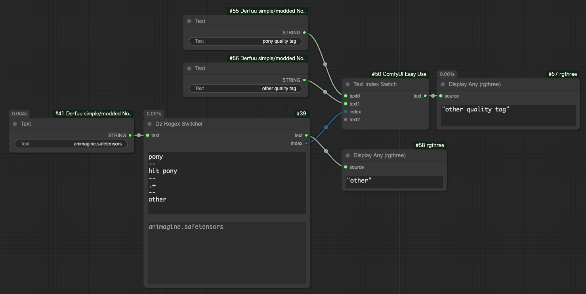

<a href="../en/index.md">English</a> | <a href="../ja/index.md">日本語</a> | <a href="../zh/index.md">繁体中文</a>

- <a href="index.md">Top</a>
- <a href="node.md">Node</a> / <a href="node_image.md">Image Node</a> / <a href="node_text.md">Text Node</a> / <a href="node_xy.md">XYPlot Node</a> / <a href="node_float.md">Float Palet</a>
- <a href="workflow.md">Workflow</a>


<h1>
Node
</h1>


## :tomato: Text Node


### D2 Regex Replace

<figure>
  
</figure>

- 正規表現を使って置換ができる
- 複数の条件を指定できる
- 正規表現によるマッチ文字列の再利用ができる（\1、\2 など）
- 対象文字列を「タグ単位」と「全体」で指定できる

#### Input

- `text`
    - 検索対象文字列
- `mode`
  - `Tag`: `text` を改行と「,」で分解し、個別に置換する
  - `Advanced`: `text` をまとめて置換する
- `regex_and_output`
    - 検索文字列と出力文字列の一覧
    - 下記のフォーマットで記入する
    - 出力文字列に何も記載されてない時はマッチした部分を削除する
    - 個数に上限は無い

```
検索文字 1
--
出力文字列 1
--
検索文字 2
--
出力文字列 2
```

#### Output

- `text`
    - 置換処理をしたテキスト

#### Sample

Pony系列のクオリティタグを削除するサンプル。

Mode: `Tag`

Input text
```
score_9, score_8_up, (score_7_up, score_6_up:0.8) , rating_explicit, source_anime, BREAK
1girl, swimsuit
```
Regex Replace
```
.*(score_|rating_|source_).*
--
--
BREAK
--

```

Output text
```
1girl, swimsuit
```


---


### D2 Regex Switcher

  

- 入力テキストを正規表現で検索し、該当したテキストを出力
- 主な目的は Checkpoint 毎のクオリティタグの切り替え
- 入力した `text` の中に合致する文字列を発見すると、対象文字列と、何番目に合致したか（0 から開始）を出力する
- 上の画像では `ioliPonyMixV4.safetensors` を受け取り、検索条件 `pony` に合致したので `score_9` が出力されている
- 最初の検索条件に合致したので `index` は `0` が出力される
- 全ての条件に合致しないと `-1` が出力される
- 文字列の前方結合、後方結合もできる。

#### Input

- `text`
    - 検索対象文字列
- `prefix`
    - 前方に結合する文字列
- `suffix`
    - 後方に結合する文字列
- `regex_and_output`
    - 検索文字列と出力文字列の一覧
    - 下記のフォーマットで記入する
- `pre_delim`
    - `prefix` と `regex_and_output` を接続する時に挟む文字
    - `Comma`: `,` / `Line break`: 改行 / `None`: 何も挟まない
- `suf_delim`
    - `suffix` と `regex_and_output` を接続する時に挟む文字

```
検索文字 1（正規表現も使用可能）
--
出力文字列 1
--
検索文字 2（正規表現も使用可能）
--
出力文字列 2
--
--
合致するものが無い時に出力する文字
```

#### Output

- `combined_text`
    - `prefix` + 出力文字列 + `suffix` を結合した文字列
- `prefix` / `suffix`
    - Input のパススルー

#### 使用例

  

この例では合致した番号（`index`）を [Easy Use](https://github.com/yolain/ComfyUI-Easy-Use) の Text Index Switch に渡して切り替えている。

合致しないと `-1` になってしまうので、全ての文字列に合致する正規表現 `.+` を使ってデフォルト出力の代わりにしている。


---


### D2 Multi Output

<figure>
  
</figure>

- seed や cfg など汎用的なパラメータをリスト出力するノード

#### Input

- `type`
    - `FLOAT`: 浮動小数点数。CFG など
    - `INT`: 整数。steps など
    - `STRING`: 文字列。sampler など
    - `SEED`: 乱数生成ボタンで seed 値を入力できる
- `Add Random`
    - 入力欄に乱数を追加する
    - `type` が `SEED` の時だけ表示される


---

### D2 Filename Template / D2 Filename Template2

<figure>
  
</figure>

- 日付や他のノードのパラメーターを取り込んで文字列テンプレートを作るためのノード
- `D2 Filename Template2` は複数行対応版です
- 配列、辞書、オブジェクトから値を取得することも可能
- Stable Diffusion webui A1111風のメタデータ書式など、よく使う書式をプリセット登録が可能
  - `custom_nodes/d2-nodes-comfyui/config/template_config.yaml` を編集することで追加可能


#### Input

- `arg_{数字}`
  - 他のノードから値を取り込む
- `format`
    - `%date:{yyyy/MM/dd/hh/mm/ss}%`
      - `yyyy`: 年
      - `MM`: 月
      - `dd`: 日
      - `hh`: 時
      - `mm`: 分
      - `ss`: 秒
    - `%{ノード名}.{key}%`
      - ノード名と、項目名を指定して値を取得する
      - 例：`%Empty Latent Image.width%`: Empty Latent Image のノードから width を取得
    - `%node:{id}.{key}%`
      - ノードIDと、項目名を指定して値を取得する
      - 例：`%node:8.width%`: ID 8 のノードから width を取得
    - `%arg_{数字}%`
      - 入力した値を埋め込む
    - `%arg_{数字}:ckpt_name%`
      - チェックポイント名から `.safetensors` を除外したものを埋め込む
    - `%arg_{数字}:preset.{プリセット名}%`
      - プリセットは `custom_nodes/d2-nodes-comfyui/config/template_config.yaml` を編集することで追加可能
    - `%exec_{数字}[{index}]%`
      - `arg_{数字}` に入力された**配列**から `{index}` の値を取得
    - `%exec_{数字}['{key}']%`
      - `arg_{数字}` に入力された**辞書**から `{key}` の値を取得
    - `%exec_{数字}.{key}%`
      - `arg_{数字}` に入力された**オブジェクト**から `{key}` の値を取得
- `arg_count`
  - 入力項目の増減
- `normalization`
  - ファイル名に使えない`:`を`_`に変換する

<figure>
  
  <figucaption>`arg_N`に接続したノード情報や、ノード名などを使って取得している</figucaption>
</figure>

<figure>
  
  <figucaption>生成パラメーターをまとめたオブジェクト `d2_pipe` から `steps`,`sampler_name` を取得している</figucaption>
</figure>

<figure>
  
  <figucaption>`arg_1` に入力された値をプリセット `a1111` を使って出力している。チェックポイント名を追加するために `D2 Pipe` を使用</figucaption>
</figure>

---

### D2 Prompt

<figure>
  
</figure>

- `CHOOSE`ボタンからLoRAを選択し、A1111方式のLoRAプロンプトを挿入できる
- テキスト内のコメントを削除する
- 行頭「#」、行頭「//」、「/\*」〜「\*/」の間が対象
- トークン数を下部に表示（`token_count` が `true` の時に動作する）
- トークン数の計測のCLIPは"ViT-L/14"を使用。他のCLIPを使いたい時は `D2 Token Counter` をご利用ください


#### コメントアウトのショートカットキーについて

- 全てのテキストボックスでコメントアウトのショートカットキー（ctrl + /）が使用可能
- ショートカットキーは `Settings > D2 > shortcutKey` で変更可能
- 無効にしたい場合は上記の内容を削除する


---

### D2 Prompt Sanitizer

<figure>
  
</figure>

- プロンプト文字列を整形するノード
- `_`（アンダースコア）を半角スペースに変換する（`long_hair` → `long hair`）
- `,`（カンマ）の後に必ず半角スペースを1つ入れ、前後の余分な空白を整理する（`a ,  b` → `a, b`）
- 連続した余分なカンマをまとめ、行頭のカンマを削除する（`a,, ,b` → `a, b`）
- 各処理は個別に ON / OFF できる

#### Input

- `underscore_to_space`：`_` を半角スペースに変換する
- `space_after_comma`：カンマ前後の空白を整理し `, ` に統一する（改行は保持）
- `remove_extra_comma`：連続した余分なカンマ（`,,` / `, ,`）を1つにまとめ、行頭のカンマを削除する（改行は保持）
- `protect_lora`：`<...>` で囲まれた LoRA 表記などを変換対象から保護する（`<lora:my_lora:1>` のアンダースコアを残す）
- `protect_score`：Pony 系の品質タグ `score_9` / `score_8_up` などを変換対象から保護する

---

### D2 Token Counter

<figure>
  
</figure>

- プロンプトのトークンを数える

---

### D2 Load Text

<figure>
  
</figure>

- テキストファイルを読み込む汎用ノード
- 学習用キャプションの一括編集では、`D2 Folder Image Queue` で `*.txt` のパスを取得して読み込む用途で使う

#### Input

- `file_path`
  - 読み込むテキストファイルのフルパス
- `encode_to_utf8`
  - `true`: 文字コードを自動判別して utf-8 に変換して読み込む
  - `false`: 変換しない（utf-8 として読み込む）

#### Output

- `text`
  - ファイルの中身（整形せずそのまま。ファイルが存在しない場合は空文字）
- `file_path`
  - 入力した `file_path` をそのまま出力（`D2 Save Caption` の `base_filename` に渡す用）

---

### D2 Save Caption

<figure>
  
</figure>

- タグを整形してキャプションファイルを保存するノード
- `base_filename` の拡張子を `extension` に置き換えたパスに保存する（例 `d:/images/aaa.jpg` → `d:/images/aaa.txt`）
- 整形は「分割 → 前後空白除去 → `_` 置換 → 除外 → 重複除去 → 先頭追加 → 末尾カンマ」の順で行う

#### Input

- `base_filename`
  - 保存先の元パス。`D2 Folder Image Queue` の `image_path` や `D2 Load Text` の `file_path` を受け取る
  - 空の場合はエラーで停止する（意図しない場所への保存を防ぐため）
- `text`
  - キャプション本文（`WD14 Tagger` や `D2 Load Text` から）
- `extension`
  - 保存するファイルの拡張子（例 `txt`）
- `exclude_tags`
  - 除外するタグ。カンマ・改行の両方で区切る
  - `regex/パターン/` と書くと正規表現にマッチしたタグを除外する（除外専用）
- `prepend_tags`
  - 先頭に追加するタグ。カンマ区切り。既に存在するタグは追加しない
- `replace_underscore`
  - `true`: `_` を空白に変換
- `trailing_comma`
  - `true`: 末尾にカンマを追加
- `ignore_case`
  - `true`: 除外の判定で大文字小文字を無視する
- `backup`
  - `true`: 同名ファイルがあれば旧ファイルを `.bak` にリネームしてから保存
- `dry_run`
  - `true`: 変換結果のプレビュー用。ファイルに保存せず、整形結果を `text` 出力で確認する

#### Output

- `text`
  - 整形後のキャプション
- `file_path`
  - 保存先のフルパス（`dry_run` 時は保存予定のパス）

---

### D2 Tag Report

<figure>
  
</figure>

- `D2 Save Caption` の `exclude_tags`（除外タグ） に繋ぐ除外タグリストを作成するためのノード
- 指定フォルダー内のキャプションからタグの出現頻度を集計し、除外タグリストを作る
  - `Get tags` ボタンで集計結果を `text` に表示する
  - ユーザーは残す・消すを編集し、`D2 Save Caption` の `exclude_tags` に渡す
- 行頭に `//` または `#` を付けるとコメント行になる
- `D2 Tag Report` `D2 Save Caption` の使い方はこちらの記事をご覧ください
  - https://note.com/da2el_ai/n/ne1fc9b3bea89?app_launch=false

#### Input

- `folder`
  - キャプションファイルのあるフォルダー（フルパス）
- `include_subfolders`
  - `true`: サブフォルダーも対象にする
- `extension`
  - 対象とする拡張子（例 `txt`）
- `order_by`
  - `count_9-0`: 出現回数の多い順
  - `count_0-9`: 出現回数の少ない順
  - `tag_a-z`: タグ名順（A→Z）
  - `tag_z-a`: タグ名順（Z→A）
- `without_count`
  - `true`: レポートに出現回数を表示しない
- `output_type`
  - `remove_comment`: コメント行を削除して残りを出力（消したいタグをコメントでマークする運用）
  - `output_comment`: コメント行のみを出力（消したいタグだけコメント化する運用）
- `separator`
  - `newline`: 改行区切りで出力（`regex/パターン/` などカンマを含むエントリが壊れないため推奨）
  - `comma`: カンマ＋空白の1行で出力

#### Output

- `text`
  - 編集後のタグリスト（`D2 Save Caption` の `exclude_tags` に渡す）