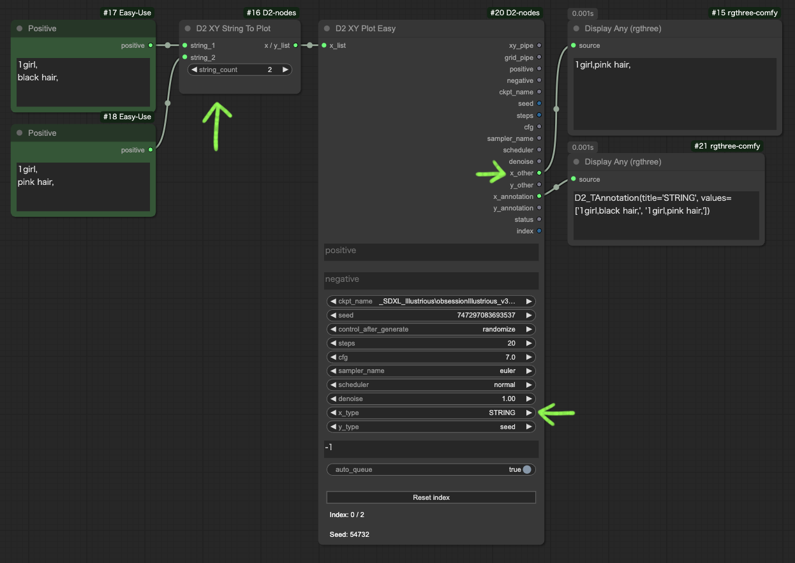

<a href="../en/index.md">English</a> | <a href="../ja/index.md">日本語</a> | <a href="../zh/index.md">繁体中文</a>

- <a href="index.md">Top</a>
- <a href="node.md">Node</a> / <a href="node_image.md">Image Node</a> / <a href="node_text.md">Text Node</a> / <a href="node_xy.md">XYPlot Node</a> / <a href="node_float.md">Float Palet</a>
- <a href="workflow.md">Workflow</a>

<h1>
Node
</h1>

## :tomato: XY Plot Node

### D2 XY Plot Easy

<figure>

</figure>

- KSampler の項目に限定したシンプルなワークフローの XY Plot が作れるノード

#### Input

- `positive` / `negative` / `seed` / `steps` / `cfg` / `sampler_name` / `scheduler` / `denoise`
  - KSampler に渡すための設定
- `ckpt_name`
  - D2 Checkpoint Loader に渡す設定
- `x_type` / `y_type`
  - XY Plot を実行する項目を指定
  - `STRING`、`INT`、`FLOAT` を指定すると `x_other`、`y_other` から出力する
- `x_list` / `y_list`
  - XY Plot の変更内容
  - 改行区切りテキストなので他のノードを使って入力することも可能
- `auto_queue`
  - `true`: 必要な回数の Queue を自動的に実行
  - `false`: 手動で Queue を実行する
- `Reset index`
  - 途中で停止した時はこのボタンで index をリセットする

#### Output

- `xy_pipe`
  - D2 KSampler で使用するパラメーターをまとめて出力
- `grid_pipe`
  - D2 Grid Image で使用するパラメーター `x_annotation` `y_annotation` `status` をまとめて出力
- `positive` / `negative` / `seed` / `steps` / `cfg` / `sampler_name` / `scheduler` / `denoise`
  - KSampler に渡すパラメーター
- `ckpt_name`
  - D2 Checkpoint Loader に渡す設定
- `x_other` / `y_other`
  - `x_type` `x_type` を `STRING` `INT` `FLOAT` に指定するとここから出力する
- `x_annotation` / `y_annotation`
  - `D2 XY Grid Image` に接続する見出しテキスト
- `status`
  - `D2 XY Grid Image` に接続する制御信号
- `index`
  - 現在の処理回数

---

### D2 XY Plot

<figure>

</figure>

- 汎用的なXY Plotのワークフローが作れるノード
- X / Y 入力はシンプルな改行区切りテキストだから他のノードと組み合わせやすい

#### Input

- `x_type` / `y_type`
  - `x_list` `y_list` のデータ型を `STRING` `INT` `FLOAT` から指定する
- `x_title` / `y_title`
  - 見出しテキストに追加するテキスト
- `x_list` / `y_list`
  - XY Plot の変更内容
  - 改行区切りテキストなので他のノードを使って入力することも可能
- `auto_queue`
  - `true`: 必要な回数の Queue を自動的に実行
  - `false`: 手動で Queue を実行する
- `Reset index`
  - 途中で停止した時はこのボタンで index をリセットする

#### Output

- `X` / `Y`
  - `x_list` `x_list` から取得した要素
- `x_annotation` / `y_annotation`
  - `D2 XY Grid Image` に接続する見出しテキスト
- `status`
  - `D2 XY Grid Image` に接続する制御信号
- `index`
  - 現在の処理回数

---

### D2 XY Grid Image

<figure>

</figure>

- `D2 XY Plot` と接続して仕様するグリッド画像作成ノード

#### Input

- `x_annotation` / `y_annotation`
  - `D2 XY Grid Image` に接続する見出しテキスト
- `status`
  - `D2 XY Grid Image` に接続する制御テキスト
  - `INIT`: 初期化
  - `FINISH`: グリッド画像を出力する
  - `{空文字}`: それ以外の状態
- `font_size`
  - 見出しテキストの文字サイズ
- `grid_gap`
  - 画像の間隔
- `swap_dimensions`
  - `true`: 縦方向のグリッド
  - `false`: 横方向のグリッド
- `grid_only`
  - `true`: グリッド画像のみ出力する
  - `false`: 個別画像も出力する

---

### D2 XY Prompt SR

<figure>
  
</figure>

- 入力テキストを検索・置換して `D2 XY Plot` に渡す
- リスト出力も可能

#### Input

- `prompt`
    - プロンプト。改行を含めても OK
- `search_txt`
    - 検索対象テキスト。複数単語を含めても OK。
    - 改行は使えない
- `replace`
    - 置換用テキスト
    - 改行で区切っているので「,」が含まれていても OK

#### Output

- `x / y_list`
  - `D2 XY Plot` に接続する
- `LIST`
  - 置換後のテキストをリスト形式で出力

---

### D2 XY Prompt SR2

<figure>
  
</figure>

- `D2 XY Plot` から受け取ったプロンプトを検索・置換して KSampler に渡す
- Stable Diffusion webui A1111 の Prompt S/R を再現したいならこちらを使う 

#### Input

- `x_y`
  - `D2 XY Plot` から受け取った置換用テキスト
- `prompt`
    - 置換対象テキスト
- `search`
    - 検索テキスト。複数単語を含めても OK。
    - 改行は使えない

---

### D2 XY Seed

<figure>
  
</figure>

- `-1` を指定するとランダム数値を出力する
- それ以外の数値はそのまま出力する
- `D2 XY Plot` 側は `x / y_type` を `INT` にする必要がある

---

### D2 XY Seed2

<figure>
  
</figure>

- seed値を指定個数出力するノード

#### input
- `initial_number`
  - `mode` が `increment`、`decrement`、`fixed` の時にこの値を基準にする
- `count`
  - 生成するseed値の個数
- `mode`
  - `fixed`: `initial_number` だけを出力する
  - `increment`: `initial_number` に1ずつ加算する
  - `decrement`: `initial_number` に1ずつ減算する
  - `randomize`: `initial_number` に関係無く乱数を出力する

---

### D2 XY Checkpoint List / D2 XY Lora List

<figure>
  
</figure>

- Checkpoint / Lora を `D2 XY Plot` に渡すノード
- 最大50個まで指定できる

---

### D2 XY Model List

<figure>
  
</figure>

- Checkpoint / Lora を `D2 XY Plot` に渡すノード
- 大量のモデルリストを取得したいけど `D2 Checkpoint List` で1個ずつ選ぶのが面倒くさい、という時に遣う
- `get_list` をクリックするとモデル一覧を取得するので、編集して必要なものだけ残して利用してください

#### input
- `model_type`
  - `checkpoints` または `lolas` を選択
- `filter`
  - 絞り込み文字列を入力
  - 正規表現が利用可能
  - 検索文字に `\` を含める時は `\\` と書く
- `get_list`
  - モデル一覧取得ボタン

---

### D2 XY Upload Image

<figure>
  
</figure>

- 画像ファイルを複数まとめてアップロードするノード
- ファイルをドラッグ・ドロップするとテンポラリフォルダーにアップロードできる
- アップロードされたファイルのパスがテキストエリアに表示される
- `D2 XY Plot Easy` を経由して `D2 Load Image` に繋ぐことを前提にしている

---

### D2 XY Folder Images

<figure>
  
</figure>

- 指定したフォルダー内の画像パスを `D2 XY Plot` に渡すノード

---

### D2 XY Annotation

<figure>
  
</figure>

- `D2 XY Plot` を使わない時や、特殊な XY Plot を行う時に見出しを付けるために使う

---

### D2 XY List To Plot

<figure>
  
</figure>

- リストを出力するノードから `D2 XY Plot` に使えるように変換する
- 内部的には `"\n".join(list)` をしているだけなので、リストの内容に改行が含まれていると意図しない動作になります
- 改行を含むテキストを使う時は `D2 XY String To Plot` を使う

---

### D2 XY String To Plot

<figure>
  
</figure>

- 複数行のテキストを `D2 XY Plot` / `D2 XY Plot Easy` に使えるように変換する
- プロンプト全体を比較する XY Plot を実行したい時に使う
- `D2 XY Plot Easy` でプロンプト比較に使う時は `x/y_type` を `STRING` にし、`x/y_other` を `D2 KSampler` の `positive` に繋げる

