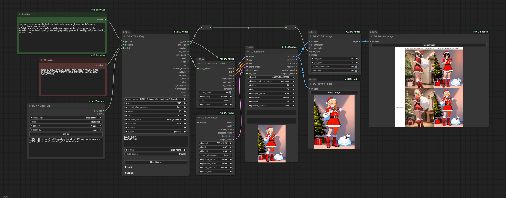
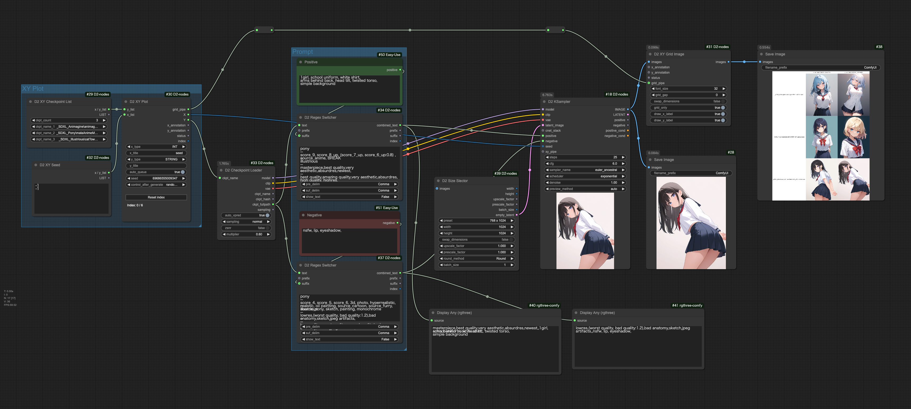
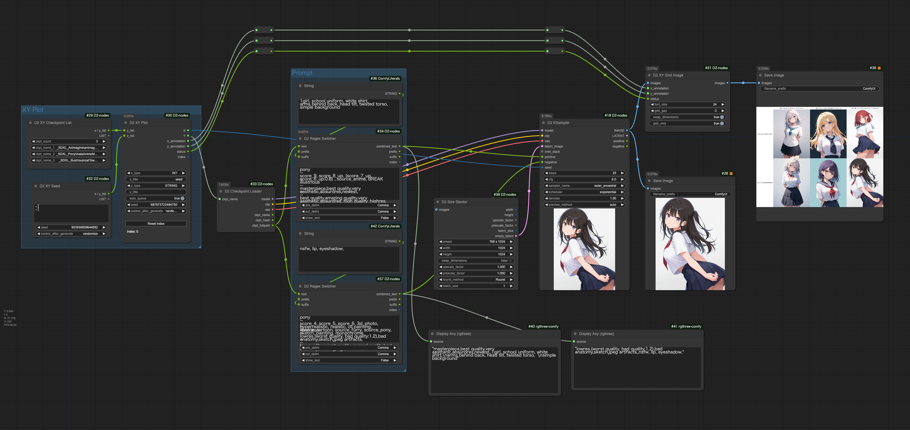

<a href="../en/index.md">English</a> | <a href="../ja/index.md">日本語</a> | <a href="../zh/index.md">繁体中文</a>

- <a href="index.md">Top</a>
- <a href="node.md">Node</a>
- <a href="workflow.md">Workflow</a>

<h1>
Workflow
</h1>

画像を ComfyUI にドロップするとワークフローを再現できます。

## :card_index_dividers: シンプルな txt2img

- Lora も Controlnet も使わないシンプルな txt2img。

## :card_index_dividers: txt2img + Hires fix

- D2 KSampler を2個、間に D2 Image Resize を入れて SwinR_4x を使用した Hires fix。

## :card_index_dividers: フォルダー内画像を一括でアップスケール

- フォルダー内画像を全て取得し、プロンプトを取得
- Controlnet anyTestを使用
- 1.5倍にアップスケールしている
- D2 XY Seed2 で出力枚数を指定

## :card_index_dividers: XY Plot: Checkpoint & Prompt S/R

- D2 XY Plot Easy を使ったシンプルな XY Plot

## :card_index_dividers: Checkpoint Test 

- チェックポイントテスト用の画像を一括で生成
- 4種類のプロンプトを生成して1枚の画像に結合する
- XY Plot と違い、チェックポイントごとに別の画像を保存する

## :card_index_dividers: XY Plot: Prompt S/R

- 基本的な Prompt S/R

## :card_index_dividers: XY Plot: Animagine、Pony、Illustrious の Chedckpoint 比較

- Animagine系、Pony系、Illustrious系はクオリティタグが異なるが、チェックポイントのパスを判断して自動的に切り替える
- ファイル名に系統の名前が入っているとは限らないので、系統名のフォルダに分類しておく必要がある

## :card_index_dividers: Refiner: Checkpoint を途中で切り替え Hires.fix

