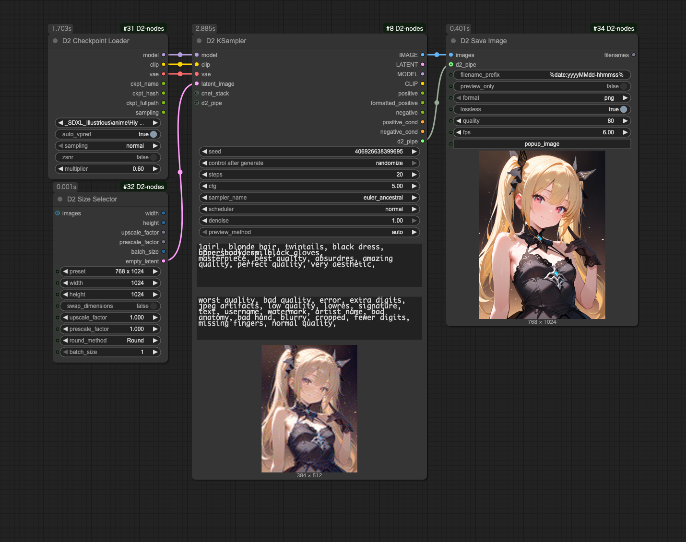
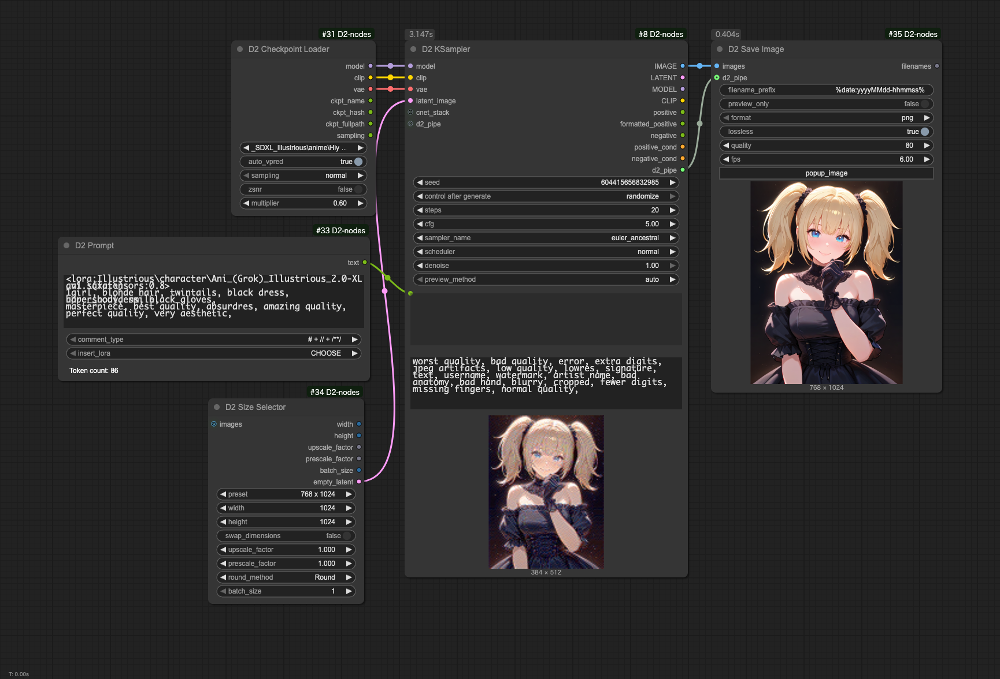
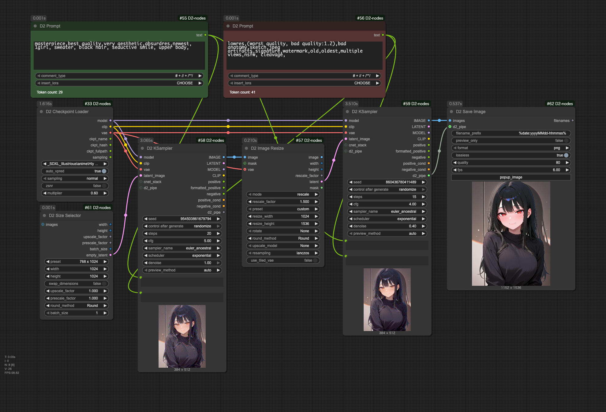
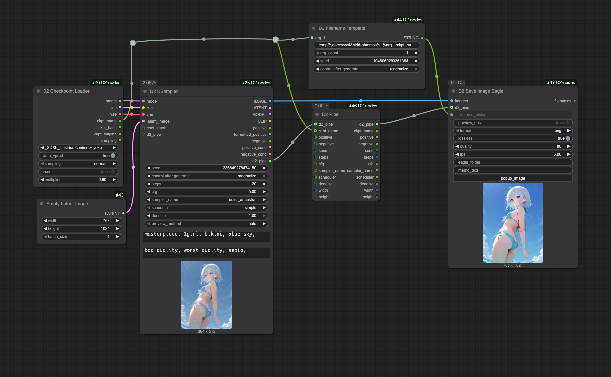
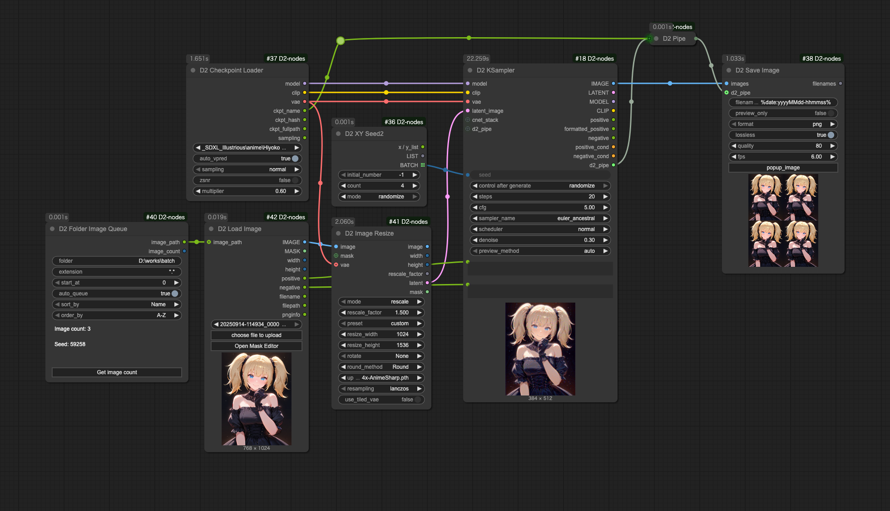
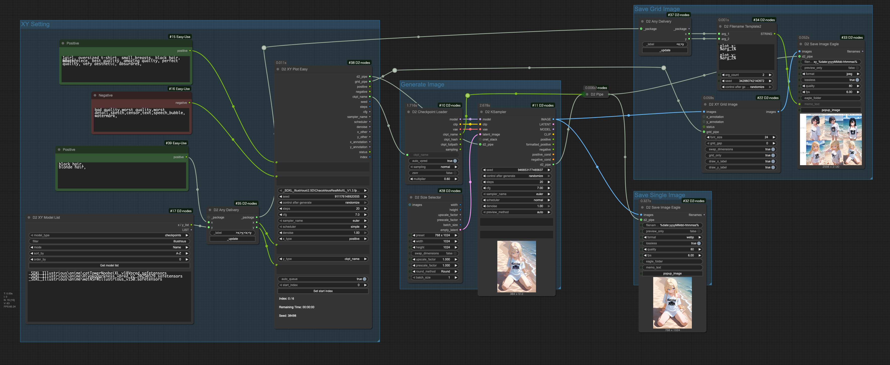
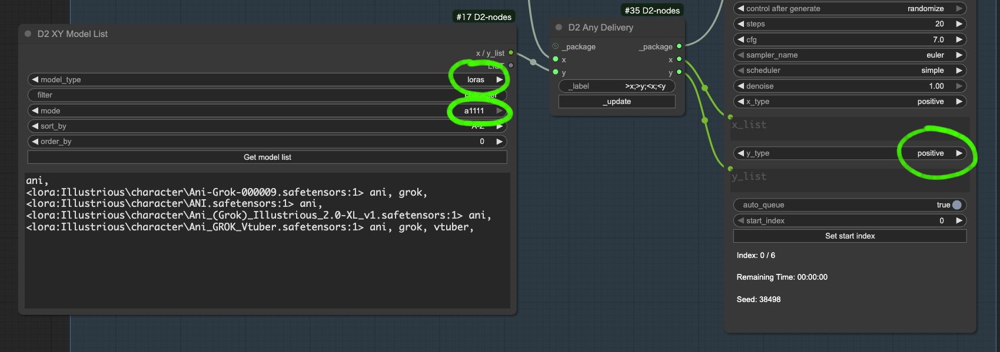
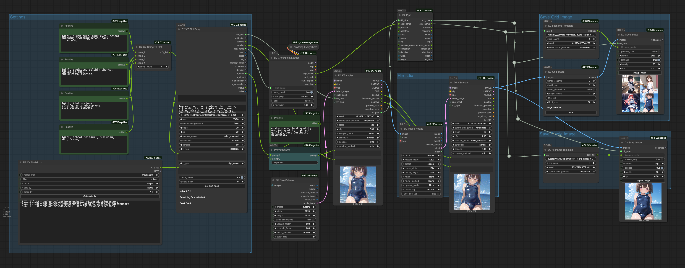

<a href="../en/index.md">English</a> | <a href="../ja/index.md">日本語</a> | <a href="../zh/index.md">繁体中文</a>

- <a href="index.md">Top</a>
- <a href="node.md">Node</a> / <a href="node_image.md">Image Node</a> / <a href="node_text.md">Text Node</a> / <a href="node_xy.md">XYPlot Node</a> / <a href="node_float.md">Float Palet</a>
- <a href="workflow.md">Workflow</a>


<h1>
Workflow
</h1>

> [!TIP]
> **画像を ComfyUI にドロップするとワークフローを再現できます。**


## :card_index_dividers: シンプルな txt2img

<a href="../../workflow/simple_t2i_20250914.png"></a>

- Lora も Controlnet も使わないシンプルな txt2img。


## :card_index_dividers: LoRA を使用した txt2img

<a href="../../workflow/lora_t2i_20250914.png"></a>

- StableDiffusion webui A1111 と同じ書式で Lora を利用する txt2img。
- D2 Prompt を使うと Loraを呼び出しやすいです


## :card_index_dividers: txt2img + Hires fix

<a href="../../workflow/hiresfix_20250914.png"></a>

- D2 KSampler を2個、間に D2 Image Resize を入れて SwinR_4x を使用した Hires fix。


## :card_index_dividers: 生成パラメーターをファイル名に入れる

<a href="../../workflow/filename_template_20250914.png"></a>

- この例ではファイルの保存に `D2 Save Image Eagle` を使用
- `D2 Filename Template` を使ってファイル名を生成
- `d2_pipe` から入力された情報で Eagleメモを自動作成して保存

## :card_index_dividers: フォルダー内画像を一括でアップスケール

<a href="../../workflow/folder_image_queue_upscale_20250914.png"></a>

- `D2 Folder Image Queue` でフォルダー内画像を全て取得し、`D2 Load Image` でプロンプトを取得
- アップスケールモデルに `4x-AnimeSharp` を使用（もちろん `None` でもよい）
- 1.5倍にアップスケールしている
- `D2 XY Seed2` で4枚ずつ出力するように指定


## :card_index_dividers: XY Plot: Checkpoint & Prompt S/R

<a href="../../workflow/xy_easy_20250914.png"></a>

- D2 XY Plot Easy を使った XY Plot
- `D2 KSampler` のパラメーターは `D2 XYPlot Easy` によって上書きされる
- グリッド画像は大きなサイズになるのでJPEG形式で保存している
- このサンプルでは画像保存に `D2 Save Image Eagle` を使用
- `D2 Filename Template2` でXY plotパラメーターを作成。Eagleメモには下記のように記録される。

```
plot_x:
black hair,
blonde hair,

plot_y:
_SDXL_Illustrious\anime\catTowerNoobaiXL_v18Vpred.safetensors
_SDXL_Illustrious\anime\HiyokoDarkness_vpred_v2_20250329.safetensors
_SDXL_Illustrious\anime\waiNSFWIllustrious_v150.safetensors
```

### Lora を比較するには

<figure>

</figure>

1. `D2 XY Model List` を下記のように変更
    - `model_type`: `loras`
    - `mode`: `a1111`
1. `Get model list` をクリックするとLora一覧が取得される
1. 必要なLoraだけ残し、トリガーワードを追記
1. 1行目は置換対象のプロンプトを記述
1. `D2 XY Plot Easy` を下記のように変更
    - `y_type`: `positive`


## :card_index_dividers: Checkpoint Test 

<a href="../../workflow/checkpoint_test_20250914.png"></a>

- チェックポイントテスト用の画像を一括で生成
- 4種類のプロンプトを生成して1枚の画像に結合する
- XY Plot と違い、チェックポイントごとに別の画像を保存する
- 1個目の `D2 KSampler` は `D2 XY Plot Easy` から受け取った生成パラメーターを使用するが、2個目の `D2 KSampler` は独自の設定を使用している
- プロンプトの数と、 `D2 Grid Image` の `trigger_count` の数を一致させている（サンプルでは`4`）
- `D2 Filename Template` を使ってチェックポイント名をファイル名に入れている


## :card_index_dividers: XY Plot: Prompt S/R

<a href="../../workflow/xy_prompt_sr_20250121.png"></a>

- Checkpointの系統（SDXL / Pony / Illustrious）によってクオリティタグを切り替えるXYプロット
- Animagine系、Pony系、Illustrious系はクオリティタグが異なるが、チェックポイントのパスを判断して自動的に切り替える
- ファイル名に系統の名前が入っているとは限らないので、系統名のフォルダに分類しておく必要がある


## :card_index_dividers: Refiner: Checkpoint を途中で切り替え Hires.fix

<a href="../../workflow/Refiner_20241218.png"></a>


