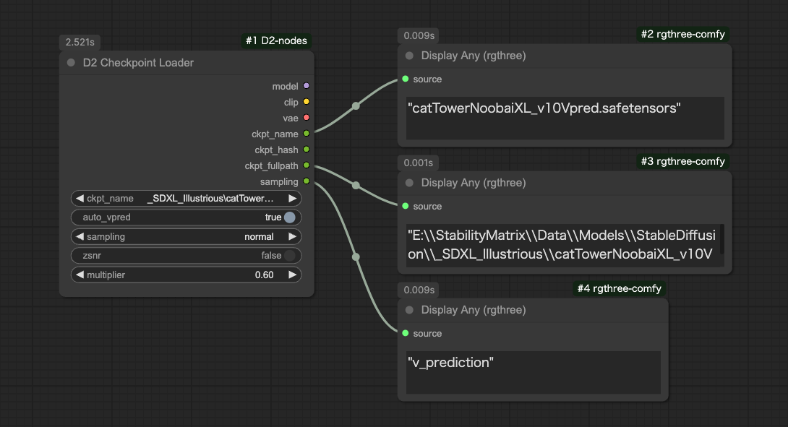

<a href="../en/index.md">English</a> | <a href="../ja/index.md">日本語</a> | <a href="../zh/index.md">繁体中文</a>

- <a href="index.md">Top</a>
- <a href="node.md">Node</a>
- <a href="workflow.md">Workflow</a>


# Node


## :tomato: Sampler Nodes


### D2 KSampler / D2 KSampler(Advanced)

<figure>

</figure>

- 可以用 STRING 格式輸入提示詞的 KSampler

#### Input

- `cnet_stack`
  - 用於連接 `D2 Controlnet Loader`
- `model` / `clip` / `vae` / ..etc
    - 與標準 KSampler 相同
- `negative` / `positive`
    - STRING 格式的提示詞

#### Output

- `IMAGE`
    - 圖像輸出
- `positive` / `negative`
    - Input 的直通

---

## :tomato: Loader Node

### D2 Checkpoint Loader



- 輸出模型檔案完整路徑的 Checkpoint Loader
- 當檔案名稱包含「vpred」時，可以自動套用 v_prediction 設定

#### Input

- `ckpt_name`
  - 檢查點名稱
- `auto_vpred`
  - `true`: 當檔案名稱包含「vpred」時，自動套用 v_prediction 設定
- `sampling` / `zsnr`
  - 與 ModelSamplingDiscrete 相同的設定（詳細不明）
- `multiplier`
  - 與 RescaleCFG 相同的設定（詳細不明）

#### Output

- `model` / `clip` / `vae`
    - 與一般的 CheckpointLoader 相同。
- `ckpt_name` / `ckpt_hash` / `ckpt_fullpath`
    - 檢查點名稱、雜湊值和完整路徑。

---

### D2 Controlnet Loader

<figure>

</figure>

- 連接到 `D2 KSampler` 可建立簡單工作流程的 Controlnet Loader

#### Input

- `cnet_stack`
  - 用於連接 `D2 Controlnet Loader`

#### Output

- `cnet_stack`
  - 用於連接 `D2 KSampler` 或 `D2 Controlnet Loader`

---

## :tomato: Image Node

### D2 Load Image

<figure>

</figure>

- 可從圖像獲取提示詞的 Load Image 節點
- 支援 `StableDiffusion webui A1111`、`NovelAI` 創建的圖像
- 附帶打開遮罩編輯器按鈕

#### Input

- `image_path`
  - 輸入圖像路徑即可載入文件
  - 用於連接 `D2 Folder Image Queue`

#### Output

- `IMAGE / MASK`
    - 圖像和遮罩
- `width / height`
    - 圖像尺寸
- `positive` / `negative`
    - 提示詞

※根據工作流程配置，可能無法獲取提示詞。例如，如果沒有包含「KSampler」字樣的節點（如：Tiled KSampler），則無法獲取。

---

### D2 Load Folder Images

<figure>

</figure>

- 批量載入並輸出資料夾內的圖像
- 用於 `D2 Grid Image` 等
- 如需順序處理請使用 `D2 Folder Image Queue`

#### Input

- `folder`
  - 指定資料夾完整路徑
- `extension`
  - 如僅載入 JPEG 圖像則指定為 `*.jpg`
  - 也可使用 `*silver*.webp` 等指定方式

---

### D2 Folder Image Queue

<figure>

</figure>

- 輸出資料夾內圖像的路徑
- 執行 Queue 時會自動執行與圖像數量相應的 Queue

#### Input

- `folder`
  - 圖像資料夾
- `extension`
  - 指定文件名過濾器
  - `*.*`: 所有圖像
  - `*.png`: 僅 PNG 格式
- `start_at`
  - 開始處理的圖像編號
- `auto_queue`
  - `true`: 自動執行剩餘的 Queue
  - `false`: 僅執行一次

#### Output

- `image_path`
  - 圖像完整路徑

---

### D2 Grid Image

<figure>

</figure>

- 輸出網格圖像
- 可選擇水平或垂直方向

#### Input

- `max_columns`
  - 水平排列的圖像數量
  - `swap_dimensions` 為 `true` 時為垂直方向的數量
- `grid_gap`
  - 圖像間距
- `swap_dimensions`
  - `true`: 垂直方向
  - `false`: 水平方向
- `trigger`
  - `true`: 輸出網格圖像
  - `false`: 僅保持圖像而不輸出網格圖像

---

### D2 Image Stack

<figure>

</figure>

- 將輸入的多個圖像一起輸出
- 最多可輸入 50 個

#### Input

- `image_count`
  - 可增減輸入數量，最多 50 個

---

### D2 EmptyImage Alpha

<figure>

</figure>

- 為 EmptyImage 添加 α 通道（透明度）

---

## :tomato: Size Node

### D2 Get Image Size

<figure>

</figure>

- 同時執行尺寸的輸出和顯示

---

### D2 Size Selector

<figure>

</figure>

- 可從預設中選擇圖像尺寸的節點
- 也可從圖像獲取尺寸
- 可從 `Ceil / Float / None` 中選擇數值的捨入方式

#### Input

- `images`
    - 用於從圖像獲取尺寸
    - 需要將 `preset` 設為 `custom`
- `preset`
    - 尺寸預設
    - 使用下方的 `width` `height` 或 `images` 的尺寸時需要設為 `custom`
    - 要修改預設時請編輯 `/custom_nodes/D2-nodes-ComfyUI/config/sizeselector_config.yaml`
- `width` / `height`
    - 寬高尺寸
    - 需要將 `preset` 設為 `custom`
- `swap_dimensions`
    - 交換 width / height
- `upscale_factor`
    - 傳遞給其他調整尺寸節點的數值，此節點不做任何處理
- `prescale_factor`
    - 以此倍率調整尺寸後輸出 width / height
- `round_method`
    - `Round`: 四捨五入
    - `Floor`: 無條件捨去
    - `None`: 不處理
- `batch_size`
    - 設定給 empty_latent 的批次大小

#### Output

- `width / height`
    - 將輸入的 `width`、`height` 乘以 `prescale_factor`
- `upscale_factor` / `prescale_factor`
    - 直通輸入值
- `batch_size`
    - 直通輸入值
- `empty_latent`
    - 輸出以指定尺寸和批次大小創建的 latent

---

### D2 Image Resize

<figure>

</figure>

- 簡單的圖像縮放
- 可指定到小數點後3位
- 可選擇四捨五入、無條件捨去、無條件進位
- 可使用放大模型進行放大
- 可輸出 Latent（需要 VAE）

---

### D2 Resize Calculator

<figure>

</figure>

- 可選擇四捨五入、無條件捨去、無條件進位

---

## :tomato: Text Node

### D2 Regex Replace

<figure>

</figure>

- 可使用正規表達式進行替換
- 可指定多個條件
- 可重複使用正規表達式的匹配字串（如\1、\2等）
- 可按「標籤單位」和「整體」指定目標字串

#### Input

- `text`
    - 搜索目標字串
- `mode`
  - `Tag`: 將 `text` 用換行和「,」分解，個別替換
  - `Advanced`: 整體替換 `text`
- `regex_and_output`
    - 搜索字串和輸出字串列表
    - 按以下格式填寫
    - 輸出字串為空時則刪除匹配部分
    - 數量沒有上限

```
搜索字串 1
--
輸出字串 1
--
搜索字串 2
--
輸出字串 2
```

#### Output

- `text`
    - 替換處理後的文字

#### Sample

刪除 Pony 系列品質標籤的範例。

Mode: `Tag`

Input text
```
score_9, score_8_up, (score_7_up, score_6_up:0.8) , rating_explicit, source_anime, BREAK
1girl, swimsuit
```
Regex Replace
```
.*(score_|rating_|source_).*
--
--
BREAK
--

```

Output text
```
1girl, swimsuit
```

---

### D2 Regex Switcher


- 用正規表達式搜索輸入文字，輸出匹配的文字
- 主要目的是切換每個 Checkpoint 的品質標籤
- 在輸入的 `text` 中發現匹配字串時，輸出目標字串和匹配順序（從0開始）
- 上圖中接收到 `ioliPonyMixV4.safetensors` 並匹配搜索條件 `pony`，因此輸出 `score_9`
- 因為匹配第一個搜索條件，所以 `index` 輸出 `0`
- 未匹配任何條件時輸出 `-1`
- 也可進行前後字串連接

#### Input

- `text`
    - 搜索目標字串
- `prefix`
    - 前方連接的字串
- `suffix`
    - 後方連接的字串
- `regex_and_output`
    - 搜索字串和輸出字串列表
    - 按以下格式填寫
- `pre_delim`
    - 連接 `prefix` 和 `regex_and_output` 時插入的字元
    - `Comma`: `,` / `Line break`: 換行 / `None`: 不插入
- `suf_delim`
    - 連接 `regex_and_output` 和 `suffix` 時插入的字元

```
搜索字串 1（可使用正規表達式）
--
輸出字串 1
--
搜索字串 2（可使用正規表達式）
--
輸出字串 2
--
--
無匹配時輸出的字串
```

#### Output

- `combined_text`
    - 連接 `prefix` + 輸出字串 + `suffix` 的字串
- `prefix` / `suffix`
    - Input 的直通

#### 使用範例


此例中將匹配的編號（`index`）傳遞給 [Easy Use](https://github.com/yolain/ComfyUI-Easy-Use) 的 Text Index Switch 進行切換。

因為不匹配時會變成 `-1`，所以使用匹配所有字串的正規表達式 `.+` 代替默認輸出。

---

### D2 Multi Output

<figure>

</figure>

- 以列表形式輸出 seed、cfg 等通用參數的節點

#### Input

- `type`
    - `FLOAT`: 浮點數。用於 CFG 等
    - `INT`: 整數。用於 steps 等
    - `STRING`: 字串。用於 sampler 等
    - `SEED`: 可用隨機數生成按鈕輸入 seed 值
- `Add Random`
    - 在輸入欄位添加隨機數
    - 僅在 `type` 為 `SEED` 時顯示

---

## :tomato: XY Plot Node

### D2 XY Plot

<figure>

</figure>

- 可創建通用 XY Plot 工作流程的節點
- X / Y 輸入為簡單的換行分隔文字，易於與其他節點組合

#### Input

- `x_type` / `y_type`
  - 從 `STRING` `INT` `FLOAT` 中指定 `x_list` `y_list` 的數據類型
- `x_title` / `y_title`
  - 添加到標題文字的文字
- `x_list` / `y_list`
  - XY Plot 的變更內容
  - 為換行分隔文字，可使用其他節點輸入
- `auto_queue`
  - `true`: 自動執行所需次數的 Queue
  - `false`: 手動執行 Queue
- `Reset index`
  - 中途停止時用此按鈕重置 index

#### Output

- `X` / `Y`
  - 從 `x_list` `y_list` 獲取的元素
- `x_annotation` / `y_annotation`
  - 連接到 `D2 XY Grid Image` 的標題文字
- `status`
  - 連接到 `D2 XY Grid Image` 的控制信號
- `index`
  - 當前處理次數

---

### D2 XY Grid Image

<figure>

</figure>

- 與 `D2 XY Plot` 連接使用的網格圖像創建節點

#### Input

- `x_annotation` / `y_annotation`
  - 連接到 `D2 XY Grid Image` 的標題文字
- `status`
  - 連接到 `D2 XY Grid Image` 的控制文字
  - `INIT`: 初始化
  - `FINISH`: 輸出網格圖像
  - `{空字串}`: 其他狀態
- `font_size`
  - 標題文字的字體大小
- `grid_gap`
  - 圖像間距
- `swap_dimensions`
  - `true`: 垂直方向網格
  - `false`: 水平方向網格
- `grid_only`
  - `true`: 僅輸出網格圖像
  - `false`: 也輸出個別圖像


---

### D2 XY Prompt SR

<figure>

</figure>

- 搜索替換輸入文字並傳遞給 `D2 XY Plot`
- 也可輸出列表

#### Input

- `prompt`
    - 提示詞。可包含換行
- `search_txt`
    - 搜索目標文字。可包含多個詞
    - 不能使用換行
- `replace`
    - 替換用文字
    - 因為用換行分隔，所以可以包含「,」

#### Output

- `x / y_list`
  - 連接到 `D2 XY Plot`
- `LIST`
  - 以列表形式輸出替換後的文字

---

### D2 XY Prompt SR2

<figure>

</figure>

- 搜索替換從 `D2 XY Plot` 接收的提示詞並傳遞給 KSampler
- 如果要重現 `Stable Diffusion webui A1111` 的 Prompt S/R 請使用此節點

#### Input

- `x_y`
  - 從 `D2 XY Plot` 接收的替換用文字
- `prompt`
    - 替換目標文字
- `search`
    - 搜索文字。可包含多個詞
    - 不能使用換行

---

### D2 XY Seed

<figure>

</figure>

- 指定 `-1` 時輸出隨機數值
- 其他數值直接輸出
- `D2 XY Plot` 側需要將 `x/y_type` 設為 `INT`

---

### D2 XY Checkpoint List / D2 XY Lora List

<figure>

</figure>

- 傳遞 Checkpoint / Lora 到 `D2 XY Plot` 的節點
- 最多可指定 50 個

---

### D2 XY Folder Images

<figure>

</figure>

- 傳遞指定資料夾內圖像路徑到 `D2 XY Plot` 的節點

---

### D2 XY Annotation

<figure>

</figure>

- 用於不使用 `D2 XY Plot` 時或進行特殊 XY Plot 時添加標題

---

### D2 XY List To Plot

<figure>

</figure>

- 將列表輸出節點的輸出轉換為可用於 `D2 XY Plot` 的格式
- 內部僅執行 `"\n".join(list)`，所以如果列表內容包含換行會產生非預期的行為

---


## :tomato: Refiner Node


### D2 Refiner Steps

<figure>

</figure>

- 輸出用於 Refiner 的 steps 的節點

#### Input

- `steps`
    - 總步數
- `start`
    - 第一個 KSampler 的開始步數
- `end`
    - 第一個 KSampler 的結束步數

#### Output

- `steps` / `start` / `end`
    - Input 的直通
- `refiner_start`
    - 第二個 KSampler 的開始步數

---

### D2 Refiner Steps A1111

<figure>

</figure>

- 用於 img2img 的 Refiner，可指定 denoise 的節點

#### Input

- `steps`
    - 總步數
- `denoise`
    - 指定 img2img 的 denoise
- `switch_at`
    - 在總步數的多少比例時切換到下一個 KSampler

#### Output

- `steps`
    - Input 的直通
- `start`
    - 第一個 KSampler 的開始步數
- `end`
    - 第一個 KSampler 的結束步數
- `refiner_start`
    - 第二個 KSampler 的開始步數

---

### D2 Refiner Steps Tester

- 用於確認步數的節點

---

## :tomato: Float Palet

### D2 Queue Button

<figure>

</figure>

- 生成指定數量（Batch count）的按鈕
- 可通過拖動面板左端移動位置

<figure>

</figure>

- 可從 ComfyUI 設定畫面的 `D2` 類別中設定隱藏
- 也可從設定畫面指定數量
- 數量用逗號（,）分隔

---

### Prompt convert dialog

<figure>

</figure>

- 用於 `NovelAI` 和 `StableDiffusion` 權重互相轉換的對話框
- 從 `Prompt convert` 按鈕開啟
- 初始狀態為隱藏
- 啟用 `settings > D2 > Show prompt convert button` 後顯示

---