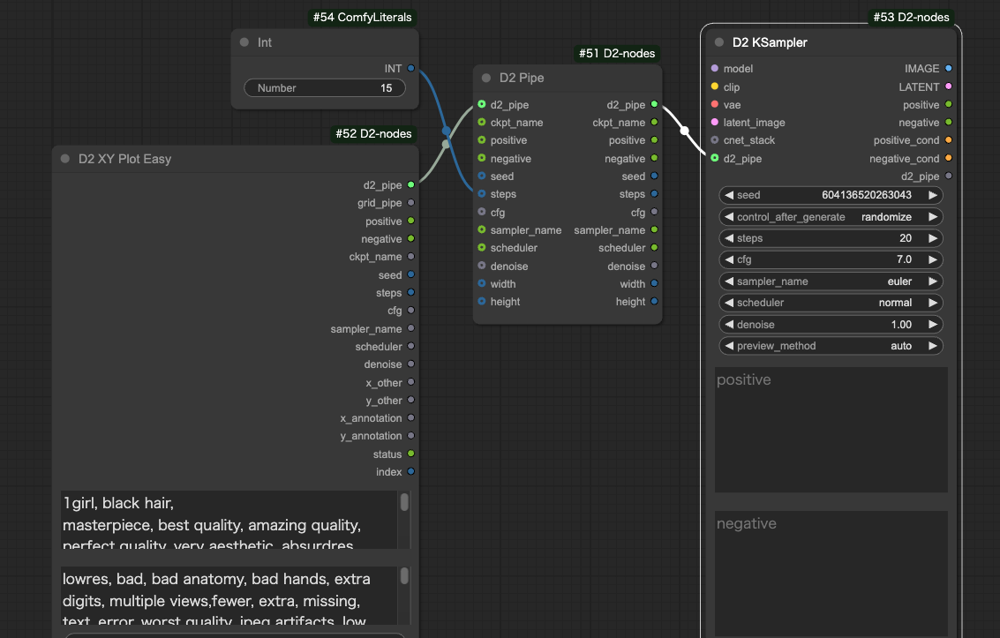
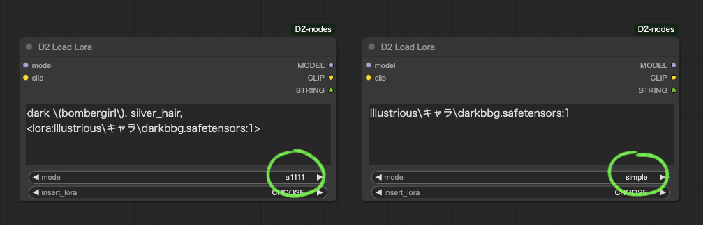
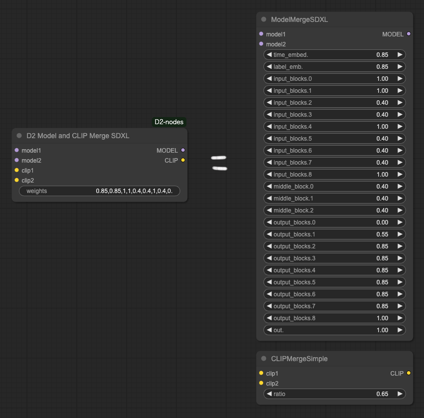

<a href="../en/index.md">English</a> | <a href="../ja/index.md">日本語</a> | <a href="../zh/index.md">繁体中文</a>

- <a href="index.md">Top</a>
- <a href="node.md">Node</a> / <a href="node_image.md">Image Node</a> / <a href="node_text.md">Text Node</a> / <a href="node_xy.md">XYPlot Node</a> / <a href="node_float.md">Float Palet</a>
- <a href="workflow.md">Workflow</a>


# Node


## :tomato: Sampler Nodes


### D2 KSampler / D2 KSampler(Advanced)

<figure>

</figure>

- 可以用 STRING 格式輸入提示詞的 KSampler

#### Input

- `cnet_stack`
  - 用於連接 `D2 Controlnet Loader`
- `model` / `clip` / `vae` / ..etc
    - 與標準 KSampler 相同
- `negative` / `positive`
    - STRING 格式的提示詞

#### Output

- `IMAGE`
    - 圖像輸出
- `positive` / `negative`
    - Input 的直通


---

### D2 Pipe

<figure>

</figure>

- 用於修改和提取 `d2_pipe` 內容的節點
- `d2_pipe` 用於在 D2 XY Plot Easy、D2 KSampler、D2 Send Eagle 等節點中批量傳遞參數


---

## :tomato: Loader Node

### D2 Checkpoint Loader


- 輸出模型檔案完整路徑的 Checkpoint Loader
- 當檔案名稱包含「vpred」時，可以自動套用 v_prediction 設定

#### Input

- `ckpt_name`
  - 檢查點名稱
- `auto_vpred`
  - `true`: 當檔案名稱包含「vpred」時，自動套用 v_prediction 設定
- `sampling` / `zsnr`
  - 與 ModelSamplingDiscrete 相同的設定（詳細不明）
- `multiplier`
  - 與 RescaleCFG 相同的設定（詳細不明）

#### Output

- `model` / `clip` / `vae`
    - 與一般的 CheckpointLoader 相同。
- `ckpt_name` / `ckpt_hash` / `ckpt_fullpath`
    - 檢查點名稱、雜湊值和完整路徑。

---

### D2 Controlnet Loader

<figure>

</figure>

- 連接到 `D2 KSampler` 可建立簡單工作流程的 Controlnet Loader

#### Input

- `cnet_stack`
  - 用於連接 `D2 Controlnet Loader`

#### Output

- `cnet_stack`
  - 用於連接 `D2 KSampler` 或 `D2 Controlnet Loader`


---


### D2 Load Lora

<figure>

</figure>

- 可以通過文本指定Lora的Lora加載器
- 也可以指定model_weight / clip_weight

<figure>

</figure>

- 有兩種模式：使用與StableDiffusion webui A1111相同格式的模式（a1111）和僅列出LoRA名稱的模式（simple）
- 具體使用方法請參考<a href="workflow.md">範例工作流程</a>


#### 輸入

- `mode`
  - `a1111`: 可以使用與StableDiffusion webui A1111相同格式的模式
  - `simple`: 僅列出LoRA名稱的簡單模式。在此模式下，不使用輸出中的`STRING`


#### 不同模式下的格式差異

**mode: a1111**
表示為`<lora:~>`。

```
<lora:lora_name:1>
```

**mode: simple**
前後不需要裝飾
```
lora_name:1
```

#### 如何指定Weight
按照`{lora_name}:{model_weight}:{clip_weight}`的格式書寫。
```
foo:0.8:1
```
如果未指定clip_weight，則應用與model_weight相同的值。
以下具有相同含義。
```
foo:0.8
foo:0.8:0.8
```
如果未指定weight，則應用"1"
以下具有相同含義。
```
foo
foo:1:1
```

#### 如何在simple模式下指定多個LoRA

用換行分隔
```
foo:0.5
bar
```
當在一行中寫入兩種類型時，用","分隔
```
foo:0.5,bar
```

#### 註釋
以"//"或"#"開頭的行將被忽略。
```
//foo:0.5
#bar
```


---


## :tomato: Size Node

### D2 Get Image Size

<figure>

</figure>

- 同時執行尺寸的輸出和顯示

---

### D2 Size Selector

<figure>

</figure>

- 可從預設中選擇圖像尺寸的節點
- 也可從圖像獲取尺寸
- 可從 `Ceil / Float / None` 中選擇數值的捨入方式

#### Input

- `images`
    - 用於從圖像獲取尺寸
    - 需要將 `preset` 設為 `custom`
- `preset`
    - 尺寸預設
    - 使用下方的 `width` `height` 或 `images` 的尺寸時需要設為 `custom`
    - 要修改預設時請編輯 `/custom_nodes/D2-nodes-ComfyUI/config/sizeselector_config.yaml`
- `width` / `height`
    - 寬高尺寸
    - 需要將 `preset` 設為 `custom`
- `swap_dimensions`
    - 交換 width / height
- `upscale_factor`
    - 傳遞給其他調整尺寸節點的數值，此節點不做任何處理
- `prescale_factor`
    - 以此倍率調整尺寸後輸出 width / height
- `round_method`
    - `Round`: 四捨五入
    - `Floor`: 無條件捨去
    - `None`: 不處理
- `batch_size`
    - 設定給 empty_latent 的批次大小

#### Output

- `width / height`
    - 將輸入的 `width`、`height` 乘以 `prescale_factor`
- `upscale_factor` / `prescale_factor`
    - 直通輸入值
- `batch_size`
    - 直通輸入值
- `empty_latent`
    - 輸出以指定尺寸和批次大小創建的 latent

---

### D2 Image Resize

<figure>

</figure>

- 簡單的圖像縮放
- 可指定到小數點後3位
- 可選擇四捨五入、無條件捨去、無條件進位
- 可使用放大模型進行放大
- 可輸出 Latent（需要 VAE）

---

### D2 Resize Calculator

<figure>

</figure>

- 可選擇四捨五入、無條件捨去、無條件進位

---


## :tomato: Refiner Node


### D2 Refiner Steps

<figure>

</figure>

- 輸出用於 Refiner 的 steps 的節點

#### Input

- `steps`
    - 總步數
- `start`
    - 第一個 KSampler 的開始步數
- `end`
    - 第一個 KSampler 的結束步數

#### Output

- `steps` / `start` / `end`
    - Input 的直通
- `refiner_start`
    - 第二個 KSampler 的開始步數

---

### D2 Refiner Steps A1111

<figure>

</figure>

- 用於 img2img 的 Refiner，可指定 denoise 的節點

#### Input

- `steps`
    - 總步數
- `denoise`
    - 指定 img2img 的 denoise
- `switch_at`
    - 在總步數的多少比例時切換到下一個 KSampler

#### Output

- `steps`
    - Input 的直通
- `start`
    - 第一個 KSampler 的開始步數
- `end`
    - 第一個 KSampler 的結束步數
- `refiner_start`
    - 第二個 KSampler 的開始步數

---

### D2 Refiner Steps Tester

- 用於確認步數的節點

---

## :tomato: Merge Node


### D2 Model and CLIP Merge SDXL

<figure>
  
</figure>

- 將 ModelMergeSDXL 和 CLIPMergeSimple 結合的節點
- 為了便於在 XYPlot 中使用，可以用逗號分隔指定各個權重
- 在此圖中指定了 `0.85,0.85,1,1,0.4,0.4,1,0.4,0.4,0.4,1,0.4,0.4,0.4,0,0.55,0.85,0.85,0.85,0.85,0.85,0.85,1,1,0.65`


