<a href="../en/index.md">English</a> | <a href="../ja/index.md">日本語</a> | <a href="../zh/index.md">繁体中文</a>

- <a href="index.md">Top</a>
- <a href="node.md">Node</a> / <a href="node_image.md">Image Node</a> / <a href="node_text.md">Text Node</a> / <a href="node_xy.md">XYPlot Node</a> / <a href="node_float.md">Float Palet</a>
- <a href="workflow.md">Workflow</a>


# Node


## :tomato: Sampler Nodes


### D2 KSampler / D2 KSampler(Advanced)

<figure>
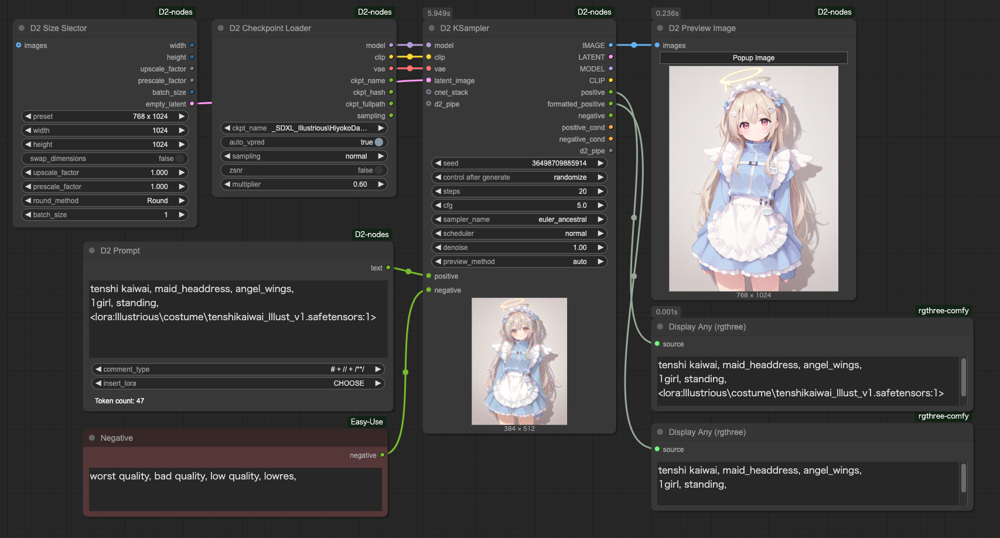
</figure>

#### 與標準KSampler的差異

- 直接輸出圖像（不需要VAE Decoder）
- 可以用STRING格式輸入提示詞
- 支援A1111方式的LoRA載入提示詞
    - 例如：`<lora:foo.safetensors:1>`
    - 格式請參考 <a href="node.md#d2-load-lora">`D2 Load Lora`</a>
    - 註：當在`D2 KSampler Advanced`中輸入`positive_cond` / `negative_cond`時，LoRA將不會套用到CLIP。只會套用到MODEL。
- 有專用的Controlnet輸入，可以簡單地應用
- 支援整合生成參數的 `d2_pipe`
    - 可以從 `D2 XY Plot`、`D2 XY Plot Easy`、`D2 XY Plot Easy Mini` 簡單接收
    - 可以簡單地將參數傳遞給 `D2 Send Eagle`
- 可以更改提示詞權重算法（weight_interpretation）

#### 注意事項

- 當連接 `d2_pipe` 時，`d2_pipe` 的參數優先
- 例如，如果在 `D2 KSampler` 中指定 **steps:20**，在 `D2 XYPlot Easy` 中指定 **steps:15**，在連接 `d2_pipe` 的情況下，將採用 `D2 XYPlot Easy` 的 **steps:15**。

#### Input

- 與標準KSampler相同
    - `model` / `clip` / `latent_image` / `seed` / `steps` / `cfg` / `sampler_name` / `scheduler` / `denoise`
- D2 KSampler中新增
    - `vae`
    - `cnet_stack`：用於連接 `D2 Controlnet Loader`
    - `d2_pipe`：整合的生成參數。從 `D2 XY Plot` 等節點接收
    - `preview_method`：生成時的預覽顯示方式
    - `positive` / `negative`：STRING格式的提示詞
- D2 KSampler Advanced中新增
    - `token_normalization` / `weight_interpretation`
        - 提示詞權重調整方法。可在 D2 KSampler Advanced 中使用
        - 使用需要安裝 [Advanced CLIP Text Encode](https://github.com/BlenderNeko/ComfyUI_ADV_CLIP_emb/)

#### Output

- 與標準KSampler相同
    - `LATENT`
- D2 KSampler中新增
    - `IMAGE`：生成的圖像
    - `MODEL` / `CLIP`：已套用LoRA
    - `positive` / `negative`：輸入的直接傳遞
    - `formatted_positive`：已刪除A1111方式LoRA格式的positive提示詞
    - `positive_cond` / `negative_cond`：已套用Controlnet的CONDITIONING
    - `d2_pipe`：整合的生成參數

---

### D2 Pipe

<figure>
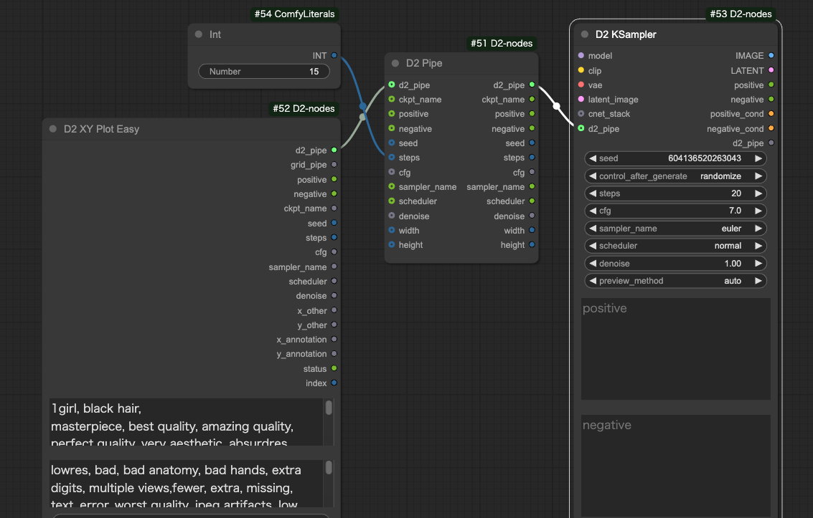
</figure>

- 用於修改和提取 `d2_pipe` 內容的節點
- `d2_pipe` 用於在 D2 XY Plot Easy、D2 KSampler、D2 Send Eagle 等節點中批量傳遞參數


---

## :tomato: Loader Node

### D2 Checkpoint Loader

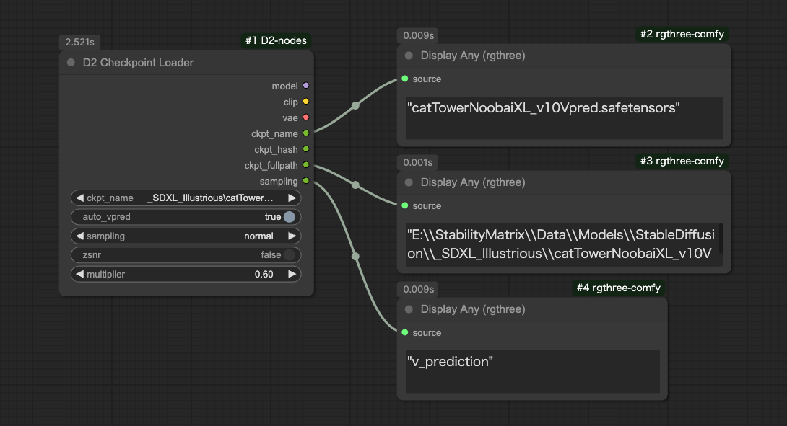

- 輸出模型檔案完整路徑的 Checkpoint Loader
- 當檔案名稱包含「vpred」時，可以自動套用 v_prediction 設定

#### Input

- `ckpt_name`
  - 檢查點名稱
- `auto_vpred`
  - `true`: 當檔案名稱包含「vpred」時，自動套用 v_prediction 設定
- `sampling` / `zsnr`
  - 與 ModelSamplingDiscrete 相同的設定（詳細不明）
- `multiplier`
  - 與 RescaleCFG 相同的設定（詳細不明）

#### Output

- `model` / `clip` / `vae`
    - 與一般的 CheckpointLoader 相同。
- `ckpt_name` / `ckpt_hash` / `ckpt_fullpath`
    - 檢查點名稱、雜湊值和完整路徑。


---


### D2 Load Diffusion Model

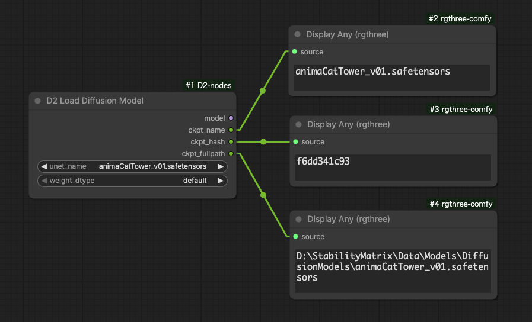

- 輸出模型檔案完整路徑和檔案名稱的 Load Diffusion Model

#### Input

- `unet_name` / `weight_dtype`: 與標準的 `Load Diffusion Model` 相同

#### Output

- `model`
    - 與標準的 Load Diffusion Model 相同。
- `ckpt_name` / `ckpt_hash` / `ckpt_fullpath`
    - 檢查點名稱、雜湊值和完整路徑。
    - 雖然實際上是 `unet_name`，但為了與 `D2 Checkpoint Loader` 保持一致，命名為 `ckpt_name`


---

### D2 Controlnet Loader

<figure>
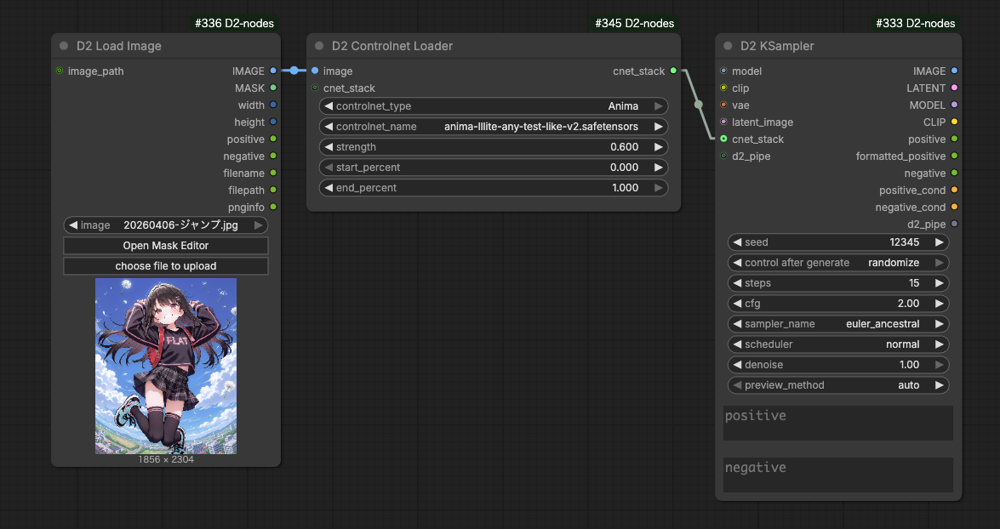
</figure>

- 連接到 `D2 KSampler` 可建立簡單工作流程的 Controlnet Loader
- 可透過 `controlnet_type` 在 `StableDiffusion`（一般的 Controlnet）與 `Anima`（kohya-ss 的 Anima-LLLite）之間切換
  - 使用 `Anima` 需要事先安裝 [ComfyUI-Anima-LLLite](https://github.com/kohya-ss/ComfyUI-Anima-LLLite)

#### Input

- `controlnet_type`
  - `StableDiffusion`：一般的 Controlnet
  - `Anima`：kohya-ss 的 Anima-LLLite（需要 [ComfyUI-Anima-LLLite](https://github.com/kohya-ss/ComfyUI-Anima-LLLite)）
- `cnet_stack`
  - 用於連接 `D2 Controlnet Loader`

#### Output

- `cnet_stack`
  - 用於連接 `D2 KSampler` 或 `D2 Controlnet Loader`


---


### D2 Load Lora

<figure>

</figure>

- 可以通過文本指定Lora的Lora加載器
- 也可以指定model_weight / clip_weight

<figure>
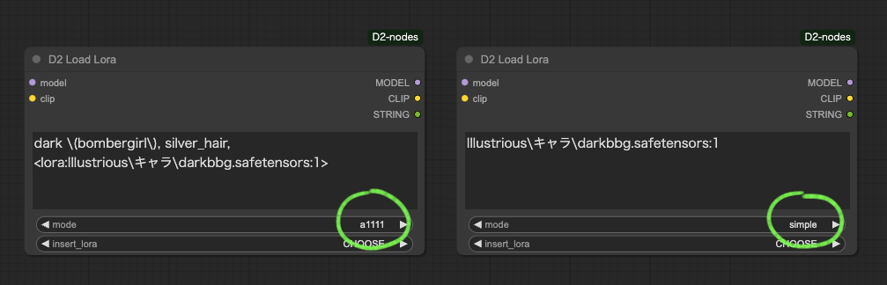
</figure>

- 有兩種模式：使用與StableDiffusion webui A1111相同格式的模式（a1111）和僅列出LoRA名稱的模式（simple）
- 具體使用方法請參考<a href="workflow.md">範例工作流程</a>


#### Input

- `mode`
  - `a1111`: 可以使用與StableDiffusion webui A1111相同格式的模式
  - `simple`: 僅列出LoRA名稱的簡單模式。在此模式下，不使用輸出中的`STRING`

#### Output

- `MODEL` / `CLIP`: 已套用LoRA的MODEL、CLIP
- `prompt`: 直接輸出輸入的文字
- `formatted_prompt`: 已刪除LoRA指定部分的文字

#### 不同模式下的格式差異

**mode: a1111**
表示為`<lora:~>`。

```
<lora:lora_name:1>
```

**mode: simple**
前後不需要裝飾
```
lora_name:1
```

#### 如何指定Weight
按照`{lora_name}:{model_weight}:{clip_weight}`的格式書寫。
```
foo:0.8:1
```
如果未指定clip_weight，則應用與model_weight相同的值。
以下具有相同含義。
```
foo:0.8
foo:0.8:0.8
```
如果未指定weight，則應用"1"
以下具有相同含義。
```
foo
foo:1:1
```

#### 如何在simple模式下指定多個LoRA

用換行分隔
```
foo:0.5
bar
```
當在一行中寫入兩種類型時，用","分隔
```
foo:0.5,bar
```

#### 註釋
以"//"或"#"開頭的行將被忽略。
```
//foo:0.5
#bar
```


---


## :tomato: Size Node

### D2 Get Image Size

<figure>
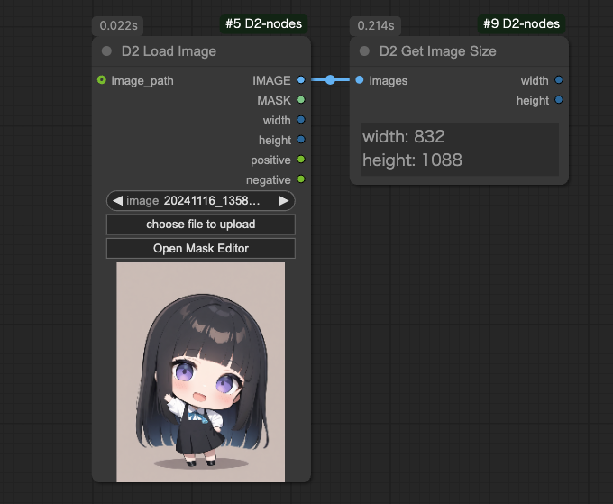
</figure>

- 同時執行尺寸的輸出和顯示

---

### D2 Size Selector

<figure>
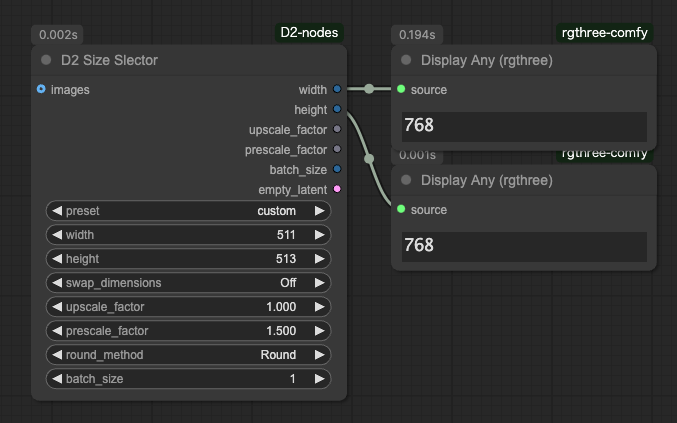
</figure>

- 可從預設中選擇圖像尺寸的節點
- 也可從圖像獲取尺寸
- 可從 `Ceil / Float / None` 中選擇數值的捨入方式

#### Input

- `images`
    - 用於從圖像獲取尺寸
    - 需要將 `preset` 設為 `custom`
- `preset`
    - 尺寸預設
    - 使用下方的 `width` `height` 或 `images` 的尺寸時需要設為 `custom`
    - 要修改預設時請編輯 `/custom_nodes/D2-nodes-ComfyUI/config/sizeselector_config.yaml`
- `width` / `height`
    - 寬高尺寸
    - 需要將 `preset` 設為 `custom`
- `swap_dimensions`
    - 交換 width / height
- `upscale_factor`
    - 傳遞給其他調整尺寸節點的數值，此節點不做任何處理
- `prescale_factor`
    - 以此倍率調整尺寸後輸出 width / height
- `round_method`
    - `Round`: 四捨五入
    - `Floor`: 無條件捨去
    - `None`: 不處理
- `batch_size`
    - 設定給 empty_latent 的批次大小

#### Output

- `width / height`
    - 將輸入的 `width`、`height` 乘以 `prescale_factor`
- `upscale_factor` / `prescale_factor`
    - 直通輸入值
- `batch_size`
    - 直通輸入值
- `empty_latent`
    - 輸出以指定尺寸和批次大小創建的 latent

---

### D2 Image Resize

<figure>
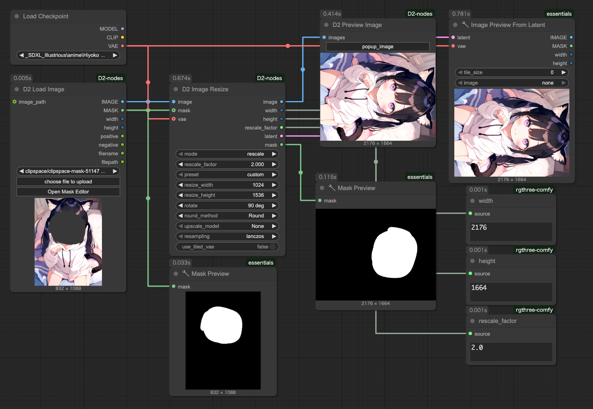
</figure>

- 圖像和遮罩的縮放和旋轉
- 縮放可指定到小數點後3位
- 可選擇四捨五入、無條件捨去、無條件進位處理小數點
- 可使用放大模型進行放大
- 可輸出 Latent（需要 VAE）
- 旋轉選項：90 / 180 / 270 度

---

### D2 Resize Calculator

<figure>
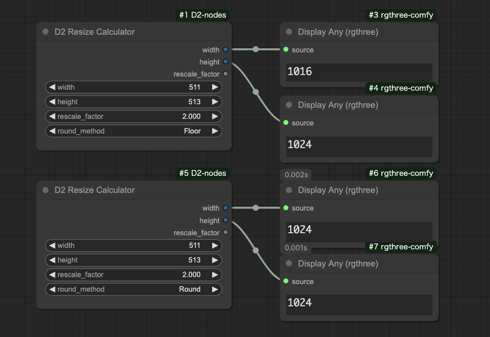
</figure>

- 可選擇四捨五入、無條件捨去、無條件進位

---


## :tomato: Refiner Node


### D2 Refiner Steps

<figure>
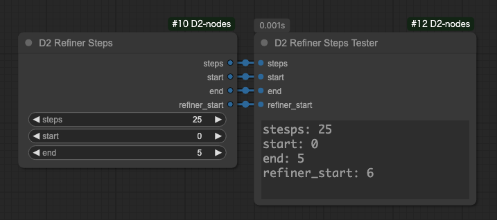
</figure>

- 輸出用於 Refiner 的 steps 的節點

#### Input

- `steps`
    - 總步數
- `start`
    - 第一個 KSampler 的開始步數
- `end`
    - 第一個 KSampler 的結束步數

#### Output

- `steps` / `start` / `end`
    - Input 的直通
- `refiner_start`
    - 第二個 KSampler 的開始步數

---

### D2 Refiner Steps A1111

<figure>
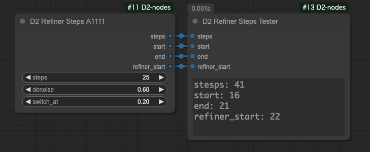
</figure>

- 用於 img2img 的 Refiner，可指定 denoise 的節點

#### Input

- `steps`
    - 總步數
- `denoise`
    - 指定 img2img 的 denoise
- `switch_at`
    - 在總步數的多少比例時切換到下一個 KSampler

#### Output

- `steps`
    - Input 的直通
- `start`
    - 第一個 KSampler 的開始步數
- `end`
    - 第一個 KSampler 的結束步數
- `refiner_start`
    - 第二個 KSampler 的開始步數

---

### D2 Refiner Steps Tester

- 用於確認步數的節點

---

## :tomato: Merge Node


### D2 Model and CLIP Merge SDXL

<figure>
  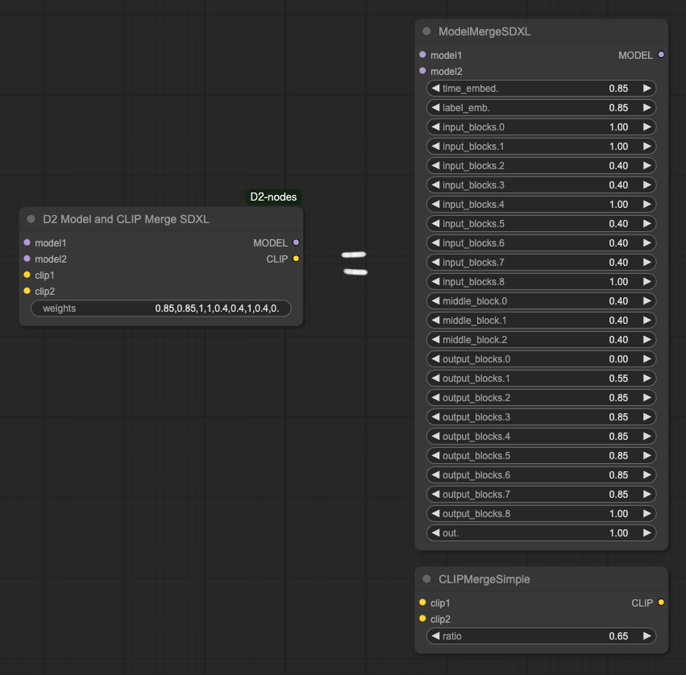
</figure>

- 將 ModelMergeSDXL 和 CLIPMergeSimple 結合的節點
- 為了便於在 XYPlot 中使用，可以用逗號分隔指定各個權重
- 在此圖中指定了 `0.85,0.85,1,1,0.4,0.4,1,0.4,0.4,0.4,1,0.4,0.4,0.4,0,0.55,0.85,0.85,0.85,0.85,0.85,0.85,1,1,0.65`

---

### D2 Any Delivery

<figure>
  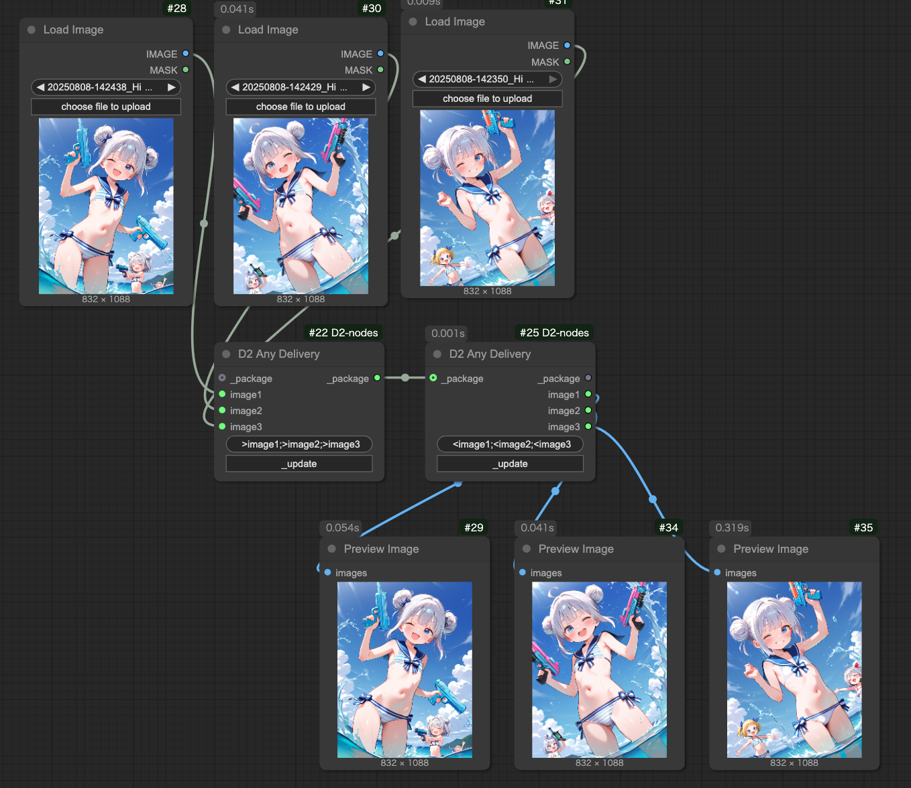
</figure>

- 可以將多個元素一起傳遞的節點
- 連接 `D2 Any Delivery` 節點，將數據作為包裝傳遞
- 可以通過在 `_label` 中寫入來動態添加必要的輸入和輸出
- 因為 ComfyUI 更新後 <a href="https://github.com/Trung0246/ComfyUI-0246" target="_blank">ComfyUI-0246</a> 的 `Highway` 變得不可用而創建
  - 如果原版更新了，可能使用原版會更好

#### Input

- `_package`
  - 從其他 `D2 Any Delivery` 節點接收的包裝
- `_label`
  - 定義輸入和輸出
  - 像 `>width; >height; <width` 這樣指定
  - 以 `>` 開頭的項目作為輸入添加
  - 以 `<` 開頭的項目作為輸出添加
  - 可以用 `;` 分隔指定多個項目
- `_update`
  - 根據 `_label` 的內容更新輸入和輸出

#### Output

- `_package`
  - 傳遞給其他 D2_AnyDelivery 節點的包裝
  - 存儲在輸入中接收的所有值
- 在 `_label` 中用 `<` 指定的項目
  - 輸出從 `_package` 中提取的值

#### _label 範例

添加 `width` `height` 到輸入
```
>width; >height
```

添加 `width` `height` 到輸出
```
<width; <height
```

添加 `prompt` `seed` 到輸入，`width` `height` 到輸出
```
>prompt; >seed; <width; <height
```

---


### D2 Preset Selector

<figure>
  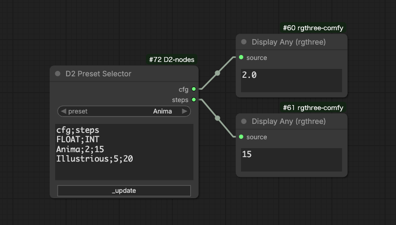
</figure>

- 以文字定義多個參數的預設組合，從下拉選單選擇一個即可整組輸出的節點
- 適用於依各 Checkpoint 切換建議的 `steps` / `cfg` 等成組設定
- 在 `preset_text` 填入格式後按下 `_update`，即可重建輸出插槽與下拉選單

#### Input

- `preset`
  - 下拉選單。目前選擇的預設
  - `preset_text` 第 3 行以後的標題會成為選項
- `preset_name`
  - 從外部以字串接收預設名稱的輸入（forceInput）
  - 當已連接且非空字串時，會優先於 `preset`（下拉選單的選擇）
- `preset_text`
  - 預設定義文字（格式如下）
  - 預設已填入範例，可直接試用
- `_update`
  - 依 `preset_text` 的內容更新輸出插槽與下拉選單

#### Output

- 會依 `preset_text` 第 1 行定義的名稱各自建立輸出插槽
- 所選預設的值會依第 2 行指定的型別轉換後輸出

#### preset_text 格式

```
steps;cfg
INT;FLOAT
Anima;15;1.5
Illustrious;20;5.0
```

- 第 1 行：輸出名稱（以 `;` 分隔）
- 第 2 行：輸出型別（`INT` / `FLOAT` / `STRING` / `BOOLEAN`）
- 第 3 行以後：`標題;值1;值2…`（每個預設一行）。標題（第一個儲存格）為必填，留空會發生錯誤

在上述範例中，選擇 `Anima` 會輸出 `steps`=15、`cfg`=1.5。

#### 限制

- `STRING` 的值中不能使用分隔符號 `;`
- 不支援將 Primitive 節點連接到 `preset` 下拉選單（因 ComfyUI 的限制，選項不會顯示）。重新載入、載入工作流程、子圖（subgraph）輸入皆可正常運作

---


### D2 Save Audio Eagle

<figure>
  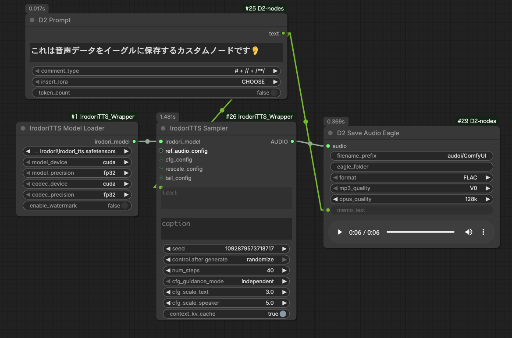
</figure>

- 將音頻文件發送到 Eagle 的節點
- 文件也會同時保存到常規文件夾，請注意硬碟剩餘空間

#### Input

- `audio`
  - 要保存的音頻
- `filename_prefix`
  - 保存文件名
- `eagle_folder`
  - Eagle 的保存目標文件夾名稱
- `format`
  - 從 FLAC / MP3 / Opus 中選擇
- `mp3_quality`
  - `format` 為 `mp3` 時使用的位元率
- `opus_quality`
  - `format` 為 `Opus` 時使用的位元率
- `memo_text`
  - 保存到 Eagle 備註欄的文字
