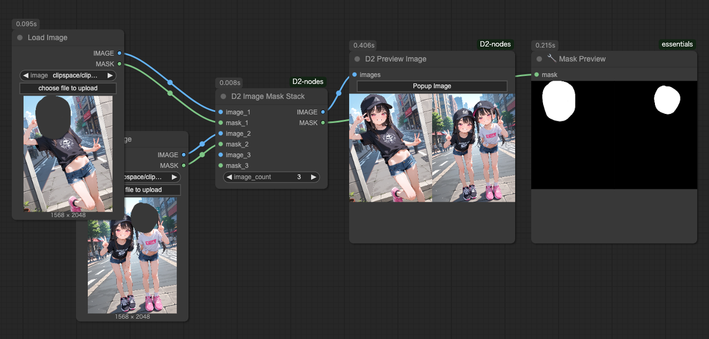
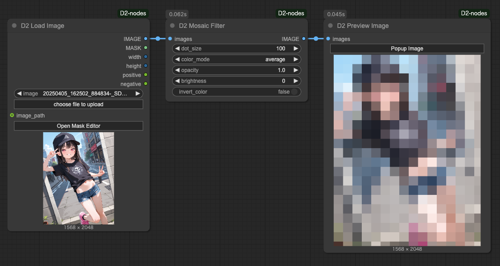
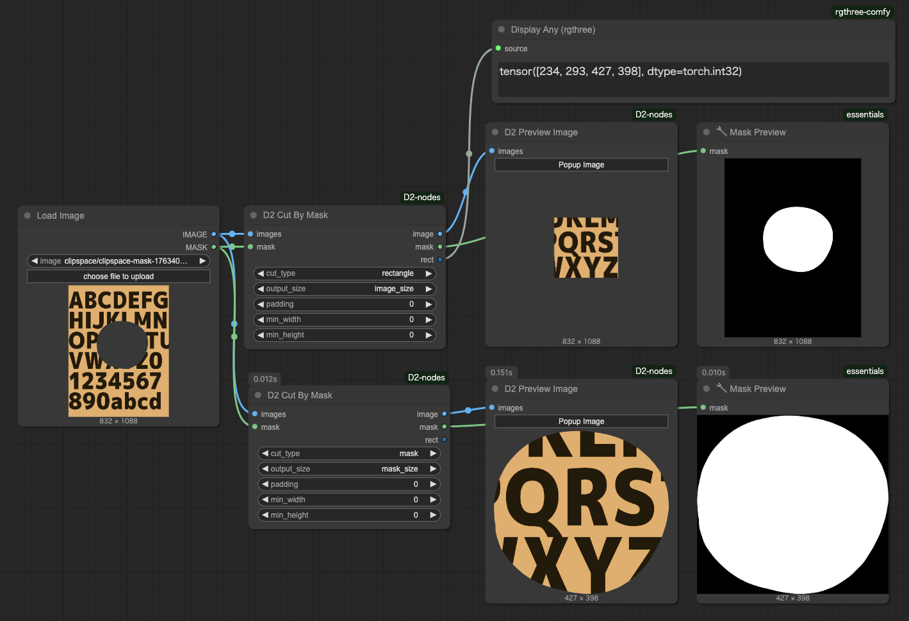
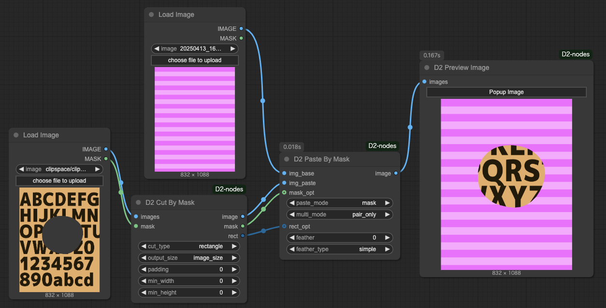
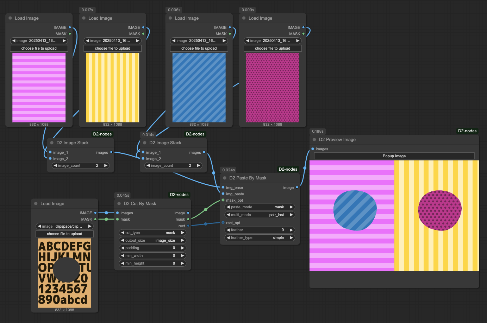
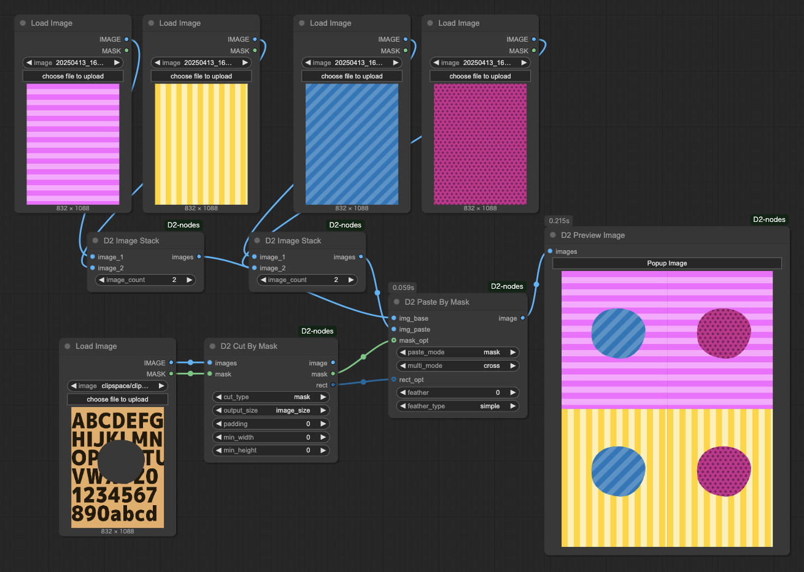

<a href="../en/index.md">English</a> | <a href="../ja/index.md">日本語</a> | <a href="../zh/index.md">繁体中文</a>

- <a href="index.md">Top</a>
- <a href="node.md">Node</a> / <a href="node_image.md">Image Node</a> / <a href="node_text.md">Text Node</a> / <a href="node_xy.md">XYPlot Node</a> / <a href="node_float.md">Float Palet</a>
- <a href="workflow.md">Workflow</a>

# Node

## :tomato: Image Node

### D2 預覽圖像

<figure>

</figure>

- 點擊 `Popup Image` 按鈕可顯示全螢幕圖庫

---

### D2 Load Image

<figure>

</figure>

- 可從圖像獲取提示詞的 Load Image 節點
- 支援 `StableDiffusion webui A1111`、`NovelAI` 創建的圖像
- 附帶打開遮罩編輯器按鈕

#### Input

- `image_path`
  - 輸入圖像路徑即可載入文件
  - 用於連接 `D2 Folder Image Queue`

#### Output

- `IMAGE / MASK`
    - 圖像和遮罩
- `width / height`
    - 圖像尺寸
- `positive` / `negative`
    - 提示詞

※根據工作流程配置，可能無法獲取提示詞。例如，如果沒有包含「KSampler」字樣的節點（如：Tiled KSampler），則無法獲取。

---

### D2 Load Folder Images

<figure>

</figure>

- 批量載入並輸出資料夾內的圖像
- 用於 `D2 Grid Image` 等
- 如需順序處理請使用 `D2 Folder Image Queue`

#### Input

- `folder`
  - 指定資料夾完整路徑
- `extension`
  - 如僅載入 JPEG 圖像則指定為 `*.jpg`
  - 也可使用 `*silver*.webp` 等指定方式

---

### D2 Folder Image Queue

<figure>

</figure>

- 輸出資料夾內圖像的路徑
- 執行 Queue 時會自動執行與圖像數量相應的 Queue

#### Input

- `folder`
  - 圖像資料夾
- `extension`
  - 指定文件名過濾器
  - `*.*`: 所有圖像
  - `*.png`: 僅 PNG 格式
- `start_at`
  - 開始處理的圖像編號
- `auto_queue`
  - `true`: 自動執行剩餘的 Queue
  - `false`: 僅執行一次

#### Output

- `image_path`
  - 圖像完整路徑

---

### D2 Grid Image

<figure>

</figure>

- 輸出網格圖像
- 支持水平和垂直排列

#### Input

- `max_columns`
  - 水平排列的圖片數量
  - 當 `swap_dimensions` 為 `true` 時，則為垂直排列的數量
- `grid_gap`
  - 圖片之間的間距
- `swap_dimensions`
  - `true`: 垂直排列
  - `false`: 水平排列
- `trigger_count`
  - 當輸入圖片達到指定數量時輸出網格圖像
- `Image count`
  - 輸入圖片的數量
- `Reset Images`
  - 清除所有輸入的圖片

---

### D2 Image Stack

<figure>

</figure>

- 將多個輸入圖像合併為一個批次
- 可與 D2 Grid Image 等一起使用
- 最多支持50個輸入

---

### D2 Image Mask Stack

<figure>

</figure>

- 將多個輸入圖像和遮罩合併為一個批次
- 基本上是 D2 Image Stack 加上遮罩支持功能

---

### D2 EmptyImage Alpha

<figure>

</figure>

- 為 EmptyImage 添加 α 通道（透明度）

---

### D2 Mosaic Filter

<figure>

</figure>

- 添加馬賽克濾鏡效果
- 可調整透明度、亮度和顏色反轉等設置

---

### D2 Cut By Mask

<figure>

</figure>

- 使用遮罩裁剪圖像
- 可以指定輸出形狀、尺寸、邊距等

#### Input

- `images`: 要裁剪的原始圖像
- `mask`: 遮罩
- `cut_type`: 裁剪圖像的形狀
    - `mask`: 按照遮罩形狀裁剪
    - `rectangle`: 從遮罩形狀計算並裁剪出矩形
    - `square_thumb`: 以最大尺寸的正方形進行裁剪。適用於縮略圖的模式
- `output_size`: 輸出圖像尺寸
    - `mask_size`: 遮罩尺寸
    - `image_size`: 輸入圖像尺寸（保持輸入圖像位置的同時周圍變為透明）
- `square_thumb`: 以最大尺寸的正方形進行裁剪。適用於縮略圖的模式
- `padding`: 擴展遮罩area的像素數（預設值 0）
- `min_width`: 遮罩尺寸的最小寬度（預設值 0）
- `min_height`: 遮罩尺寸的最小高度（預設值 0）
- `output_alpha`: 是否在輸出圖像中包含透明度通道

#### output
- `image`: 通過遮罩區域裁剪的圖像
- `mask`: 遮罩
- `rect`: 裁剪的矩形區域

---

### D2 Paste By Mask

<figure>

</figure>

- 使用由 D2 Paste By Mask 創建的遮罩或矩形區域合成圖像
- 可以指定模糊寬度、貼上形狀等

#### Input

- `img_base`: 底層圖像（支援批次處理）
- `img_paste`: 要貼上的圖像（支援批次處理）
- `paste_mode`: 決定如何裁剪 img_paste 以及貼上座標
    - `mask`: 用 mask_opt 遮罩 img_paste 並在位置 x=0, y=0 貼上（遮罩形狀貼上）
    - `rect_full`: 將 img_paste 裁剪為 rect_opt 的尺寸並在 rect_opt 位置貼上（矩形貼上）
    - `rect_position`: 在 rect_opt 位置貼上 img_paste（矩形貼上）
    - `rect_pos_mask`: 用 mask_opt 遮罩 img_paste 並在 rect_opt 位置貼上（遮罩形狀貼上）
- `multi_mode`: 當 img_base、img_paste 其中一個或兩者都有多張圖像時的處理方式
    - `pair_last`: 從頭開始以相同索引處理 img_base 和 img_paste 對。如果其中一個圖像較少，則使用最後一張圖像
    - `pair_only`: 與 pair_last 相同。如果其中一個圖像較少，則在處理前顯示錯誤並停止
    - `cross`: 處理所有組合

input `optional`:
- `mask_opt`: 遮罩
- `rect_opt`: 矩形區域
- `feather`: 邊緣模糊的像素數（預設值 0）

#### output

- `image`: 合成的圖像

#### 關於 multi_mode

`pair_last` 和 `pair_only` 將 `img_base` 和 `img_paste` 中相同順序的圖像作為一對輸出。

<figure>

</figure>

`cross` 輸出所有組合。

<figure>

</figure>

