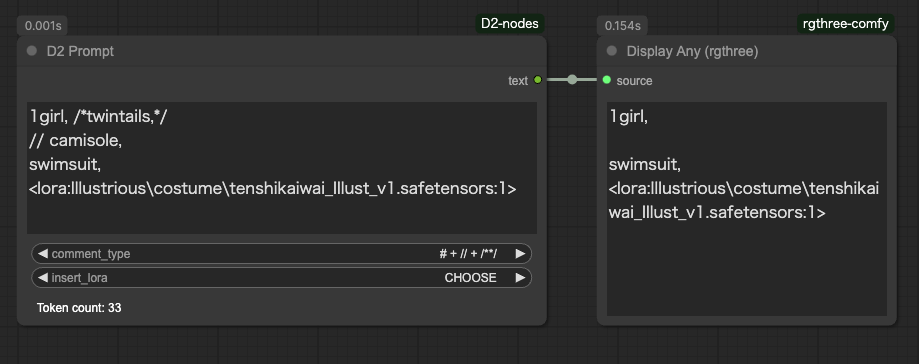

<a href="../en/index.md">English</a> | <a href="../ja/index.md">日本語</a> | <a href="../zh/index.md">繁体中文</a>

- <a href="index.md">Top</a>
- <a href="node.md">Node</a> / <a href="node_image.md">Image Node</a> / <a href="node_text.md">Text Node</a> / <a href="node_xy.md">XYPlot Node</a> / <a href="node_float.md">Float Palet</a>
- <a href="workflow.md">Workflow</a>


# Node


## :tomato: Text Node

### D2 Regex Replace

<figure>

</figure>

- 可使用正規表達式進行替換
- 可指定多個條件
- 可重複使用正規表達式的匹配字串（如\1、\2等）
- 可按「標籤單位」和「整體」指定目標字串

#### Input

- `text`
    - 搜索目標字串
- `mode`
  - `Tag`: 將 `text` 用換行和「,」分解，個別替換
  - `Advanced`: 整體替換 `text`
- `regex_and_output`
    - 搜索字串和輸出字串列表
    - 按以下格式填寫
    - 輸出字串為空時則刪除匹配部分
    - 數量沒有上限

```
搜索字串 1
--
輸出字串 1
--
搜索字串 2
--
輸出字串 2
```

#### Output

- `text`
    - 替換處理後的文字

#### Sample

刪除 Pony 系列品質標籤的範例。

Mode: `Tag`

Input text
```
score_9, score_8_up, (score_7_up, score_6_up:0.8) , rating_explicit, source_anime, BREAK
1girl, swimsuit
```
Regex Replace
```
.*(score_|rating_|source_).*
--
--
BREAK
--

```

Output text
```
1girl, swimsuit
```

---

### D2 Regex Switcher


- 用正規表達式搜索輸入文字，輸出匹配的文字
- 主要目的是切換每個 Checkpoint 的品質標籤
- 在輸入的 `text` 中發現匹配字串時，輸出目標字串和匹配順序（從0開始）
- 上圖中接收到 `ioliPonyMixV4.safetensors` 並匹配搜索條件 `pony`，因此輸出 `score_9`
- 因為匹配第一個搜索條件，所以 `index` 輸出 `0`
- 未匹配任何條件時輸出 `-1`
- 也可進行前後字串連接

#### Input

- `text`
    - 搜索目標字串
- `prefix`
    - 前方連接的字串
- `suffix`
    - 後方連接的字串
- `regex_and_output`
    - 搜索字串和輸出字串列表
    - 按以下格式填寫
- `pre_delim`
    - 連接 `prefix` 和 `regex_and_output` 時插入的字元
    - `Comma`: `,` / `Line break`: 換行 / `None`: 不插入
- `suf_delim`
    - 連接 `regex_and_output` 和 `suffix` 時插入的字元

```
搜索字串 1（可使用正規表達式）
--
輸出字串 1
--
搜索字串 2（可使用正規表達式）
--
輸出字串 2
--
--
無匹配時輸出的字串
```

#### Output

- `combined_text`
    - 連接 `prefix` + 輸出字串 + `suffix` 的字串
- `prefix` / `suffix`
    - Input 的直通

#### 使用範例


此例中將匹配的編號（`index`）傳遞給 [Easy Use](https://github.com/yolain/ComfyUI-Easy-Use) 的 Text Index Switch 進行切換。

因為不匹配時會變成 `-1`，所以使用匹配所有字串的正規表達式 `.+` 代替默認輸出。

---

### D2 Multi Output

<figure>

</figure>

- 以列表形式輸出 seed、cfg 等通用參數的節點

#### Input

- `type`
    - `FLOAT`: 浮點數。用於 CFG 等
    - `INT`: 整數。用於 steps 等
    - `STRING`: 字串。用於 sampler 等
    - `SEED`: 可用隨機數生成按鈕輸入 seed 值
- `Add Random`
    - 在輸入欄位添加隨機數
    - 僅在 `type` 為 `SEED` 時顯示


---

### D2 Filename Template

<figure>
  
</figure>

- 用於創建文件名的節點
- 可以引入外部元素

#### Input

- `arg_1` `arg_2` `arg_3`
  - 從其他節點導入值
- `format`
    - `%date:{yyyy/MM/dd/hh/mm/ss}%`
      - `yyyy`: 年
      - `MM`: 月
      - `dd`: 日
      - `hh`: 時
      - `mm`: 分
      - `ss`: 秒
    - `%node:{id}.{key}%`
      - 通過指定節點ID和項目名稱來獲取值
      - 示例：`%node:8.width%`: 從ID為8的節點獲取width值
    - `%arg_1%`（2和3相同）
      - 嵌入輸入的值
    - `%arg_1:ckpt_name%`（2和3相同）
      - 嵌入移除 `.safetensors` 後的檢查點名稱

#### Example

```
%date:yyyyMMdd-hhmmss%_%arg_1:ckpt_name%
👇
20241219-021926_obsessionIllustrious_v31
```


---


### D2 Prompt

<figure>
  
</figure>

- 刪除文字中的註解
- 包括行首「#」、行首「//」以及「/*」至「*/」之間的內容
- 在底部顯示令牌數量
- 令牌計數使用"ViT-L/14" CLIP。如果想使用其他CLIP模型，請使用`D2 Token Counter`


#### 關於註解快捷鍵

- 所有文字框都可使用註解快捷鍵（ctrl + /）
- 快捷鍵可在`Settings > D2 > shortcutKey`中更改
- 如需停用此功能，請刪除上述內容

---

### D2 Token Counter

<figure>
  
</figure>

- 計算提示詞的標記數量

