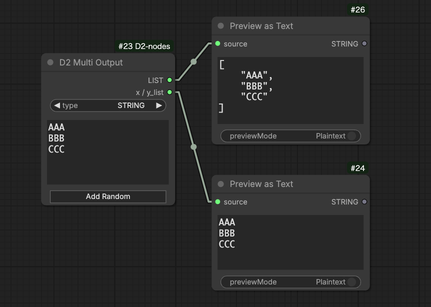
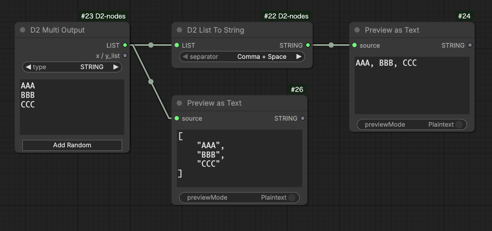
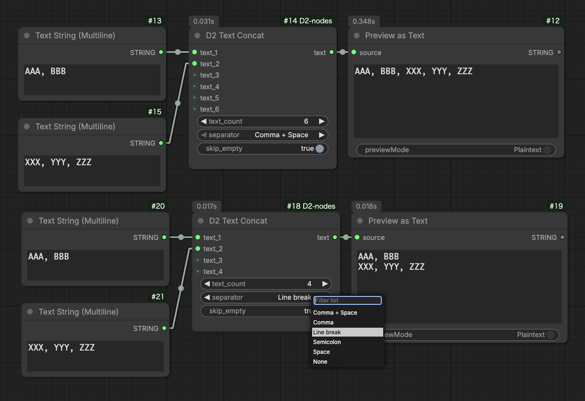
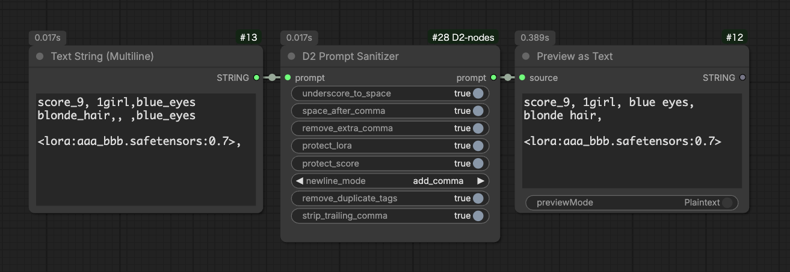
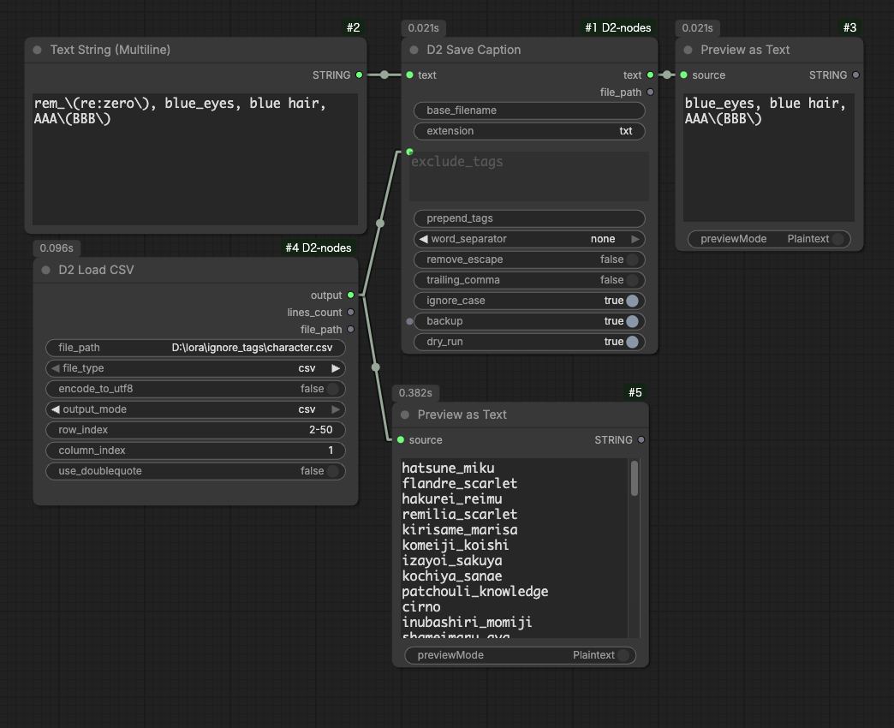
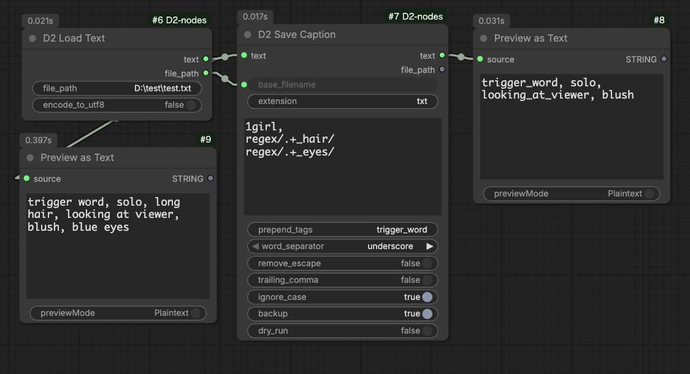

<a href="../en/index.md">English</a> | <a href="../ja/index.md">日本語</a> | <a href="../zh/index.md">繁体中文</a>

- <a href="index.md">Top</a>
- <a href="node.md">Node</a> / <a href="node_image.md">Image Node</a> / <a href="node_text.md">Text Node</a> / <a href="node_xy.md">XYPlot Node</a> / <a href="node_float.md">Float Palet</a>
- <a href="workflow.md">Workflow</a>


# Node


## :tomato: Text Node

### D2 Regex Replace

<figure>

</figure>

- 可使用正規表達式進行替換
- 可指定多個條件
- 可重複使用正規表達式的匹配字串（如\1、\2等）
- 可按「標籤單位」和「整體」指定目標字串

#### Input

- `text`
    - 搜索目標字串
- `mode`
  - `Tag`: 將 `text` 用換行和「,」分解，個別替換
  - `Advanced`: 整體替換 `text`
- `regex_and_output`
    - 搜索字串和輸出字串列表
    - 按以下格式填寫
    - 輸出字串為空時則刪除匹配部分
    - 數量沒有上限

```
搜索字串 1
--
輸出字串 1
--
搜索字串 2
--
輸出字串 2
```

#### Output

- `text`
    - 替換處理後的文字

#### Sample

刪除 Pony 系列品質標籤的範例。

Mode: `Tag`

Input text
```
score_9, score_8_up, (score_7_up, score_6_up:0.8) , rating_explicit, source_anime, BREAK
1girl, swimsuit
```
Regex Replace
```
.*(score_|rating_|source_).*
--
--
BREAK
--

```

Output text
```
1girl, swimsuit
```

---

### D2 Regex Switcher


- 用正規表達式搜索輸入文字，輸出匹配的文字
- 主要目的是切換每個 Checkpoint 的品質標籤
- 在輸入的 `text` 中發現匹配字串時，輸出目標字串和匹配順序（從0開始）
- 上圖中接收到 `ioliPonyMixV4.safetensors` 並匹配搜索條件 `pony`，因此輸出 `score_9`
- 因為匹配第一個搜索條件，所以 `index` 輸出 `0`
- 未匹配任何條件時輸出 `-1`
- 也可進行前後字串連接

#### Input

- `text`
    - 搜索目標字串
- `prefix`
    - 前方連接的字串
- `suffix`
    - 後方連接的字串
- `regex_and_output`
    - 搜索字串和輸出字串列表
    - 按以下格式填寫
- `pre_delim`
    - 連接 `prefix` 和 `regex_and_output` 時插入的字元
    - `Comma`: `,` / `Line break`: 換行 / `None`: 不插入
- `suf_delim`
    - 連接 `regex_and_output` 和 `suffix` 時插入的字元

```
搜索字串 1（可使用正規表達式）
--
輸出字串 1
--
搜索字串 2（可使用正規表達式）
--
輸出字串 2
--
--
無匹配時輸出的字串
```

#### Output

- `combined_text`
    - 連接 `prefix` + 輸出字串 + `suffix` 的字串
- `prefix` / `suffix`
    - Input 的直通

#### 使用範例


此例中將匹配的編號（`index`）傳遞給 [Easy Use](https://github.com/yolain/ComfyUI-Easy-Use) 的 Text Index Switch 進行切換。

因為不匹配時會變成 `-1`，所以使用匹配所有字串的正規表達式 `.+` 代替默認輸出。

---

### D2 Multi Output

<figure>

</figure>

- 以列表形式輸出 seed、cfg 等通用參數的節點

#### Input

- `type`
    - `FLOAT`: 浮點數。用於 CFG 等
    - `INT`: 整數。用於 steps 等
    - `STRING`: 字串。用於 sampler 等
    - `SEED`: 可用隨機數生成按鈕輸入 seed 值
- `Add Random`
    - 在輸入欄位添加隨機數
    - 僅在 `type` 為 `SEED` 時顯示

### Output

- `LIST`
  - 以換行分解並以陣列形式輸出
- `x/y_list`
  - 普通的換行分隔文字
  - 用於 `D2 XY Plot`、`D2 XY Plot Easy`、`D2 XY Plot Easy Mini`


---

### D2 List To String

<figure>
  
</figure>

- 將陣列（LIST）結合成單一字串的節點
- 以 `separator` 選擇分隔字元

#### Input

- `separator`
    - `Comma + Space`: 以 `, ` 結合
    - `Comma`: 以 `,` 結合
    - `Line break`: 以換行結合
    - `Semicolon`: 以 `;` 結合
    - `Space`: 以半形空格結合
    - `None`: 不使用分隔字元結合

---

### D2 Text Concat

<figure>
  
</figure>

- 可調整輸入數量的文字結合節點
- 以 `text_count` 增減輸入欄位，結合連接到 `text_1` 〜 `text_N` 的文字
- `separator` 與 `D2 List To String` 共用

#### Input

- `text_count`
    - 增減輸入欄位的數量（1〜50）
- `separator`
    - `Comma + Space`: 以 `, ` 結合
    - `Comma`: 以 `,` 結合
    - `Line break`: 以換行結合
    - `Semicolon`: 以 `;` 結合
    - `Space`: 以半形空格結合
    - `None`: 不使用分隔字元結合
- `skip_empty`
    - 為 `true` 時，跳過未連接或空白（僅空格・換行）的輸入再結合
    - 可避免混入多餘的分隔字元（`, , `）


---

### D2 Filename Template / D2 Filename Template2

<figure>
  
</figure>

- 用於通過整合日期和其他節點的參數來創建字串模板的節點
- `D2 Filename Template2` 是支援多行的版本
- 也可以從陣列、字典和物件中獲取值
- 常用格式的預設功能，如Stable Diffusion webui A1111風格的元數據
  - 可以通過編輯 `custom_nodes/d2-nodes-comfyui/config/template_config.yaml` 添加預設

#### Input

- `arg_{數字}`
  - 從其他節點導入值
- `format`
    - `%date:{yyyy/MM/dd/hh/mm/ss}%`
      - `yyyy`: 年
      - `MM`: 月
      - `dd`: 日
      - `hh`: 時
      - `mm`: 分
      - `ss`: 秒
    - `%{節點名稱}.{key}%`
      - 通過指定節點名稱和項目名稱來獲取值
      - 示例：`%Empty Latent Image.width%`: 從Empty Latent Image節點獲取width值
    - `%node:{id}.{key}%`
      - 通過指定節點ID和項目名稱來獲取值
      - 示例：`%node:8.width%`: 從ID為8的節點獲取width值
    - `%arg_{數字}%`
      - 嵌入輸入的值
    - `%arg_{數字}:ckpt_name%`
      - 嵌入移除 `.safetensors` 後的檢查點名稱
    - `%arg_{數字}:preset.{預設名稱}%`
      - 可以通過編輯 `custom_nodes/d2-nodes-comfyui/config/template_config.yaml` 添加預設
    - `%exec_{數字}[{index}]%`
      - 從輸入到 `arg_{數字}` 的**陣列**中獲取 `{index}` 的值
    - `%exec_{數字}['{key}']%`
      - 從輸入到 `arg_{數字}` 的**字典**中獲取 `{key}` 的值
    - `%exec_{數字}.{key}%`
      - 從輸入到 `arg_{數字}` 的**物件**中獲取 `{key}` 的值
- `arg_count`
  - 增加或減少輸入項目的數量
- `normalization`
  - 正規化檔案名稱中的無效字元


<figure>
  
  <figucaption>使用連接到`arg_N`的節點資訊、節點名稱等來獲取</figucaption>
</figure>

<figure>
  
  <figucaption>從匯總了生成參數的物件`d2_pipe`中獲取`steps`、`sampler_name`</figucaption>
</figure>

<figure>
  
  <figucaption>使用輸入到`arg_1`的值與預設`a1111`。使用`D2 Pipe`添加檢查點名稱</figucaption>
</figure>

---


### D2 Prompt

<figure>
  
</figure>

- 您可以從 `CHOOSE` 按鈕選擇LoRA,並插入A1111方式的LoRA提示詞
- 刪除文字中的註解
- 包括行首「#」、行首「//」以及「/*」至「*/」之間的內容
- 在底部顯示令牌數量（當 `token_count` 為 `true` 時生效）
- 令牌計數使用"ViT-L/14" CLIP。如果想使用其他CLIP模型，請使用`D2 Token Counter`


#### 關於註解快捷鍵

- 所有文字框都可使用註解快捷鍵（ctrl + /）
- 快捷鍵可在`Settings > D2 > shortcutKey`中更改
- 如需停用此功能，請刪除上述內容

---

### D2 Prompt Sanitizer

<figure>
  
</figure>

- 整理提示詞字串的節點
- 將 `_`（底線）轉換為半形空格（`long_hair` → `long hair`）
- 在每個 `,`（逗號）之後確保有一個半形空格，並整理前後多餘的空白（`a ,  b` → `a, b`）
- 合併多餘的連續逗號，並刪除行首的逗號（`a,, ,b` → `a, b`）
- 也可以轉換換行、刪除重複的標籤
- 各項處理皆可獨立切換開關

#### Input

- `underscore_to_space`：將 `_` 轉換為半形空格
- `space_after_comma`：整理逗號前後的空白並統一為 `, `（保留換行）
- `remove_extra_comma`：將多餘的連續逗號（`,,` / `, ,`）合併為一個，並刪除行首的逗號（保留換行）
- `protect_lora`：保護以 `<...>` 包圍的 LoRA 表記不被轉換（保留 `<lora:my_lora:1>` 中的底線）
- `protect_score`：保護 Pony 系的品質標籤 `score_9` / `score_8_up` 等不被轉換
- `newline_mode`：換行的轉換方式
    - `keep`：不做任何處理（保留換行）
    - `add_comma`：在每行結尾加上 `,`（保留換行；空行與已以 `,` 結尾的行不會添加）
    - `to_comma`：將換行轉換為 `,` 並合併為一行
    - `to_space`：將換行轉換為半形空格
    - `remove`：刪除換行（`1girl\nsmile` → `1girlsmile`；適合結合日文文字）
- `remove_duplicate_tags`：刪除重複的標籤（保留先出現的；比較時忽略 `_` 與半形空格的差異、以及大小寫）
- `strip_trailing_comma`：刪除整個字串結尾的逗號（適合與 `add_comma` 搭配使用）

> 處理順序為「刪除重複標籤 → 轉換換行 → 轉換底線 → 移除多餘逗號 → 整理逗號 → 刪除結尾逗號」。`remove_duplicate_tags` 殘留的 `,,` 會由 `remove_extra_comma` 清理，因此兩者都開啟即可整理得乾淨。

---

### D2 Token Counter

<figure>
  
</figure>

- 計算提示詞的標記數量

---

### D2 Load Text

<figure>
  
</figure>

- 讀取文字檔案的通用節點
- 批次編輯訓練用標註時，用於讀取 `D2 Folder Image Queue` 以 `*.txt` 取得的路徑

#### Input

- `file_path`
  - 要讀取的文字檔案完整路徑
- `encode_to_utf8`
  - `true`: 自動判別字元編碼並轉換為 utf-8 後讀取
  - `false`: 不轉換（以 utf-8 讀取）

#### Output

- `text`
  - 檔案內容（原樣返回，不整形；檔案不存在時為空字串）
- `file_path`
  - 將輸入的 `file_path` 原樣輸出（用於傳給 `D2 Save Caption` 的 `base_filename`）

---

### D2 Load CSV

<figure>
  
</figure>

- 讀取 CSV / TSV 檔案，並指定行・列的範圍取出的節點
- 像提示詞這種含有逗號的資料，前提是已用雙引號括起（標準的 CSV 跳脫）
- 為了即使是大型檔案也能抑制記憶體用量，輸出只有一個，並以 `output_mode` 切換格式

#### Input

- `file_path`
  - 要讀取的檔案完整路徑
- `file_type`
  - `csv`: 逗號分隔 / `tsv`: 定位字元（Tab）分隔。輸入檔案的分隔字元
- `encode_to_utf8`
  - `true`: 自動判別字元編碼並轉換為 utf-8 後讀取
- `output_mode`
  - `list`: 以 2 維陣列輸出
  - `csv`: 以換行＋逗號分隔的文字輸出
- `row_index` / `column_index`
  - 要輸出的行・列範圍（從 1 開始）。留空表示全部
  - `3`: 只有第 3 行（列）
  - `2-`: 從第 2 行（列）到最後
  - `-4`: 第 1〜4 行（列）
  - `2-4`: 第 2〜4 行（列）
  - 格式錯誤（`0`・`2--4`・非數值等）會以錯誤停止執行（避免流出錯誤的資料）
- `use_doublequote`
  - 當 `output_mode:csv` 時，將所有儲存格加上雙引號
  - 設為 `false` 則為單純的逗號結合，含逗號的儲存格會失去分隔（`"AAA,BBB","XXX,YYY"` -> `AAA,BBB,XXX,YYY`）

#### Output

- `output`
  - 選取範圍的資料。依 `output_mode` 為 2 維陣列或文字
- `lines_count`
  - 選取範圍的行數
- `file_path`
  - 將輸入的 `file_path` 原樣輸出

---

### D2 Save Caption

<figure>
  
</figure>

- 整形標籤並儲存標註檔案的節點
- 儲存到將 `base_filename` 的副檔名替換為 `extension` 的路徑（例 `d:/images/aaa.jpg` -> `d:/images/aaa.txt`）
- 整形依「分割 -> 去除前後空白 -> 統一分隔 -> 移除跳脫 -> 排除 -> 去除重複 -> 開頭追加 -> 結尾逗號」的順序進行

#### Input

- `base_filename`
  - 儲存目標的來源路徑。接收 `D2 Folder Image Queue` 的 `image_path` 或 `D2 Load Text` 的 `file_path`
  - 為空時以錯誤停止（避免儲存到非預期的位置）
- `text`
  - 標註內容（來自 `WD14 Tagger` 或 `D2 Load Text`）
- `extension`
  - 儲存檔案的副檔名（例 `txt`）
- `exclude_tags`
  - 要排除的標籤。以逗號與換行兩者分隔
  - 寫成 `regex/pattern/` 時排除符合正規表示式的標籤（僅排除）
  - 比較時忽略括號的跳脫（提示詞的 `rem_\(re:zero\)` 可用排除標籤 `rem_(re:zero)` 排除）
- `prepend_tags`
  - 追加到開頭的標籤。以逗號分隔。已存在的標籤不會追加
- `word_separator`
  - 統一單字分隔（整合 `blue eyes` 與 `blue_hair` 的混用）
  - `underscore`（預設）: 將空格統一為 `_`（`blue eyes` -> `blue_eyes`）
  - `space`: 將 `_` 統一為空格（`blue_hair` -> `blue hair`）
  - `none`: 不轉換
- `remove_escape`
  - `true`: 從輸出標籤移除括號的跳脫（`\(` `\)` `\[` `\]`）（`rem_\(re:zero\)` -> `rem_(re:zero)`）。適合訓練用標註
- `trailing_comma`
  - `true`: 在結尾追加逗號
- `ignore_case`
  - `true`: 排除判定時忽略大小寫
- `backup`
  - `true`: 若有同名檔案，先將舊檔案重新命名為 `.bak` 再儲存
- `dry_run`
  - `true`: 不儲存到檔案，僅以 `text` 輸出確認整形結果（轉換結果的預覽）

#### Output

- `text`
  - 整形後的標註
- `file_path`
  - 儲存目標的完整路徑（`dry_run` 時為預定儲存的路徑）

---

### D2 Tag Report

<figure>
  
</figure>

- 從指定資料夾內的標註集計標籤出現頻率，並建立排除標籤清單的節點
- `Get tags` 按鈕會將集計結果顯示於 `text`。使用者編輯要保留・刪除的標籤，再傳給 `D2 Save Caption` 的 `exclude_tags`
- 在行首加上 `//` 或 `#` 即為註解行
- `D2 Tag Report` `D2 Save Caption` 的使用方式請參閱這篇文章（日文）
  - https://note.com/da2el_ai/n/ne1fc9b3bea89?app_launch=false

#### Input

- `folder`
  - 存放標註檔案的資料夾（完整路徑）
- `include_subfolders`
  - `true`: 同時處理子資料夾
- `extension`
  - 目標副檔名（例 `txt`）
- `order_by`
  - `count_9-0`: 依出現次數由多到少
  - `count_0-9`: 依出現次數由少到多
  - `tag_a-z`: 依標籤名稱（A->Z）
  - `tag_z-a`: 依標籤名稱（Z->A）
- `without_count`
  - `true`: 報告中不顯示出現次數
- `output_type`
  - `remove_comment`: 刪除註解行並輸出其餘（運用：以註解標記要刪除的標籤）
  - `output_comment`: 僅輸出註解行（運用：僅將要刪除的標籤註解化）
- `separator`
  - `newline`: 以換行分隔輸出（建議，使 `regex/pattern/` 等含逗號的項目不會被破壞）
  - `comma`: 以逗號＋空格的單行輸出

#### Output

- `text`
  - 編輯後的標籤清單（傳給 `D2 Save Caption` 的 `exclude_tags`）
