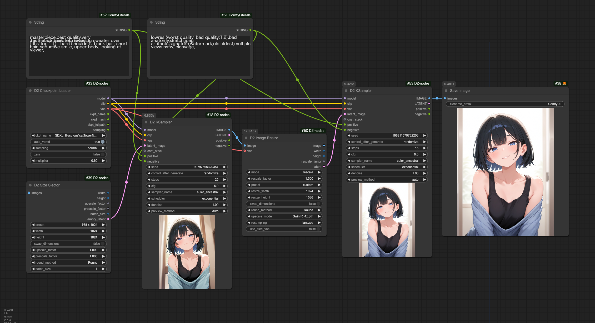

<a href="../en/index.md">English</a> | <a href="../ja/index.md">日本語</a> | <a href="../zh/index.md">繁体中文</a>

- <a href="index.md">Top</a>
- <a href="node.md">Node</a>
- <a href="workflow.md">Workflow</a>

# Workflow

將圖像拖放到 ComfyUI 即可重現工作流程。

## :card_index_dividers: 簡單的 txt2img

- 不使用 `Lora` 和 `Controlnet` 的簡單 txt2img。

## :card_index_dividers: txt2img + Hires fix

- 使用兩個 D2 KSampler，中間加入使用 SwinR_4x 的 D2 Image Resize 來實現 Hires fix。

## :card_index_dividers: 批量放大資料夾內的圖像

- 獲取資料夾內所有圖像並提取提示詞
- 使用 `Controlnet anyTest`
- 放大至 1.5 倍

## :card_index_dividers: XY Plot: Checkpoint & Prompt S/R

- 使用 D2 XY Plot Easy 的簡單 XY Plot

## :card_index_dividers: XY Plot: Prompt S/R

- 基本的 `Prompt S/R`

## :card_index_dividers: XY Plot: Animagine、Pony、Illustrious 的 Checkpoint 比較

- `Animagine`系、`Pony`系、`Illustrious`系的品質標籤雖然不同，但會根據檢查點路徑自動切換
- 由於檔案名稱不一定包含系列名稱，需要將其分類到對應系列名稱的資料夾中

## :card_index_dividers: Refiner: 中途切換 Checkpoint 的 Hires.fix

