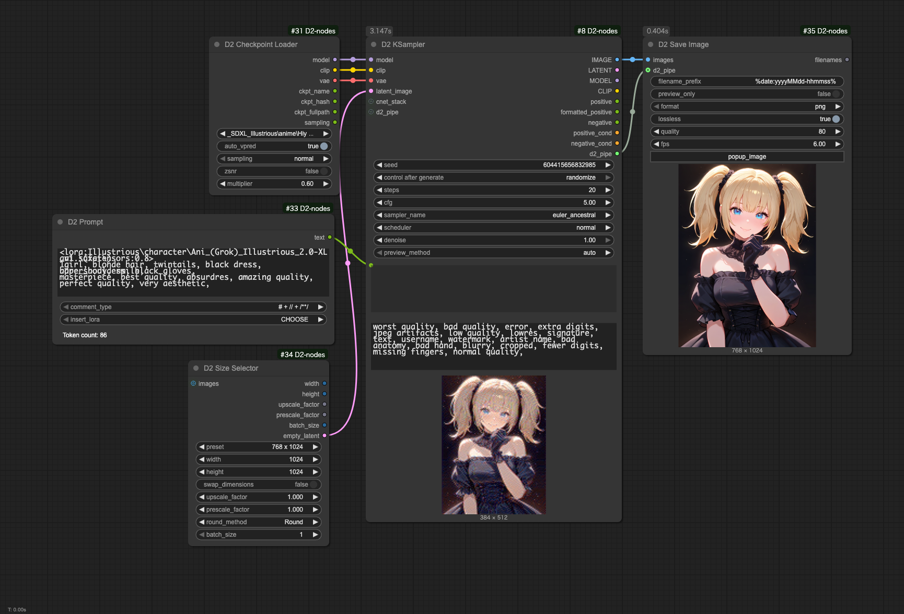

<a href="../en/index.md">English</a> | <a href="../ja/index.md">日本語</a> | <a href="../zh/index.md">繁体中文</a>

- <a href="index.md">Top</a>
- <a href="node.md">Node</a> / <a href="node_image.md">Image Node</a> / <a href="node_text.md">Text Node</a> / <a href="node_xy.md">XYPlot Node</a> / <a href="node_float.md">Float Palet</a>
- <a href="workflow.md">Workflow</a>


# Workflow

> [!TIP]
> **將圖像拖放到 ComfyUI 即可重現工作流程。**

## :card_index_dividers: 簡單的 txt2img

<a href="../../workflow/simple_t2i_20250914.png"></a>

- 不使用 Lora 或 Controlnet 的簡單 txt2img。

## :card_index_dividers: 使用LoRA的txt2img

<a href="../../workflow/lora_t2i_20250914.png"></a>

- 使用與StableDiffusion webui A1111相同格式的Lora的txt2img。
- 使用D2 Prompt可以更容易地使用Lora

## :card_index_dividers: txt2img + Hires fix

<a href="../../workflow/hiresfix_20250914.png"></a>

- 使用兩個 D2 KSampler，中間加入 D2 Image Resize，使用 SwinR_4x 的 Hires fix。

## :card_index_dividers: 在檔案名中包含生成參數

<a href="../../workflow/filename_template_20250914.png"></a>

- 此範例使用 `D2 Save Image Eagle` 保存文件
- 使用 `D2 Filename Template` 生成檔案名
- 使用 `d2_pipe` 輸入的信息自動創建 Eagle 備忘錄

## :card_index_dividers: 批量放大資料夾內的圖像

<a href="../../workflow/folder_image_queue_upscale_20250914.png"></a>

- 使用 `D2 Folder Image Queue` 獲取資料夾內所有圖像，並使用 `D2 Load Image` 獲取提示詞
- 使用 `4x-AnimeSharp` 放大模型（當然，也可以使用 `None`）
- 放大1.5倍
- 使用 `D2 XY Seed2` 每次輸出4張圖像

## :card_index_dividers: XY Plot: Checkpoint 和 Prompt S/R

<a href="../../workflow/xy_easy_20250914.png"></a>

- 使用 D2 XY Plot Easy 的 XY Plot
- `D2 KSampler` 的參數會被 `D2 XYPlot Easy` 覆蓋
- 網格圖像較大，因此使用JPEG格式保存
- 此範例使用 `D2 Save Image Eagle` 保存圖像
- 使用 `D2 Filename Template2` 創建XY繪圖參數。Eagle備忘錄記錄如下：

```
plot_x:
black hair,
blonde hair,

plot_y:
_SDXL_Illustrious\anime\catTowerNoobaiXL_v18Vpred.safetensors
_SDXL_Illustrious\anime\HiyokoDarkness_vpred_v2_20250329.safetensors
_SDXL_Illustrious\anime\waiNSFWIllustrious_v150.safetensors
```

### 比較Lora的方法

<figure>

</figure>

1. 將 `D2 XY Model List` 更改為：
    - `model_type`: `loras`
    - `mode`: `a1111`
1. 點擊 `Get model list` 獲取Lora列表
1. 只保留需要的Lora，並添加觸發詞
1. 第一行描述要替換的提示詞
1. 將 `D2 XY Plot Easy` 更改為：
    - `y_type`: `positive`

## :card_index_dividers: Checkpoint Test

<a href="../../workflow/checkpoint_test_20250914.png"></a>

- 批量生成檢查點測試圖像
- 生成4種不同的提示詞並合併為一張圖像
- 與 XY Plot 不同，為每個檢查點保存單獨的圖像
- 第一個 `D2 KSampler` 使用從 `D2 XY Plot Easy` 接收的生成參數，但第二個 `D2 KSampler` 使用自己的設置
- 提示詞的數量與 `D2 Grid Image` 的 `trigger_count` 數量一致（範例中為 `4`）
- 使用 `D2 Filename Template` 將檢查點名稱加入檔案名

## :card_index_dividers: XY Plot: Prompt S/R

<a href="../../workflow/xy_prompt_sr_20250121.png"></a>

- 根據Checkpoint類型（SDXL / Pony / Illustrious）切換品質標籤的XY繪圖
- Animagine系列、Pony系列和Illustrious系列具有不同的質量標籤，但根據檢查點路徑自動切換
- 由於文件名可能不包含系列名稱，需要將文件分類到相應系列的資料夾中

## :card_index_dividers: Refiner: 切換檢查點的 Hires.fix

<a href="../../workflow/Refiner_20241218.png"></a>
